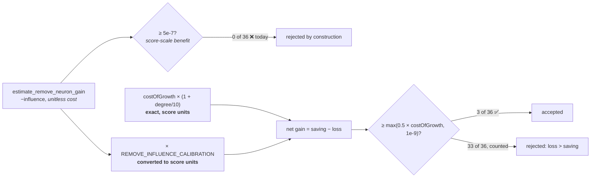

# Decide the scale of a removal's `expectedCreatureScoreGain` (Issue #1811)

## Summary

Adds `docs/analysis/remove-neuron-gain-scale-1785.md`, the decision record #1811
asked for. It settles which quantity `expectedCreatureScoreGain` carries for a
sole-op `RemoveNeuron`, states the accept/reject rule as a codeable formula, and
reconciles the estimator's sign convention, `coordinated_post_discount_noise_floor(1)`
and `REMOVE_LOW_IMPACT_NOISE_FLOOR` vs `costOfGrowth` in one table.
Closes #1811.

**Decision.** `expectedCreatureScoreGain` is a **net benefit on the realised
creature-score-delta scale** — the #1778 scale — being the exact complexity
saving minus the calibrated influence loss. Readings 1 and 3 from the issue are
both correct (a missing benefit term *and* a missing unit conversion); reading 2
(a magnitude screen on a cost) is rejected because it inverts the meaning of a
shared field and cannot express worth.

The load-bearing evidence is an identity rather than a measurement:
`costOfGrowth` is NEAT-AI's own `Score.ts` complexity penalty, so
`saving(u) = costOfGrowth × (1 + degree(u)/10)` is *already* in creature-score
units, exactly. Only the influence term is estimated, so only it needs a
calibration or a noise screen.

**The rule** (#1812 implements it; code changes are out of scope here):

```text
expectedCreatureScoreGain(u) = costOfGrowth × (1 + degree(u)/10)
                             − |estimate_remove_neuron_gain(u)| × REMOVE_INFLUENCE_CALIBRATION
accept(u) ⟺ expectedCreatureScoreGain(u) ≥ max(0.5 × costOfGrowth, GAIN_FLOOR_NOISE_BACKSTOP)
```

`estimate_remove_neuron_gain` keeps its sign and value; no existing constant
changes value. The sole-op floor is re-denominated for one candidate type, not
dropped — both of #1785's constraints hold.

## Evidence

Docs-only decision record — no runtime surface, so no screenshot and no
benchmark. The numbers in the doc were measured against the shipped
`compute_impacts_public` and `calculate_removal_savings` on the committed #1810
fixture (`tests/fixtures/remove_neuron_reachability/network.json`), via a
throwaway harness that was not committed. They are re-derivable by any
implementer from those two shipped functions plus the fixture.

Worked example at `costOfGrowth = 1e-7`, floor `5e-8`:

| Neuron | degree | influence | gain | verdict |
|---|---|---|---|---|
| `h-x-0` (orphan) | 2 | `0.0` | **`+1.2e-7`** | **accept** (2.4× clear) |
| `h-b-08` (least-influential connected) | 5 | `9.72e-2` | **`−2.92e-4`** | **reject** |
| `h-d-01` (worst case) | 4 | `1.0` | `−3.0e-3` | reject |

Fixture yield moves from **0/36** to **3/36** — exactly the three zero-influence
orphans. Verdicts are invariant to `REMOVE_INFLUENCE_CALIBRATION` for any value
above `1.03e-6`, which covers both measured add-path calibrations, so the
decision does not rest on the interim constant.



## Test Plan

No tests added — code changes are explicitly out of scope for #1811, and the
repo's testing doctrine forbids tests that assert on document text.

The decision's testable content lands in #1812, whose tests must encode the
worked example above (`h-x-0` accepted; `h-b-08` and `h-d-01` rejected). The doc
also records that #1810's characterisation pin
(`tests/issue_1785_remove_neuron_reachability.rs`, Block 1) **will** break when
#1812 lands, and that the pin and
`docs/analysis/remove-neuron-reachability-1785.md` must be updated together.

`./quality.sh` was run and passes on this branch.
