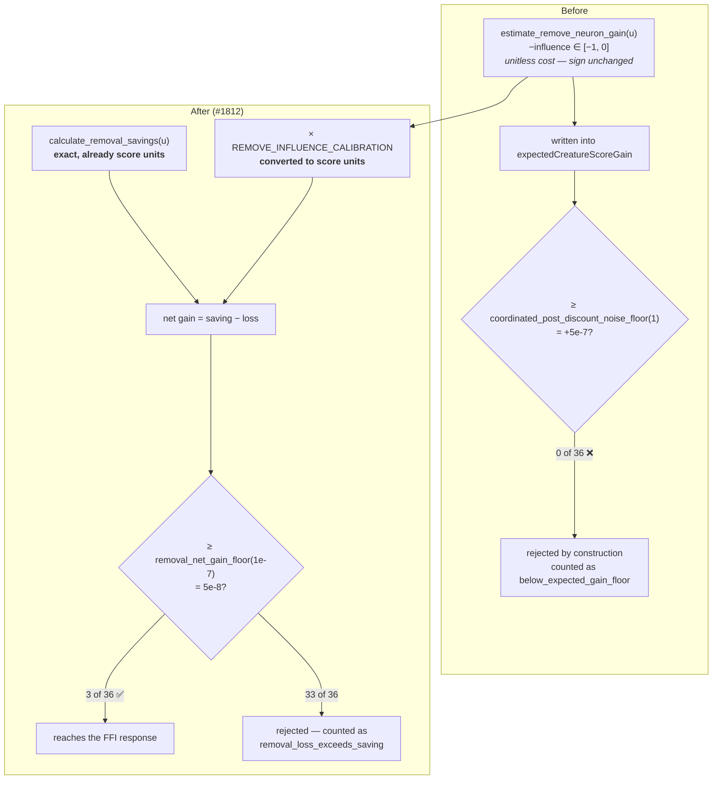

# Gate 1 — make sole-op `RemoveNeuron` candidates reachable (Issue #1812)

## Summary

Every sole-op `RemoveNeuron` candidate was dropped by construction.
`apply_honest_remove_neuron_gain` wrote `estimate_remove_neuron_gain`'s output —
a **unitless influence fraction, negated**, documented `<= 0.0` — straight into
`expectedCreatureScoreGain`, and `apply_final_coordinated_gain_floor` screened
that field against `coordinated_post_discount_noise_floor(1) = +5e-7`. No
non-positive value clears a positive floor, so the survivor set was empty for
every neuron that was not promoted, and the only removals that could reach the
FFI response were provably zero-variance neurons carrying an accepted bias fold.

This implements the rule settled by #1811
(`docs/analysis/remove-neuron-gain-scale-1785.md`) for sole-op `RemoveNeuron`
candidates only. The estimator keeps its sign and value — it is now the gain's
**cost term** rather than the gain — and the gain gains the two pieces it was
missing: the exact complexity saving, and the unit conversion onto the
creature-score scale.

```text
saving(u) = calculate_removal_savings(incoming, outgoing, costOfGrowth)
loss(u)   = |estimate_remove_neuron_gain(u)| × REMOVE_INFLUENCE_CALIBRATION
expectedCreatureScoreGain(u) = saving(u) − loss(u)
accept(u) ⟺ gain(u) ≥ removal_net_gain_floor(costOfGrowth) = max(0.5 × costOfGrowth, 1e-9)
```

The floor is **replaced for one candidate type, not dropped**, and the sign is
not flipped — both of #1785's constraints hold. Multi-op coordinated candidates
keep `coordinated_post_discount_noise_floor` unchanged, exactly as
`apply_honest_remove_neuron_gain` already scopes itself. Every rejection is
counted under a new named reason, `removal_loss_exceeds_saving`.

Closes #1812.

## Evidence

Backend/FFI-only change — no web interface, so no screenshot. The evidence is
the characterisation pin flipping on the committed #1810 fixture.



Measured on `tests/fixtures/remove_neuron_reachability/network.json` at the
production `costOfGrowth = 1e-7`, reproducing the #1811 worked example exactly:

| Measurement | Before | After |
|---|---|---|
| Emitted gain — max (best) | `−0e0` | **`+1.200000e-7`** |
| Emitted gain — median | `−1.666667e-1` | `−4.998600e-4` |
| Floor applied to a sole-op removal | `5e-7` | `5e-8` |
| Candidates reaching the FFI response | **0** | **3** (`h-x-0`, `h-x-1`, `h-x-2`) |
| Rejections counted under `removal_loss_exceeds_saving` | n/a | **33** |
| Rejections counted under `below_expected_gain_floor` | 36 | **0** |

The three survivors are exactly the fixture's zero-influence orphans, and they
survive **without** promotion — Block 2 still measures zero promotions on the
same run. A synthetic hidden neuron wired straight into `out-1` with a dominant
weight (influence `−9.99e-1`, net gain `−2.997e-3`) is still rejected and
counted, which is the direct check that the fix did not become "accept
everything".

`docs/analysis/remove-neuron-reachability-1785.md` Block 1 is updated in step
with the pin, as #1810's closing note required.

### Deliberately not carried across from the add path

`REMOVE_INFLUENCE_CALIBRATION` is applied **bare**. The per-creature
`calibration_correction` is clamped to `[0.001, 1.0]`, so it only ever discounts
— and discounting a *cost* shrinks the penalty and makes removals **easier** to
accept, inverting its safety direction. `influence_is_converted_by_the_bare_calibration`
pins the #1811 worked flip: a degree-4 neuron at `1e-4` influence is rejected
bare and would be accepted at the correction's clamp.

## Test Plan

### Added

- `tests/issue_1812_remove_neuron_net_gain_gate.rs` — 7 tests over the FFI-facing
  `apply_final_coordinated_gain_floor`: a harmless removal reaches the response
  on a gain that sits *below* the shared floor (so it only passes via the new
  routing); influence-carrying removals are rejected at every degree and counted;
  the floor is a real boundary (just-under rejected, at-floor and just-over
  accepted); multi-op groups keep the shared floor and the shared reason; the
  `CONSTANT_NEURON_PRIORITY_GAIN` promotion still passes; the new reason is
  registered in `ALL_REJECTION_REASONS` and reaches an operator as prose; and the
  calibration is applied bare.
- `src/analysis/remove_neuron_net_gain.rs` — 8 unit tests on the rule itself,
  including the #1811 worked example (`h-x-0` accepted at 2.4× clear, `h-b-08`
  rejected), a non-finite influence rejected rather than treated as free, and the
  floor's `cost_of_growth` tracking and backstop clamp.
- `tests/issue_1785_remove_neuron_reachability.rs` — Block 1b, the synthetic
  high-influence neuron.

### Modified (business-logic change, documented per the testing doctrine)

The emitted `expectedCreatureScoreGain` for a sole-op removal is now a net
benefit rather than a bare cost, so three suites that asserted on the old value
were updated rather than removed. Each keeps its original guarantee and adds the
conversion:

- `tests/issue_1785_remove_neuron_reachability.rs` — Block 1 was the #1810
  zero-yield characterisation pin, which its own closing note said this fix would
  break. It now pins the post-fix numbers end to end.
- `tests/ffi/issue_1530_dispatch_honest_remove_neuron_gain.rs` — both tests. The
  #1530 guarantee (the estimator tracks the analytic propagated effect in sign
  and magnitude, and the seam does not echo the request-supplied placeholder) is
  asserted on the **estimator**, which is unchanged; the emitted gain is then
  asserted to be that value converted and netted.
- `src/analysis/discovery_dispatch::tests::honest_gain_overrides_fabricated_remove_neuron_gain`
  — same treatment.

### Unmodified and still passing

- `tests/issue_1622_constant_neuron_priority.rs` — the promotion path is
  untouched; `1.0` clears any `removal_net_gain_floor`.
- `tests/coordinated_min_gain_floor.rs`, `tests/issue_1272_per_op_count_noise_floor.rs`,
  `tests/issue_1129_rejection_breakdown.rs`, `tests/issue_1139_coordinated_floor_always_applied.rs`,
  `tests/issue_1740_threshold_recalibration.rs` — multi-op and non-removal
  candidates are not rescoped.

### Gates

`cargo clippy --all-targets -- -D warnings` clean; `./quality.sh` passes.

## Security Self-Check

- **Input validation** — no new external input. `removal_net_gain_floor` rejects
  a non-finite or non-positive `cost_of_growth` rather than producing a `NaN`
  floor, and `removal_influence_loss` turns a non-finite influence into an
  infinite loss so the removal is rejected, never silently treated as free.
- **Secrets / injection / output encoding / authn / dependencies** — not
  applicable: no I/O, no new dependency, no new FFI entry point, no rendering
  sink.
- **Error handling** — no failure is swallowed. Every sole-op removal leaves the
  pass as a survivor or as a counted rejection under
  `REJECTION_REMOVAL_LOSS_EXCEEDS_SAVING`, asserted by the reachability pin.
