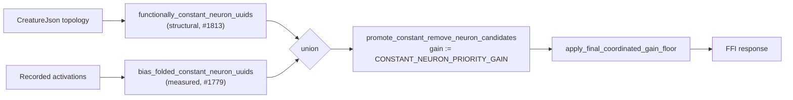

# Wire the structural functionally-constant neuron detector (Issue #1813)

## Summary

`functionally_constant_neuron_uuids` ignored its argument and returned an empty
`HashSet` unconditionally, so the #1622 promotion escape hatch — the only route
by which a remove-neuron candidate clears the positive gain floor — fired solely
for neurons that already carried an accepted #1623 bias fold. A structurally
constant hidden neuron with no recorded activations (so no fold can be
evaluated) was flagged by neither source and deleted by the floor with no
diagnostic.

**Path chosen: wire it.** Deleting the seam would have left the promotion path
reachable only through *measured* constancy, which by construction cannot see a
neuron with no recorded activations — exactly the case #1785 is about. The
structural judgement is cheap (topology only), sound, and complements the
measured one, which is the split the module's doc comment already described.

`functionally_constant_neuron_uuids` now flags a **hidden** neuron whose output
cannot vary given the topology alone — every incoming synapse either carries a
zero weight or originates at a neuron that is itself constant (a declared
`"constant"` neuron or another structurally-constant hidden neuron); a neuron
with no incoming synapses satisfies this vacuously. Constancy propagates to a
fixpoint, so chains are flagged end to end. Nothing else is: one varying source,
or one source not present in the creature, leaves the neuron unflagged, and
constancy that is only apparent from *activations* is deliberately left to the
#1623 bias fold.

The orchestrator's union at `orchestration.rs` is unchanged in shape but now has
two live sources, and its debug log reports the structural and measured flag
counts separately so a silent revert to zero is visible in run logs.

Closes #1813.

## Evidence

Backend/library change — no web interface to screenshot. Verified by the tests
below plus `cargo clippy --all-targets -- -D warnings` and `./quality.sh`.

Before this change the upper branch contributed nothing: a neuron with no
recorded activations reached the floor with a ≈0 gain and was dropped.

## Test Plan

New suite `tests/issue_1813_structural_constant_detection.rs`:

- `structurally_constant_orphan_is_flagged_and_variance_carrier_is_not` — the
  positive/negative pair the acceptance criteria ask for.
- `flagged_structural_constant_is_promoted_past_the_final_gain_floor` —
  end-to-end: flag → promote → `apply_final_coordinated_gain_floor`; the
  structural constant survives to the FFI-facing survivor set, the
  variance-carrying candidate is rejected.
- `all_zero_incoming_weights_is_structurally_constant`,
  `constancy_propagates_through_a_chain_of_constant_sources`,
  `a_neuron_fed_by_a_declared_constant_neuron_is_flagged` — the remaining
  structural cases.
- `input_and_output_neurons_are_never_flagged`,
  `measured_only_constancy_is_left_to_the_bias_fold`,
  `a_dangling_source_is_never_assumed_constant` — the negative boundaries; an
  unknown source is never assumed constant (fail-safe, not a silent assumption).

Unit tests in `src/analysis/remove_neuron_constant_promotion.rs`:

- `structural_detector_flags_only_topology_constant_neurons` and
  `empty_creature_flags_nothing` added.
- `seam_returns_empty_until_detector_is_wired` **renamed** to
  `seam_flags_nothing_without_hidden_neurons`; its assertion is unchanged, but
  what it pins is now the hidden-only scope rather than an unconditional empty
  set.

Existing characterisation suites pass **unmodified in their assertions**:
`tests/issue_1706_dominated_branch_characterisation.rs` (dominated branches are
variance-carrying, so the structural detector correctly flags none of them) and
`tests/issue_1785_remove_neuron_reachability.rs` (every hidden neuron in that
fixture has a non-zero-weight path from a live input). Only the prose and
assertion messages describing the seam as "unwired" were updated, together with
`docs/DOMINATED_BRANCH_COLLAPSE_EXTENT.md` and
`docs/analysis/remove-neuron-reachability-1785.md`.

## Security Self-Check

- Input validation: the detector reads an already-validated `CreatureJson` (the
  forward-only FFI gate runs before any business logic) and makes no assumption
  about unknown UUIDs — a dangling synapse source is never treated as constant.
- No new dependencies, no I/O, no shell/SQL/HTTP surface, no secrets staged.
- Fail-loud: the detector never reports a neuron constant on absence of
  evidence; unprovable cases are simply not flagged.
