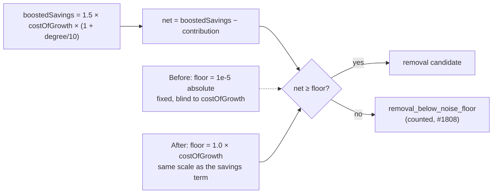

# Gate 2: re-denominate `REMOVE_LOW_IMPACT_NOISE_FLOOR` in units of `costOfGrowth`

## Summary

`REMOVE_LOW_IMPACT_NOISE_FLOOR` was an absolute `1e-5` screening
`boostedSavings − contribution` — a term **linear in the host-supplied
`costOfGrowth`**. At NEAT-AI's shipped `costOfGrowth = 1e-7` a zero-contribution
hidden neuron needed **657 synapses** to clear it, so the shipped focus/FFI
triage rejected every neuron the production population contains. Worse, any
host-side change to `costOfGrowth` silently rescaled the gate's strictness by the
same factor, with nothing in the repo recording the coupling.

The screen is now denominated in the scale the savings term actually lives on,
mirroring what #1812 did for Gate 1 on the analysis path:

- `REMOVE_LOW_IMPACT_NOISE_FLOOR_UNITS: f32 = 1.0` replaces the absolute
  constant — one hidden neuron's complexity cost.
- `remove_low_impact_noise_floor(cost_of_growth)` returns
  `max(units × costOfGrowth, GAIN_FLOOR_NOISE_BACKSTOP)`, the same shape and the
  same backstop as Gate 1's `removal_net_gain_floor`.

Closes #1814.

### Why `1.0` — the bracket

| Bound | Reason |
|---|---|
| **> 0.664** | The #1142 numerical-noise class (`net = +6.64e-8` at `costOfGrowth = 1e-7`) is `0.664` units. A `1.0`-unit floor rejects it with 1.5× margin, so the #1142 guarantee is preserved — re-denominated, not deleted. |
| **< 1.5** | A zero-contribution orphan's net is exactly `REMOVAL_CANDIDATE_BOOST = 1.5` units. A rule that cannot prune a dead neuron has failed at its only certain case. |

### The 657-synapse break-even is gone

With zero contribution the net is `1.5 × (1 + degree/10)` units, which exceeds
`1.0` unit at **degree 0** — `costOfGrowth` cancels from both sides. Every
zero-contribution hidden neuron now clears the floor at any degree and any
`costOfGrowth`. What the floor bounds instead is the *contribution* a neuron may
carry: it survives while `contribution ≤ costOfGrowth × (0.5 + 0.15 × degree)`
(e.g. `2.3e-7` for a 12-synapse neuron at the production default). This is
documented in the constant's doc comment.

### Overrides

- `NEAT_AI_DISCOVERY_REMOVE_LOW_IMPACT_NOISE_FLOOR` — **preserved unchanged** as
  an *absolute* override, applied verbatim (including `0.0` to disable) and
  taking precedence. Every existing operator and test override keeps its meaning.
- `NEAT_AI_DISCOVERY_REMOVE_LOW_IMPACT_NOISE_FLOOR_UNITS` — new, overrides the
  multiplier and still scales with `costOfGrowth`.

Both are documented in `docs/CONFIGURATION.md`.

### Operator-facing string

`REJECTION_REMOVAL_BELOW_NOISE_FLOOR`'s description now reads
`remove-low-impact noise floor of <threshold> at costOfGrowth <basis>` — the
threshold alone is meaningless without the `costOfGrowth` it was derived from,
and the value follows the env override.

## Evidence

Backend/Rust library change — no web interface to screenshot. Verified by the
test suite and the measured characterisation pin below.

### Gate 2 on the #1810 production-shaped fixture

Measured by `cargo test --test issue_1785_remove_neuron_reachability -- --nocapture`
(36 hidden neurons, `costOfGrowth = 1e-7`):

| Measurement | Before | After |
|---|---|---|
| Surviving candidates | **0** | **3** (the zero-contribution orphans) |
| `noise_floor_rejections` | 3 | **0** |
| `removal_savings_below_impact` drops | 33 | 33 |
| Best boosted savings in the fixture | `3.3e-7` | `3.3e-7` |
| Effective floor | `1e-5` | **`1e-7`** |
| Break-even degree, zero contribution | **657** | **0** |

### Regression-tripwire verification

Both directions were checked by temporarily moving the constant:

- `UNITS = 100.0` (equivalent to the old `1e-5` at the production
  `costOfGrowth`) → `realistic_neuron_survives_noise_floor_at_default_cost_of_growth`
  and `screen_strictness_scales_with_cost_of_growth` go **red**.
- `UNITS = 0.5` (too loose) → `numerical_noise_class_still_rejected`,
  `noise_class_rejection_also_scales_with_cost_of_growth`,
  `issue_1142_evidence_candidate_is_dropped` and
  `shipped_units_sit_inside_the_documented_bracket` go **red**.

`./quality.sh` passes cleanly (`cargo clippy --all-targets -- -D warnings`,
`cargo test`, fmt, deny, audit).

## Test Plan

### Added — acceptance criteria

`src/focus/ranking/removal_candidates.rs` (`noise_floor_denomination_tests`):

- `realistic_neuron_survives_noise_floor_at_default_cost_of_growth` — a
  12-synapse, `1e-8`-contribution hidden neuron at the production
  `costOfGrowth` survives; the degree ladder `1, 2, 5, 20` is also checked.
- `numerical_noise_class_still_rejected` — reproduces the #1142 cache entry
  (contribution `1.14e-7`, net `+6.6e-8`) and asserts it is rejected **and**
  counted.
- `screen_strictness_scales_with_cost_of_growth` — the same zero-contribution
  neuron gets the same verdict at `costOfGrowth` `1e-7`, `1e-6`, `1e-5`, `1e-4`.
- `noise_class_rejection_also_scales_with_cost_of_growth` — the rejection verdict
  is scale-invariant too, when the contribution scales with `costOfGrowth`.

`src/analysis/constants/candidate_scoring.rs`
(`remove_low_impact_noise_floor_tests`):

- `floor_is_linear_in_cost_of_growth`
- `backstop_clamps_degenerate_cost_of_growth` (zero, negative, `NaN`, `∞`, `1e-12`)
- `absolute_env_override_is_preserved` (verbatim at any `costOfGrowth`; `0.0` disables)
- `units_env_override_scales_and_yields_to_absolute`
- `invalid_overrides_fall_back_to_the_default`
- `shipped_units_sit_inside_the_documented_bracket` (compile-time `const` assertions)

`src/analysis/diagnostics/rejection_reasons.rs`:

- `removal_noise_floor_description_names_the_applied_threshold` — the description
  quotes the threshold actually applied and its `costOfGrowth` basis, and follows
  the env override.

### Modified — setup changed, contract unchanged

Each of these relied on the default floor being an absolute `1e-5` that
`costOfGrowth = 1e-7` could never reach — the defect being fixed. They now pin
that historical floor through the preserved absolute env override so the
*rejecting* branch (and its counting) stays under test; reachability at the
default is covered by the new tests. No test was deleted or commented out.

- `removal_candidates.rs::below_noise_floor_savings_are_rejected_and_counted`
- `removal_triage.rs::entry_points_agree_on_noise_floor_rejections`
- `tests/focus/issue_1767_structural_removal_triage.rs` — two tests
- `tests/focus/issue_1783_removal_triage_unification.rs` — one test
- `tests/analysis/issue_1807_ffi_cost_of_growth_validation.rs` — the NaN guard's
  proxy assertion ("fewer than 3 candidates") no longer distinguishes the guard
  working from the guard missing, since the three low-contribution neurons now
  legitimately survive. It now asserts the **high-impact** neuron is never
  nominated and that the whole hidden layer is never nominated.
- `tests/issue_1785_remove_neuron_reachability.rs` — Blocks 3 and 4 of the #1810
  characterisation pin, which the file's own header says is *expected* to break
  when a gate is fixed. Block 4 also now re-searches the break-even at four
  `costOfGrowth` values to pin the invariance.
- `tests/issue_1785_remove_neuron_end_to_end.rs` — `prunable_degree()` already
  derived its fixture from the floor; it now passes `COST_OF_GROWTH` through.

### Documentation

- `docs/CONFIGURATION.md` — both env vars.
- `docs/analysis/remove-neuron-reachability-1785.md` — Blocks 3/4 tables, the
  Mermaid gate diagram, and the "what a fix has to change" section updated to
  the measured post-fix numbers.
- `docs/analysis/remove-neuron-gain-scale-1785.md` — the "#1814 decides" row now
  records the landed decision.
- `tests/fixtures/remove_neuron_reachability/README.md` — the orphans' fate.

## Security self-check

- No new external input surface: the change is arithmetic on values already
  validated by `effective_cost_of_growth` (#1783) and the FFI `costOfGrowth`
  guard (#1807). Env overrides are parsed with `f32::parse` and filtered to
  finite, non-negative values, falling back to the compile-time default.
- No secrets, no new dependencies, no shell/SQL/filesystem/HTTP calls.
- Fails loud: a degenerate `costOfGrowth` returns the noise backstop rather than
  a silently widened or `NaN` floor, and every rejected neuron is still counted
  under a named reason (`#1808` conservation invariant asserted in tests).
