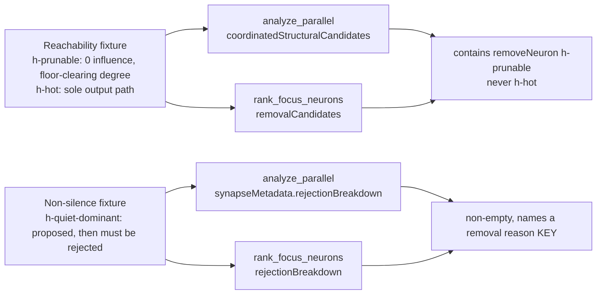

# End-to-end guard for the remove-neuron path (Issue #1815)

## Summary

Adds `tests/issue_1785_remove_neuron_end_to_end.rs` — the standing composition
guard #1785's test-gap section named: "No test drives `analyze_parallel`
end-to-end and asserts a `removeNeuron` candidate survives to the FFI response."
Every existing removal test drove one unit (`apply_honest_remove_neuron_gain`,
`apply_coordinated_gain_floor`, `identify_structural_removal_candidates`) on a
hand-built input, so two independent unreachability gates could both ship green:
each unit passed and only the composition nobody asserted was broken.

Closes #1815.

Test-only change plus the documentation section that describes the guard. No
`src/` behaviour is modified.

Two invariants, four cases, all asserted on the **FFI response shape** so no
intermediate-vector refactor can keep them green while the candidate is deleted
downstream:

1. **Reachability** — a `removeNeuron` candidate for a neuron genuinely worth
   pruning (zero downstream influence, non-trivial synapse count) must reach both
   shipped entry points: `analyze_parallel` (`coordinatedStructuralCandidates`)
   and `rank_focus_neurons` (`removalCandidates`), which is how production
   reaches `identify_structural_removal_candidates` (#1806).
2. **Non-silence** — on a fixture where nothing should be pruned, the rejection
   breakdown must be non-empty and must name a removal-related reason **key**
   (`removal_savings_below_impact`, `removal_below_noise_floor`,
   `removal_active_neuron`, `removal_loss_exceeds_saving`). Checking the key, not
   a count, means a mis-keyed or renamed reason is caught. This is the direct
   guard on the `rejectionBreakdown: null` #1785 observed.

Plus the negative direction on the reachability fixture: the high-influence
neuron carrying the creature's whole output path must **not** be returned, so the
guard cannot be satisfied by weakening a gate into accepting everything.

### Fixtures track the calibration instead of pinning it

The prunable neuron's synapse degree is **derived** at runtime from
`remove_low_impact_noise_floor()` and `calculate_removal_savings`, never
hard-coded. When #1814 lowers Gate 2's absolute floor, the fixture shrinks with it
and the invariant still holds. This is what separates this suite from
`tests/issue_1785_remove_neuron_reachability.rs`, which is deliberately a
characterisation pin of today's numbers.

Both fixtures are built in code, run at the production `costOfGrowth = 1e-7`
(`DEFAULT_COST_OF_GROWTH`), and unset both gate-moving env vars under `#[serial]`
so a stray local override cannot make a red guard look green.



## Evidence

Backend/CLI change — no web interface to screenshot. The evidence is the test
output, before and after.

### After (this branch)

```text
running 4 tests
test analyze_parallel_names_a_removal_reason_when_nothing_is_prunable ...
=== analyze_parallel zero-yield removal targets: []
=== synapseMetadata.rejectionBreakdown: {"below_expected_gain_floor":1,"no_samples":3,
    "removal_loss_exceeds_saving":1,"within_batch_target_short_circuit":1,"zero_improvement":2}
ok
test analyze_parallel_returns_a_remove_neuron_candidate_for_a_prunable_neuron ...
=== analyze_parallel removal targets: ["h-prunable"]
ok
test focus_ffi_path_names_a_removal_reason_when_nothing_is_prunable ...
=== focus zero-yield rejectionBreakdown: {"removal_savings_below_impact":2}
ok
test focus_ffi_path_returns_a_removal_candidate_for_a_prunable_neuron ...
=== focus removal targets: ["h-prunable"]
=== focus rejectionBreakdown: {"removal_savings_below_impact":1}
ok

test result: ok. 4 passed; 0 failed
```

### Before — `Develop` at `06403d7`, the commit #1785 was written against

Run in a `git worktree` at `06403d7`. The file does not compile there as written,
because two of the reason keys and the exported default did not exist yet:

```text
error[E0432]: unresolved imports
  `...rejection_reasons::REJECTION_REMOVAL_ACTIVE_NEURON`,
  `...rejection_reasons::REJECTION_REMOVAL_LOSS_EXCEEDS_SAVING`,
  `...rejection_reasons::REJECTION_REMOVAL_SAVINGS_BELOW_IMPACT`
error[E0432]: unresolved import `neat_ai_discovery::focus::DEFAULT_COST_OF_GROWTH`
```

A missing-symbol failure proves less than a failing assertion, so the run was
repeated with those four names shimmed to their literal values — behaviour under
test unchanged — and **three of the four cases fail**:

```text
test analyze_parallel_names_a_removal_reason_when_nothing_is_prunable ...
=== synapseMetadata.rejectionBreakdown: {"below_expected_gain_floor":2,"no_samples":3}
panicked: ... must name a removal-related reason key (one of ["removal_savings_below_impact",
  "removal_below_noise_floor", "removal_active_neuron", "removal_loss_exceeds_saving"]);
  got keys ["below_expected_gain_floor", "no_samples"]
FAILED

test analyze_parallel_returns_a_remove_neuron_candidate_for_a_prunable_neuron ...
=== analyze_parallel removal targets: []
panicked: a removeNeuron candidate for h-prunable (zero downstream influence,
  990 synapses) must reach the analyze_parallel response; got []
FAILED

test focus_ffi_path_names_a_removal_reason_when_nothing_is_prunable ...
=== focus zero-yield rejectionBreakdown: null
panicked: ... must carry a rejection breakdown after a zero-yield removal pass, got null
FAILED

test focus_ffi_path_returns_a_removal_candidate_for_a_prunable_neuron ... ok

test result: FAILED. 1 passed; 3 failed
```

The `rejectionBreakdown: null` in that output is the exact observation #1785
reported. Reported honestly: the **focus-path reachability** case already passed
at `06403d7` — an extreme-degree orphan could always clear the `1e-5` noise floor
— so what that commit lacked on the focus surface was the *reason* (#1808), not
the candidate. Both invariants still have a case that fails there: reachability
via the analysis path, non-silence via both.

### CI cost

- The focus cases are structure-only (#1766) and are handed a deliberately
  unopenable parquet path, so a passing response also proves no record decode
  happened. No GPU, no fixture files.
- The `analyze_parallel` cases write their records to a `tempfile` parquet (no
  committed discovery parquet, no discovery directory) and use the repo's
  standard `GpuAnalyzer::gpu_is_available()` skip, matching every other
  `analyze_parallel` integration test.
- Whole suite runs in ~3s.

## Test Plan

Added `tests/issue_1785_remove_neuron_end_to_end.rs`:

| Test | Invariant |
|---|---|
| `analyze_parallel_returns_a_remove_neuron_candidate_for_a_prunable_neuron` | Reachability on the analysis path, plus the negative direction (`h-hot` never returned) |
| `focus_ffi_path_returns_a_removal_candidate_for_a_prunable_neuron` | Reachability on the focus FFI path, plus the negative direction |
| `analyze_parallel_names_a_removal_reason_when_nothing_is_prunable` | Non-silence on `synapseMetadata.rejectionBreakdown` (reason key `removal_loss_exceeds_saving`) |
| `focus_ffi_path_names_a_removal_reason_when_nothing_is_prunable` | Non-silence on the focus `rejectionBreakdown` (reason key `removal_savings_below_impact`) |

Documentation: new "The standing end-to-end guard (Issue #1815)" section in
`docs/analysis/remove-neuron-reachability-1785.md` with a Mermaid diagram,
distinguishing this guard from the #1810 characterisation pin above it.

No existing test was modified, commented out or removed. `./quality.sh` passes.

### Relationship to neighbours

- **#1802** owns the general `considered == returned + sum(rejections)`
  reconciliation invariant. This suite asserts the removal-specific observable at
  the FFI boundary and adds no counter plumbing of its own, so it still holds
  alongside it.
- **#1808** owns the rejection accounting inside the triage implementations. This
  suite asserts what that accounting makes observable.
- **#1814** (Gate 2's absolute floor) remains open. Because the fixture degree is
  derived from the floor rather than hard-coded, this guard passes now and keeps
  passing after #1814 lands.

## Security Self-Check

- Input validation: no new external input surface — both fixtures are built in
  the test.
- Secrets: none staged; no hidden files touched.
- Injection surface: no new SQL, shell, filesystem or HTTP calls. The only file
  written is a `tempfile::tempdir()` parquet.
- Dependencies: no new dependency.
