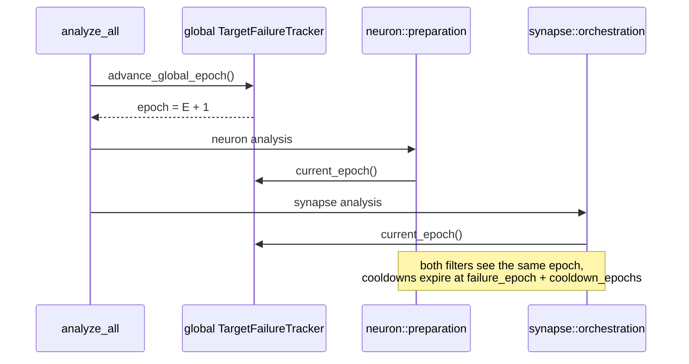

## Summary

Cleared the single carried-over quality-gate finding tracked by the baseline
tracker: the Mermaid `sequenceDiagram` note in
`docs/archive/pr-summaries/pr-summary-1790.md` contained an unescaped `;` in its
message text, which Mermaid parses as a statement separator rather than as
prose. The `;` is now a `,` — the separator the tracker itself recommends — so
the diagram parses and the repo baseline is clean again. Closes #1817.

Documentation-only change: one character in one archived PR summary. No Rust
source, test, or configuration file is touched, so no version bump is required
(CI's `version-increment` job still applies).

### Base branch

This PR targets `milestone/bug-fix-29-jul`, not `Develop`. The offending file
was added by PR #1809 and exists only on the milestone line — it is absent from
`Develop`, so the fix can only land where the artefact actually lives.

## Evidence

No web interface to screenshot, and Playwright MCP is not available in this run.
The fix is verifiable by inspection and by the repo-wide scan below.

Before → after, the offending diagram line (line 54):

```text
- Note over N,S: both filters see the same epoch;<br/>cooldowns expire at failure_epoch + cooldown_epochs
+ Note over N,S: both filters see the same epoch,<br/>cooldowns expire at failure_epoch + cooldown_epochs
```

The corrected diagram now parses as five participants and six messages:



A repo-wide sweep of every `` ```mermaid `` block confirmed this was the only
unescaped `;` in unquoted Mermaid message text. The remaining `;` occurrences in
Mermaid blocks are all HTML entities (`&gt;`, `&le;`, `&rho;`, …) or `;` inside
quoted node labels, neither of which the statement-separator rule applies to —
consistent with the tracker listing exactly one finding.

## Test Plan

- No automated test added: the enforcing Mermaid gate lives in the Vibe Coder
  worker (`mermaid_validator.ts`), not in this repo, and `./quality.sh` here has
  no Markdown stage. A repo-local Mermaid gate would be a separate change and is
  out of scope for this tracker.
- `./quality.sh < /dev/null` — full gate re-run (bash syntax, shellcheck, PR
  summary layout, `cargo deny`, build, fmt, clippy, `cargo check`,
  `cargo test --lib --tests --all-features`, rustdoc, release build).
- Manual verification: re-ran the Mermaid block sweep across all Markdown files
  and confirmed zero unescaped statement separators remain.
