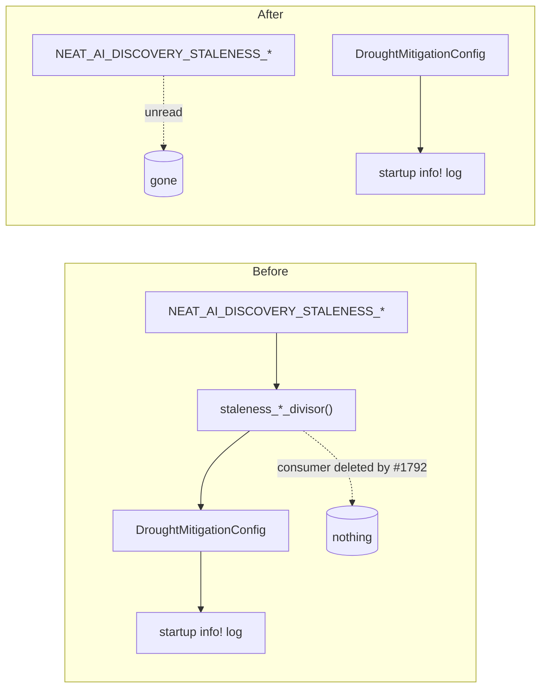

# Delete the orphaned staleness-window config knobs (Issue #1818)

## Summary

The adaptive staleness window (#1203) lived entirely on the
`CandidateOutcomeCache` that #1792 deleted as dead code. Its **configuration
surface** survived the removal: two env vars were still read at startup, echoed
back in the drought-mitigation config log, and documented for operators — while
controlling nothing. Tuning
`NEAT_AI_DISCOVERY_STALENESS_CONSERVATIVE_DIVISOR` produced a value in the log
and zero behavioural change: the same "looks like a working lever, is not"
failure mode #1792 was filed to remove, relocated to the config surface.

Took option **(A) delete**. Option (B) — re-point the divisors at a live
per-candidate surface — is not available: #1792 already established that no
writer exists, because the only inbound per-candidate history the library
receives is the caller-supplied `failureCache`, which carries failures only and
no source UUID. There is nothing to key a staleness window on.

Closes #1818.

### Removed

| Surface | Items |
|---------|-------|
| `src/analysis/constants/candidate_scoring.rs` | `STALENESS_CONSERVATIVE_DIVISOR`, `STALENESS_EXTENDED_DROUGHT_DIVISOR`, `STALENESS_WINDOW_FLOOR`, `STALENESS_DIVISOR_FLOOR`, `STALENESS_DIVISOR_CEILING`, `staleness_conservative_divisor()`, `staleness_extended_drought_divisor()` |
| `src/config/drought_mitigation.rs` | Both `DroughtMitigationConfig` fields, their `from_env` reads, and both fields on the startup `info!` line |
| `docs/CONFIGURATION.md` | Both `NEAT_AI_DISCOVERY_STALENESS_*` rows |
| `docs/DROUGHT_PLAYBOOK.md` | Config-log sample lines, both operator-lever rows, the "Cache effective window" column of the three-regimes table, and the #1203 companion-issue bullet |

Stale doc comments in `detection_thresholds.rs`, `config/user_facing.rs` and
`analysis_outcome.rs` that referenced the deleted mechanism were corrected.

Nothing else changed: the divisors were `pub` items in a library crate, so
`dead_code` under `-D warnings` never flagged them, but nothing outside the
config snapshot read them either.

## Evidence

Backend/library change with no web interface — no screenshot applies. Evidence
is the test suite plus `./quality.sh`.

The config surface before and after the removal:

`tests/issue_1818_staleness_config_knobs_removed.rs` fails against the unfixed
tree — `config_snapshot_carries_no_staleness_fields` does not compile
(`missing fields staleness_conservative_divisor, staleness_extended_drought_divisor`)
and `staleness_env_vars_do_not_change_the_effective_config` fails on the
snapshot comparison — and passes after the removal.

## Test Plan

Added `tests/issue_1818_staleness_config_knobs_removed.rs`:

- `staleness_env_vars_do_not_change_the_effective_config` — the operator-visible
  regression: setting both vars to unusual values must produce a
  `DroughtMitigationConfig::from_env()` byte-identical to the unset baseline.
- `config_snapshot_carries_no_staleness_fields` — exhaustive destructuring, so
  re-adding a field to the snapshot (and therefore to the startup config log)
  fails the build.
- `no_staleness_variable_is_documented` — no `NEAT_AI_DISCOVERY_STALENESS_*`
  survives in `docs/CONFIGURATION.md`, `docs/DROUGHT_PLAYBOOK.md`, `README.md`
  or `AGENTS.md`.

Modified `tests/issue_1422_drought_mitigation_config.rs` (**business-logic
change, documented as required by the issue**): the two
`from_env_reports_compiled_defaults_when_unset` assertions covering the deleted
fields, their two `EnvGuard::unset` entries, and the two constant imports were
removed. No test was commented out; every remaining #1422 assertion is intact.

`tests/issue_1611_env_var_single_source.rs` continues to pass — the removed vars
were never in its canonical list.

## Security Self-Check

- No new input surface, dependency, endpoint, or external call — this PR only
  deletes code and documentation.
- No secrets or hidden files staged.
