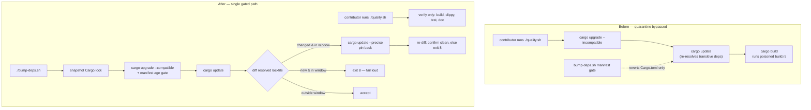

# Pre-commit gate no longer bypasses the dependency quarantine (Issue #1865)

## Summary

`./quality.sh` — the pre-commit step CONTRIBUTING.md mandates — ran
`cargo upgrade --incompatible` followed by `cargo update`, force-upgrading every
direct **and transitive** crate to the newest published version with no age
check. That bypassed both quarantine mechanisms this repo already ships (the
Renovate `minimumReleaseAge` window and `VIBE_BUMP_QUARANTINE_HOURS` in
`bump-deps.sh`), so a crate poisoned minutes earlier was resolved and its
`build.rs` executed on the contributor's machine at the next `cargo build`.

Two changes close it:

1. **`quality.sh` no longer mutates the dependency graph.** The upgrade block is
   gone — a quality gate verifies the tree. Bumps go through `./bump-deps.sh`
   (quarantine-gated) or Renovate.
2. **`bump-deps.sh` gates the resolved lockfile, not just the manifest.** The
   old gate age-checked the requirement strings in `Cargo.toml`, then phase 3
   ran an unconditional `cargo update` that re-resolved the lockfile straight
   back to the rejected version — and transitive packages were never checked at
   all. `Cargo.lock` is now snapshotted before any mutation and diffed
   afterwards; every in-quarantine change is pinned back with
   `cargo update --precise`, a newly-pulled package inside the window fails the
   run loud (exit 8, no earlier version exists to pin back to), and an unknown
   publish time fails closed. `--no-network` now also skips the lockfile
   refresh, since an offline re-resolve cannot be age-checked.

Closes #1865.

## Evidence

This is a CLI/build-tooling change with no web interface, so there is no
screenshot; verification is the test output below.

Where the quarantine window is enforced, before and after:



Test run (`./quality.sh` passes end to end; the two suites that target this
change):

```text
running 1 test
test quality_gate_never_mutates_the_dependency_graph ... ok
test result: ok. 1 passed; 0 failed

bump-deps.sh Tests — Passed: 62, Failed: 0
```

## Test Plan

- **Added `tests/issue_1865_quality_gate_no_dep_mutation.rs`** — regression test
  for the reported bug. It runs the real `quality.sh` with a stubbed `cargo` on
  `PATH` that records every invocation (plus `cargo-upgrade` present, to prove
  availability is not what stops the upgrade), then asserts no `upgrade` or
  `update` sub-command was issued while `build` still was. It fails against the
  unfixed script with
  ``quality.sh must not run `cargo upgrade` … Recorded: `cargo upgrade --incompatible` ``.
- **Added four groups to `tests/bump_deps_test.sh`** (tests 20–23, 62
  assertions total), each calling the real helpers with fixture data:
  - `extract_lock_versions` emits every `[[package]]` in a `Cargo.lock`
    (transitive included) and not the lockfile's own `version` header key.
  - `compute_new_deps` reports only packages absent from the before-state.
  - `plan_lock_quarantine` reverts a transitive bump published 1h ago, blocks a
    brand-new package published 2h ago, and keeps a bump published 300h ago —
    all hermetic via the `BUMP_DEPS_TEST_FIXTURE` / `BUMP_DEPS_NOW_EPOCH` seams.
  - `plan_lock_quarantine` fails closed when the publish time cannot be
    determined.
- **Modified `tests/issue_1685_doc_link_integrity.rs`** (documented business-logic
  change): `ci_doc_build_step_pointers_are_current` hard-coded `quality.sh:74-75`
  as the doc-build location. Removing the upgrade block moved that step, so the
  test now derives the line number from `quality.sh` itself and still asserts
  `docs/ci-doc-build-step.md` cites it. No assertion was weakened or removed.
- **Modified `tests/test_quality_upgrade.sh`** (header comment only): its
  `cargo upgrade --incompatible` precondition now documents the `bump-deps.sh`
  path rather than `quality.sh`. Assertions unchanged.

## Docs updated

- `CONTRIBUTING.md` — gate step list renumbered; added the "the gate never
  upgrades dependencies" note.
- `AGENTS.md` — the dependency-bump section now points at `./bump-deps.sh` and
  forbids reintroducing `cargo upgrade`/`cargo update` into `quality.sh`.
- `docs/GPU_GUIDE.md`, `docs/ci-doc-build-step.md` — repointed the stale
  `quality.sh` references.
- `CHANGELOG.md` — new `### Security` entry under Unreleased.

## Follow-up

`.github/workflows/ci.yml:159` (the `version-increment` job) runs a bare
`cargo update` on every PR — the same unquarantined re-resolve, on the CI path.
`AGENTS.md` forbids modifying `ci.yml` without explicit approval, so it is filed
as stSoftwareAU/NEAT-AI-Discovery#1878 with the proposed narrowed command rather
than changed here.
