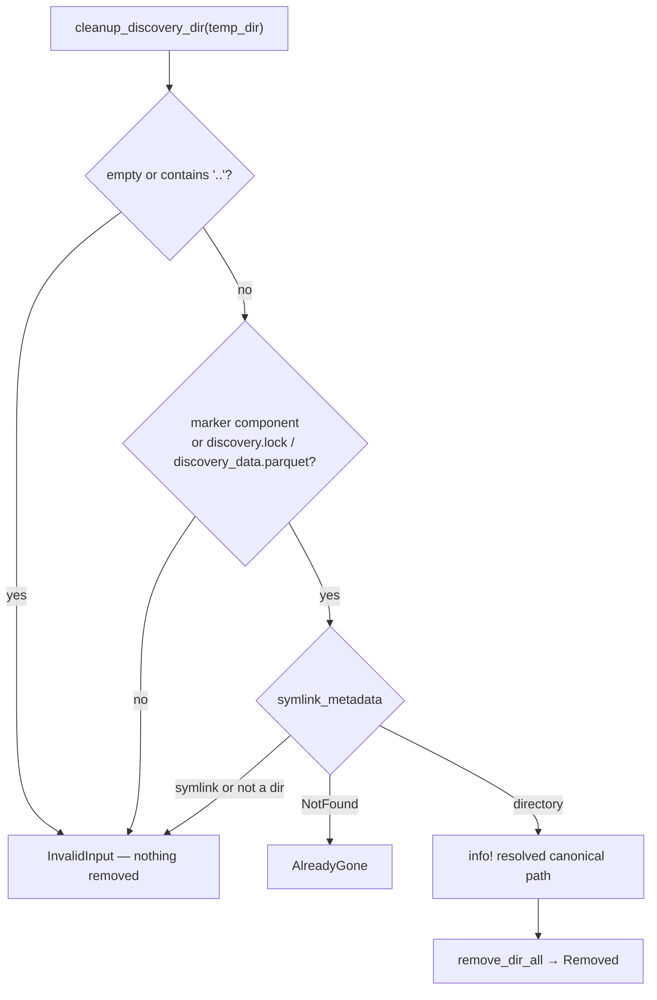

# Harden `cleanup_discovery_dir` against arbitrary caller paths (Issue #1866)

## Summary

The FFI entry point `cleanup_discovery_dir` passed its caller-supplied `tempDir`
straight to `fs::remove_dir_all` with no validation, so any host-side path bug,
mis-set environment variable, or partially-compromised caller obtained an
unconstrained recursive delete at the host process's privilege (CWE-73,
A01:2025 Broken Access Control). The sibling scanner
`clean_orphaned_discovery_dirs` already carried this guard from Issue #1218; its
directly FFI-exposed twin did not.

The guard now lives inside `cleanup_discovery_dir` itself, so it covers the FFI
entry point **and** the scanner's internal delegation. Closes #1866.

A path is accepted only when it is positively identifiable as a discovery
directory:

- a path component contains `.discovery` (`DISCOVERY_DIR_MARKER`), **or**
- the directory contains `discovery.lock` or `discovery_data.parquet`.

Additional checks:

- paths containing a `..` component are refused (they could escape a genuine
  discovery root while still carrying a marker component);
- an empty path is refused;
- the directory is probed with `symlink_metadata` rather than `exists()`, so a
  symlinked `temp_dir` is refused and `remove_dir_all` can never reach the link
  target's contents;
- a non-directory is refused;
- every accepted removal logs its resolved canonical path at `info!` as an audit
  trail, replacing the previous `debug!`-only line.

The allowlist runs **before** any existence probe — matching the sibling
scanner's rationale — so a caller cannot bypass it by passing a path that does
not yet exist. The Issue #1100 race-suppression contract is preserved: a genuine
discovery path that another actor already removed still returns
`alreadyGone: true`.

At the FFI boundary a rejected path is now reported as a non-retryable
`data_validation` error instead of a retryable `io_error`, so a host cannot loop
on a caller bug that will never succeed.



## Evidence

Backend/library change with no web interface, so there is no screenshot. The
evidence is the regression test: with the fix reverted (`src/discovery_cleanup.rs`
stashed) the FFI-level test fails and the unrelated directory is destroyed —

```text
thread 'issue_1866_cleanup_dir_path_guard::ffi_cleanup_rejects_unrelated_directory'
panicked at tests/ffi/issue_1866_cleanup_dir_path_guard.rs:40:5:
assertion `left == right` failed: unrelated path must be refused:
{"alreadyGone":false,"success":true}
```

With the fix in place all 12 new tests pass, alongside the 16 pre-existing
`discovery_cleanup` unit tests and the full 128-test FFI suite.

## Test Plan

New — `tests/issue_1866_cleanup_dir_path_guard.rs` (library-level guard):

- `test_cleanup_rejects_unrelated_directory` — an unrelated tree is refused and
  survives intact.
- `test_cleanup_rejects_root_and_tmp` — `/`, `/tmp`, `/var/folders/xx`, `/etc`
  are refused (the Issue #1218 spot-check, now applied to the direct entry
  point).
- `test_cleanup_rejects_empty_path`
- `test_cleanup_rejects_parent_dir_traversal` — `.discovery/session/../../Documents`
  is refused and the traversal target survives.
- `test_cleanup_accepts_child_of_discovery_root` — the orphan scanner's
  delegation path still works.
- `test_cleanup_accepts_directory_with_lock_file`
- `test_cleanup_accepts_directory_with_parquet_data`
- `test_cleanup_missing_discovery_path_still_already_gone` — Issue #1100
  race-suppression preserved.
- `test_cleanup_rejects_regular_file`
- `test_cleanup_rejects_symlinked_temp_dir` (unix) — the symlink, its target and
  the target's canary file all survive.

New — `tests/ffi/issue_1866_cleanup_dir_path_guard.rs` (exported entry point):

- `ffi_cleanup_rejects_unrelated_directory` — the guard is reached through the
  FFI boundary, returns `success: false` with a non-retryable `data_validation`
  error, and the directory survives.
- `ffi_cleanup_removes_genuine_discovery_dir` — a real discovery session is
  still removed.

### Documented existing-test changes

Two pre-existing unit tests in `src/discovery_cleanup.rs` passed paths that the
new allowlist correctly rejects. Neither was removed or weakened — both were
moved under a `.discovery` root so they exercise the same behaviour on a
realistic discovery path:

- `test_cleanup_already_gone_returns_ok` — the missing path is now
  `<tmp>/.discovery/does-not-exist`.
- `test_concurrent_cleanup_no_not_found_error` — the concurrently-cleaned
  session now lives under a `.discovery` root, so the second actor's call after
  the directory is gone still passes the allowlist.

## Security Self-Check

- **Input validation**: `tempDir` is validated against an allowlist before any
  filesystem mutation; the check precedes the existence probe so it cannot be
  bypassed with a non-existent path.
- **Injection surface**: no new shell, SQL, or HTTP calls; the only filesystem
  mutation is now allowlist-gated.
- **Error handling**: rejections return a structured, non-retryable
  `data_validation` error containing only the caller's own path — no internal
  state or stack traces are leaked. No failure is swallowed: every rejection is
  a hard `Err`.
- **Secrets / dependencies**: no secrets staged, no new dependencies.

## Documentation

`docs/FFI_API.md` — the `cleanup_discovery_dir` section now documents the path
validation rules, the rejection response shape, and the `info!` audit log.
