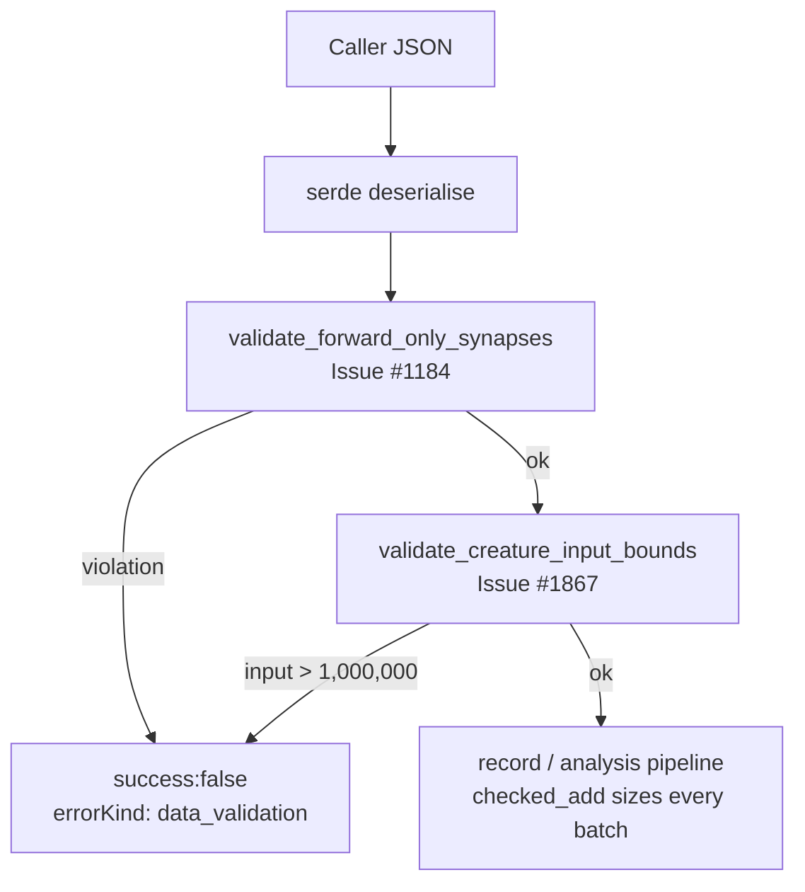

# Bound `creature.input` at the FFI boundary (Issue #1867)

## Summary

`CreatureJson.input` crossed the FFI boundary as a bare, caller-supplied
`usize` that nothing bounded. It sized a `Vec<String>` of input-neuron UUIDs in
`src/record/processing.rs`, so `{"input": 10000000000}` asked the library to
materialise ten billion `String`s. Allocation failure there routes through
`handle_alloc_error`, which **aborts** — an abort the `panic::catch_unwind`
wrapping every FFI entry point cannot intercept, so the host process died
instead of receiving an error response. A value near `usize::MAX` additionally
wrapped the `non_input_neuron_count + creature.input` additions (release builds
set no `overflow-checks`), letting the `checked_mul` guard below them pass on a
size unrelated to the real record count. Closes #1867.

The fix:

- **New gate** `validate_creature_input_bounds`
  (`src/ffi_types/creature_bounds.rs`) caps `creature.input` at
  `MAX_CREATURE_INPUT_NEURONS` (1,000,000) and returns
  `DiscoveryError::InvalidInput` (`errorKind: "data_validation"`). It runs at
  every FFI entry point that accepts a `CreatureJson`, chained onto the existing
  `validate_forward_only_synapses` call (Issue #1184/#1188), so no entry point
  gains a second error-response block.
- **The cap is absolute, not `creature.neurons.len()`.** Input neurons are
  implied by the count and are *not* listed in `creature.neurons` — the
  documented `record_discovery` payload in `docs/FFI_API.md` pairs `"input": 20`
  with a single listed neuron, and `src/analysis/neuron/preparation.rs` builds
  the input neurons from the count alone. A neuron-count-relative bound (as the
  issue suggested) would reject ordinary creatures.
- **Three bare additions → `checked_add`** in `src/record/mod.rs`,
  `src/record/validation.rs` and `src/record/processing.rs`, matching the
  `checked_mul` beside them. In `processing.rs` the sum is now computed once
  before the loop rather than per observation.
- Docs updated in the same change: the AGENTS.md "Validated FFI Surface"
  invariant and a new "Creature Input Bound" section in `docs/FFI_API.md`.

Out of scope, noted for triage: `creature.output` drives
`HashSet::with_capacity(creature.output)` in
`src/analysis/detection/topology_cache.rs` and is likewise unbounded. This issue
scopes `input` only.

## Evidence

Backend/FFI change — no web interface to screenshot. Verified by
`cargo test` and the full `./quality.sh` gate (clippy `-D warnings`, fmt,
`cargo deny`, doc build, release build), which passed cleanly:

```text
✅ All quality checks passed!
```

New tests (`cargo test --test ffi issue_1867`):

```text
running 7 tests
test issue_1867_creature_input_bounds::creature_input_at_usize_max_is_rejected ... ok
test issue_1867_creature_input_bounds::wide_input_creature_with_few_listed_neurons_is_accepted ... ok
test issue_1867_creature_input_bounds::record_discovery_data_reports_overflow_instead_of_wrapping ... ok
test issue_1867_creature_input_bounds::record_discovery_rejects_oversized_input_without_aborting ... ok
test issue_1867_creature_input_bounds::creature_input_exactly_at_limit_is_accepted ... ok
test issue_1867_creature_input_bounds::analyze_parallel_rejects_oversized_input ... ok
test issue_1867_creature_input_bounds::creature_input_above_limit_is_rejected ... ok

test result: ok. 7 passed; 0 failed
```

Where the gate sits in the call flow:



## Test Plan

Added `tests/ffi/issue_1867_creature_input_bounds.rs` (registered in
`tests/ffi/main.rs`):

- `wide_input_creature_with_few_listed_neurons_is_accepted` — the documented
  20-inputs/1-neuron payload still validates (guards against a
  `neurons.len()`-relative bound regression).
- `creature_input_exactly_at_limit_is_accepted` — the cap is inclusive.
- `creature_input_above_limit_is_rejected` — one past the cap fails with
  `DiscoveryErrorKind::DataValidation`.
- `creature_input_at_usize_max_is_rejected` — the silent-wrap trigger is
  rejected.
- `record_discovery_rejects_oversized_input_without_aborting` — regression for
  the abort: `record_discovery_internal` with `"input": 10000000000` returns
  `success:false` / `errorKind: "data_validation"` instead of allocating ten
  billion strings. Fails (aborts the test process) against the unfixed code.
- `analyze_parallel_rejects_oversized_input` — the analysis entry point shares
  the gate.
- `record_discovery_data_reports_overflow_instead_of_wrapping` — a direct
  library call with `creature.input = usize::MAX` returns a typed overflow error
  instead of wrapping.

Added unit tests in `src/ffi_types/creature_bounds.rs` covering ordinary,
wide-input, zero-input, at-limit, above-limit and `usize::MAX` creatures.

Updated `tests/issue_1256_public_api_surface.rs` to import the two new public
names (`MAX_CREATURE_INPUT_NEURONS`, `validate_creature_input_bounds`), keeping
the curated public-surface list enforced.

## Security Self-Check

- **Input validation**: the new gate validates a caller-supplied count before
  any allocation; the three sizing additions are now checked.
- **Secrets**: none staged.
- **Injection surface**: none added.
- **Error handling**: rejections return the existing structured JSON error
  shape; no paths or internal state leaked.
- **Dependencies**: none added.
