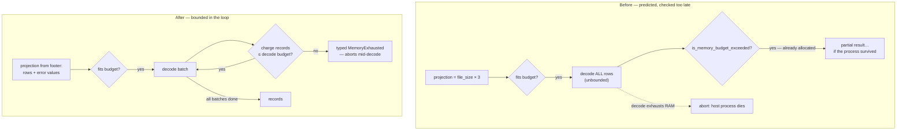

# Bound the parquet decode instead of predicting it (Issue #1869)

## Summary

The admission-control decision for pre-loading a Parquet file was derived from
the file's **compressed** on-disk size (`file_size × 3`), and the only memory
guard ran **after** the allocation it was meant to prevent
(`orchestration.rs:630`, "Check memory budget after parquet loading"). Parquet's
dictionary and RLE encodings routinely beat 3:1 on this schema's repeated neuron
UUIDs and near-identical error floats, so a 100 MB file projected at
"300 MB, fits comfortably" could decode into many gigabytes — and if the decode
exhausted memory first, Rust aborted and took the host process with it rather
than returning the partial result that branch exists to produce.

This change stops predicting the decode and starts bounding it. Closes #1869.

- **Footer-derived projection.** `estimate_parquet_in_memory_bytes` now reads
  the Parquet footer (`src/parquet_format/footer.rs`) for the *exact*
  decompressed row count and `errors` leaf-value count, and projects
  `rows × (struct + UUID heap) + error_values × 4`. The old `file_size × 3`
  heuristic is kept only as a floor, so no projection regresses downward. The
  footer read is metadata-only — no column data is decoded.
- **A bound that is actually enforced.** `DecodeBudget`
  (`src/parquet_format/decode_budget.rs`) charges every materialised record
  **inside** the reader's batch loop, alongside the cancellation and deadline
  checks that already run there, and fails loud with a typed
  `DiscoveryError::MemoryExhausted` the moment the ceiling is reached. The
  ceiling resolves in priority order: the caller's budget (the analysis phase
  forwards `max_analysis_memory_mb` through `RecordCache` →
  `load_grouped_records_shared_with_budget` → the reader), then
  `NEAT_AI_DISCOVERY_MAX_PARQUET_DECODE_MB`, then half of total system RAM.
- **Closes the `max_obs` gap.** `read_records_from_parquet_with_limit` caps
  distinct *observations*, not rows, so a file whose rows all share one
  `obs_index` was unbounded even at `maxObs: 1`. The byte budget holds
  regardless of how rows are distributed.
- **Bounds the exporter's dense grid.** `export_visualisation_snapshot`
  allocates `O(distinct_neurons × distinct_obs)` vectors regardless of sparsity;
  `ensure_dense_snapshot_fits` (`src/export/dense_bound.rs`) checks the
  projection against the same ceiling before the first vector is allocated.

Ceilings for row count / distinct neurons / errors-per-row and a sparse exporter
representation (also floated in the issue) were deliberately **not** added: the
cumulative byte budget subsumes them, and a sparse rewrite of the exporter is a
separate change to its output shape.

## Evidence

Backend/library change with no web interface — no screenshot applies. The
evidence is the test suite plus `./quality.sh`, which passes cleanly (`cargo
deny`, `clippy -D warnings`, `cargo check --all-targets --all-features`, the
full `cargo test --lib --tests --all-features` run, `rustdoc -D warnings`, and
the release build).

Where the bound moved — from a post-hoc check to an in-loop one:



Selected test output:

```
running 11 tests
test footer_stats_report_decompressed_row_count ... ok
test projection_is_not_derived_from_compressed_size_alone ... ok
test grouped_decode_aborts_when_the_budget_is_exhausted ... ok
test grouped_decode_succeeds_within_a_generous_budget ... ok
test limited_read_aborts_when_the_budget_is_exhausted ... ok
test the_environment_override_bounds_budget_free_decode_paths ... ok
test dense_snapshot_grid_is_bounded_before_allocation ... ok
test a_budget_charges_every_record_and_reports_consumption ... ok
test an_unlimited_budget_never_aborts ... ok
test default_limit_is_half_of_total_ram_and_unknown_ram_is_unbounded ... ok
test estimated_record_bytes_grows_with_uuid_and_errors ... ok

test result: ok. 11 passed; 0 failed
```

## Test Plan

All tests are in `tests/issue_1869_parquet_decode_bound.rs` and exercise real
functions against a real low-entropy Parquet file written by this crate's own
writer (repeated UUID, repeated error floats — the shape the issue describes).

| Test | Verifies |
|------|----------|
| `footer_stats_report_decompressed_row_count` | The footer yields the exact row count and a non-zero uncompressed size. |
| `projection_is_not_derived_from_compressed_size_alone` | **Regression test**: the projection exceeds `on_disk × 3` and covers the real materialised cost. Fails against the unfixed estimator, which returned exactly `on_disk × 3`. |
| `grouped_decode_aborts_when_the_budget_is_exhausted` | A 1 MB budget aborts a 50k-record decode with a `MemoryExhausted`-classified error naming the decode budget. |
| `grouped_decode_succeeds_within_a_generous_budget` | Every record is still returned when the budget fits — the bound does not truncate valid work. |
| `limited_read_aborts_when_the_budget_is_exhausted` | The `max_obs` gap: 50k rows over eight `obs_index` values pass the observation limit but are stopped by the byte budget. |
| `the_environment_override_bounds_budget_free_decode_paths` | `NEAT_AI_DISCOVERY_MAX_PARQUET_DECODE_MB` bounds a decode with no caller budget, and the same read completes once the override is removed (`#[serial]`). |
| `dense_snapshot_grid_is_bounded_before_allocation` | A 200k × 200k exporter grid is rejected with `MemoryExhausted`; a small grid passes. |
| `a_budget_charges_every_record_and_reports_consumption` | Per-record charging, the error naming the file, and consumption reporting. |
| `an_unlimited_budget_never_aborts` | An unbounded budget never rejects. |
| `default_limit_is_half_of_total_ram_and_unknown_ram_is_unbounded` | Default ceiling arithmetic, including the unknown-RAM case. |
| `estimated_record_bytes_grows_with_uuid_and_errors` | The per-record estimate charges UUID heap and four bytes per error. |

No existing tests were modified or removed.

## Security self-check

- **Input validation** — the decode budget *is* the new validation: untrusted
  Parquet content is bounded by decoded bytes, not by a compression-ratio guess.
- **Fail loud** — budget exhaustion returns a typed
  `DiscoveryError::MemoryExhausted` (classified retryable) with the file path,
  consumed MB and ceiling; nothing is swallowed or reported as success.
- **Error handling** — messages name the parquet path the caller already
  supplied and the configured limits; no internal state or stack traces leak.
- **Secrets / dependencies** — no new dependencies, no credentials, no hidden
  files staged.
- **Documentation** — `docs/CONFIGURATION.md` gains the new environment
  variable and `docs/CACHE_TUNING.md`'s `file_size × 3` description is corrected
  to the footer-derived projection.
