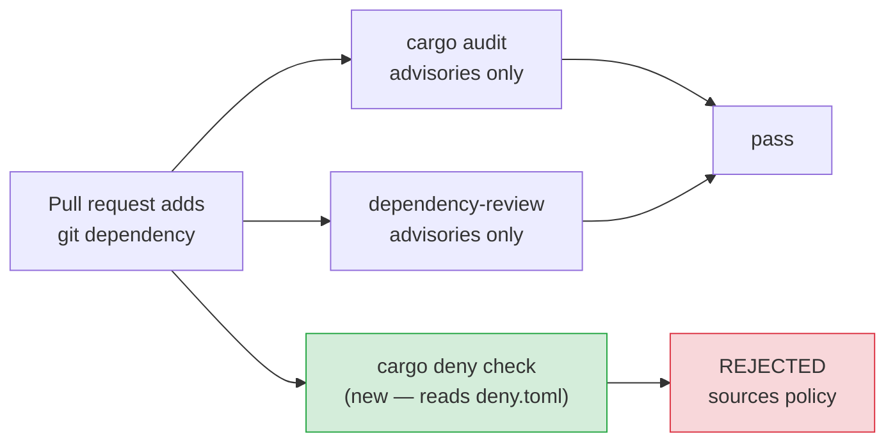

# PR Summary — Enforce the declared cargo-deny policy in CI (Issue #1870)

## Summary

`deny.toml` declared a strict supply-chain policy — `[sources]` (crates.io
only, no git remotes, no alternate registries), `[bans]`, and the Apache-2.0
compatible `[licenses]` allow-list — that no CI job ever consulted. The
`security` workflow ran `cargo audit` and `dependency-review-action`, both of
which check published *advisories* only and neither of which reads `deny.toml`.
A pull request adding `foo = { git = "https://github.com/attacker/foo" }` —
bypassing crates.io checksums entirely — passed every required check.

The only two paths that ran `cargo deny check` were honour-system:
`quality.sh` (a local pre-commit gate CI never runs) and `bump-deps.sh` phase 4,
which **skipped** the gate with a warning when `cargo-deny` was not installed —
a silent pass on any host without the tool.

Changes:

- `.github/workflows/security.yml` — install `cargo-deny` pinned to 0.20.2 with
  `--locked` (same hardening as the existing `cargo-audit` install) and run
  `cargo deny check` as an enforced step. Job `timeout-minutes` raised 20 → 30
  to cover a cold source build of both plugins.
- `bump-deps.sh` — new sourceable helper `bump_deps::require_cargo_deny`; phase
  4 now hard-fails with exit 9 when `cargo-deny` is missing instead of printing
  a warning and continuing. The no-bump summary line now reports `audit_run`
  too, so a successful run positively confirms the gate executed rather than
  merely not failing.
- `CONTRIBUTING.md` — document the enforced policy check in the CI pipeline
  list and the new `bump-deps.sh` hard-fail.

Closes #1870.

## Evidence

This is a CI/CLI change with no web interface to screenshot.

Enforcement path before and after:



Verification with the pinned version installed locally
(`cargo install --locked --version 0.20.2 cargo-deny`):

```text
$ cargo deny check
advisories ok, bans ok, licenses ok, sources ok
exit=0
```

`actionlint .github/workflows/security.yml` — exit 0.

`./quality.sh` — passes cleanly (`✅ All quality checks passed!`).

## Test Plan

New `tests/issue_1870_cargo_deny_ci_enforcement.rs` — 4 tests, all failing
against the unfixed tree and passing after the change:

- `security_workflow_installs_cargo_deny_pinned_and_locked` — the workflow
  installs `cargo-deny` with both `--locked` and an explicit `--version` pin.
- `security_workflow_runs_cargo_deny_check` — the workflow has an enforced
  `cargo deny check` run step.
- `bump_deps_hard_fails_when_cargo_deny_is_missing` — runs the real
  `bump-deps.sh --no-network` under a stubbed `PATH` with no `cargo-deny`, and
  asserts a non-zero exit, an error naming `cargo-deny`, and no
  "audit gate skipped" message.
- `bump_deps_runs_the_audit_gate_when_cargo_deny_is_present` — same run with a
  `cargo-deny` stub on `PATH`, asserting exit 0 and `audit_run=1` in the
  summary.

Existing suites re-run green: `tests/bump_deps_test.sh` (62 assertions),
`tests/test_security_workflow_validation.sh` (3 assertions), and the full
`cargo test --lib --tests --all-features` run inside `./quality.sh`.
