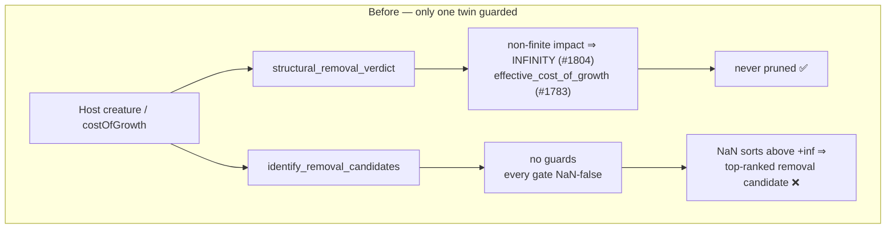
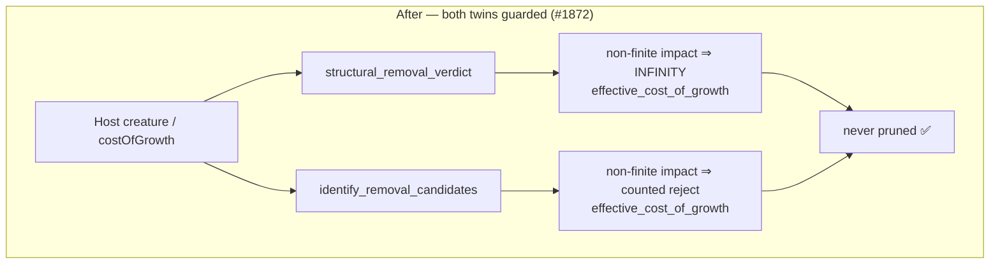

# Guard non-finite impact and `costOfGrowth` on the record-derived removal path

## Summary

The structural removal path was hardened against non-finite host-shaped values
in #1804 (impact) and #1783 (`costOfGrowth`); the record-derived twin missed
both guards. Closes #1872.

Two gaps, one root cause — every removal gate is **NaN-false**, so a NaN slips
through all of them and then the descending `total_cmp` sort orders a positive
`NaN` *above* `+inf`:

1. **NaN contribution became the top-ranked removal candidate.**
   `identify_removal_candidates` had no non-finite guard, so a NaN synapse weight
   propagating through `activation_weighted_impact` produced the strongest
   licence for a destructive edit on the one neuron whose contribution cannot be
   reasoned about.
2. **Raw `costOfGrowth` made every neuron prunable.** `rank_selectable` read
   `args.cost_of_growth.unwrap_or(DEFAULT_COST_OF_GROWTH)`, bypassing the #1783
   validator. A non-finite or non-positive host value makes `savings` NaN, and
   the same NaN-false gates then emit **every** ranked neuron.

### Fix

- `identify_removal_candidates` rejects a neuron whose `impact` or
  `activation_weighted_impact` is non-finite, mirroring the structural path's
  `f32::INFINITY` policy — a contribution that cannot be reasoned about is
  treated as infinitely costly to remove. The drop is a **counted** verdict
  (`savings_below_impact_rejections`), so the #1808 conservation invariant still
  holds and nothing fails silently.
- `rank_selectable` resolves its threshold through `effective_cost_of_growth`
  (now `pub(super)`), which WARNs on the offending value and substitutes
  `DEFAULT_COST_OF_GROWTH`.

A genuine `0.0` contribution stays prunable on both paths — the guard does not
over-correct.

## Evidence

Backend library change, no web interface to screenshot. The evidence is the
regression linkage: each new test was run against the **unfixed** code and
reproduces the exact failure the issue describes.

With both guards temporarily removed:

```
---- record_derived_path::nan_contribution_is_never_a_removal_candidate ----
a NaN contribution must never license removal, got ["h-nan", "h-zero"]

---- record_derived_path::nonsense_cost_of_growth_does_not_flood_removal_candidates ----
costOfGrowth NaN must fall back to the default, not make every neuron
prunable; got ["h-zero", "h-keep", "out-0", "out-1", "h-nan"]
```

`h-nan` ranks **first**, and a NaN `costOfGrowth` emits all five ranked neurons —
precisely the two failures reported. Both pass after the fix.

### The two twin paths, before and after





## Test Plan

**New integration tests** — `tests/issue_1804_nonfinite_impact_not_prunable.rs`,
module `record_derived_path`, driving the shipped public `rank_focus_neurons`
against a real parquet fixture (a NaN weight is inexpressible over the JSON FFI
boundary but reachable through the `CreatureJson` struct this API takes):

- `nan_contribution_is_never_a_removal_candidate` — reproduces gap 1.
- `zero_contribution_still_prunable_and_high_contribution_still_safe` — the
  no-over-correction pair.
- `nonsense_cost_of_growth_does_not_flood_removal_candidates` — reproduces gap 2
  across `NaN`, `±∞`, `0.0` and `-1e-4`.

**New unit tests** — `src/focus/ranking/removal_candidates.rs`, module
`record_path_nonfinite_tests`:

- `nan_activation_weighted_impact_is_never_a_candidate` — also asserts the
  #1808 conservation invariant and that the genuine candidate survives.
- `infinite_and_nan_impact_are_never_candidates` — `+∞`, `-∞`, NaN `impact`.
- `zero_contribution_is_still_a_candidate` — no over-correction.
- `effective_cost_of_growth_rejects_nonsense_host_values` — the #1783 validator
  directly.
- `validated_threshold_stops_the_flood_a_raw_nan_would_cause` — pins the hazard
  (raw NaN threshold passes every gate) beside the validated behaviour.

No existing test was modified, commented out, or removed. `./quality.sh` passes.

## Security self-check

- **Input validation**: this change *adds* validation on host-supplied
  `costOfGrowth` and on derived impact values; it removes none.
- **Fail loud**: the rejected `costOfGrowth` is logged at WARN naming the
  offending value and the substituted default; the rejected neuron is counted
  under a named rejection reason, never silently dropped.
- No secrets, new dependencies, injection surface, or endpoints touched.
