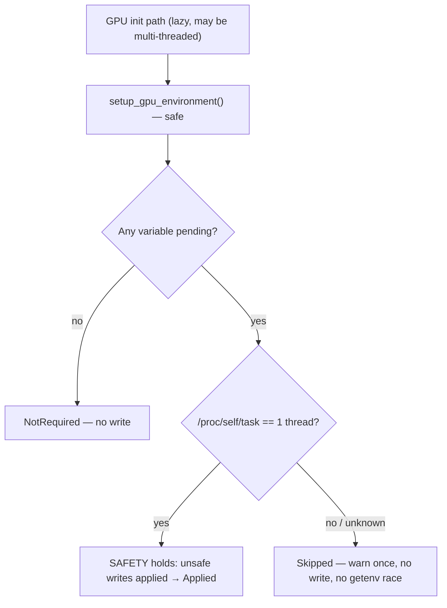

# Enforce the GPU env-setup thread invariant instead of asserting it (Issue #1873)

## Summary

Three safe `pub` functions — `GpuAnalyzer::check_gpu_availability`,
`GpuAnalyzer::new` and `get_adapter_info_internal` — discharged
`unsafe { suppress_mesa_warnings_if_requested(); ensure_xdg_runtime_dir(); }`
under a `// SAFETY:` comment claiming the call "runs before any GPU init and
thus before any thread that reads the process environment is spawned". Nothing
enforced that: GPU init is lazy (`OnceLock`), reachable straight from the FFI
entry point, and rayon pools spawn independently of it — so in a multi-threaded
Deno host the `set_var` could race a concurrent `getenv` (undefined behaviour on
POSIX under Rust 2024 semantics).

This applies the issue's option 2 with the invariant made *checkable* rather
than merely documented: a new safe entry point
`analysis::utils::platform::setup_gpu_environment()` reads the live OS thread
count from `/proc/self/task` and only performs the writes when the process is
observably single-threaded. When other threads already exist it skips the writes
and warns loudly (never silently), telling the operator to export
`XDG_RUNTIME_DIR` — and the Mesa variables under
`NEAT_AI_DISCOVERY_QUIET_GPU=1` — in the host environment instead. The three
call sites now call the safe function, so no safe caller asserts an invariant it
cannot uphold, and the remaining `// SAFETY:` comment sits at the one place the
code actually enforces it.

The raw `unsafe` entry points from Issue #1753 are unchanged and still carry
their `# Safety` contracts; only the safe callers changed.

Closes #1873.

## Evidence

Backend-only change (no web interface to screenshot). Verified by the unit and
integration tests below.

Verdict semantics:

| Verdict | Meaning |
|---------|---------|
| `Applied` | Process was observably single-threaded; the writes ran. |
| `NotRequired` | Non-Linux, or every variable already set by the host. |
| `Skipped` | Other threads live (or count unreadable) — writes refused and warned. |

Behaviour change documented in `docs/GPU_GUIDE.md` (the XDG_RUNTIME_DIR
troubleshooting section now tells operators to export the variable before
starting a multi-threaded host).

## Test Plan

Added in `src/analysis/utils/platform.rs`:

- `test_may_mutate_environment_requires_single_thread` — truth table for the
  guard: only `Some(1)` permits a write; `Some(2)`, `Some(64)` and `None`
  (undeterminable) all refuse.
- `test_live_thread_count_sees_extra_threads` (Linux) — the count grows while a
  spawned thread is alive, and the guard refuses the write for that count.
- `test_setup_gpu_environment_is_safe_and_consistent` — the entry point is
  callable from safe code and repeated calls agree.
- `test_setup_gpu_environment_skips_when_other_threads_live` (Linux, serial) —
  regression guard for the race: with a live second thread and
  `XDG_RUNTIME_DIR` removed, the verdict is `Skipped` and the variable is still
  unset afterwards (against the unfixed code the variable would have been
  written).
- `test_setup_gpu_environment_is_a_noop_off_linux` (non-Linux).

Added in `tests/gpu/issue_1873_gpu_env_setup_thread_guard.rs`:

- `setup_gpu_environment_is_safe_and_consistent`
- `setup_gpu_environment_never_writes_while_threads_live` — never reports
  `Applied` while another thread is alive.
- `setup_gpu_environment_skips_or_is_unnecessary_on_linux` (Linux)
- `setup_gpu_environment_is_not_required_off_linux` (non-Linux)

No existing tests were removed or modified; the Issue #713/#1753 tests of the
raw `unsafe` entry points still pass unchanged.
