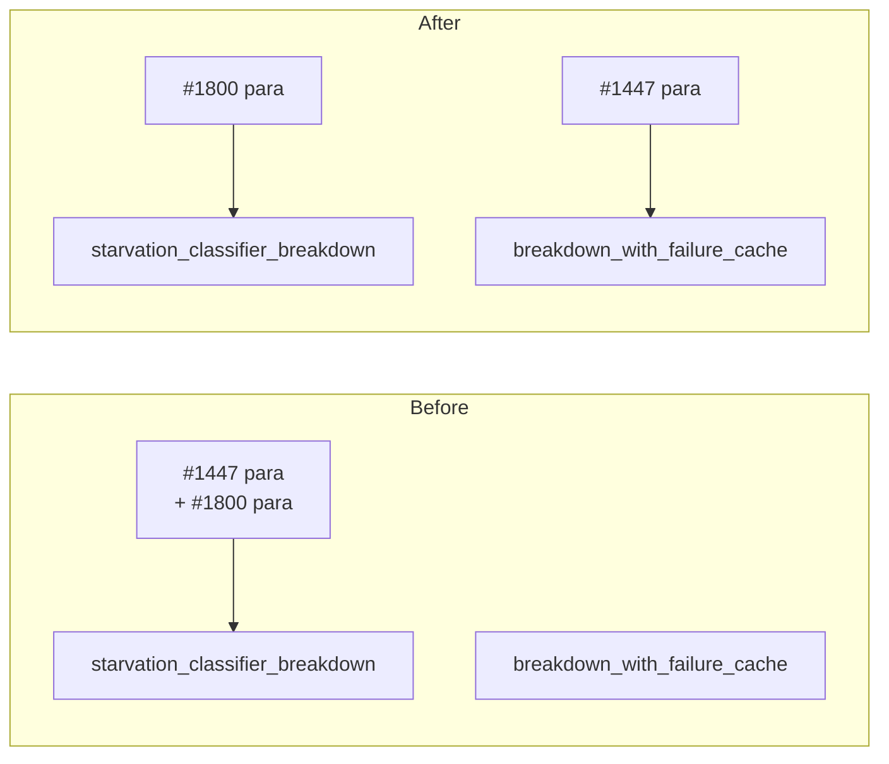

## Summary

Split the fused rustdoc block in `src/ffi_internal/analysis.rs`. Closes #1874.

The #1447 paragraph describing `breakdown_with_failure_cache` ("Clone a
rejection breakdown into its wire map…") had been merged into the top of the
#1800 doc block and left sitting on `starvation_classifier_breakdown`, while
`breakdown_with_failure_cache` itself carried no doc comment. Because rustdoc
takes the first line as the summary, `starvation_classifier_breakdown`'s
summary described the wrong function.

The #1447 paragraph now sits on `fn breakdown_with_failure_cache`, and
`starvation_classifier_breakdown` keeps only its own #1800 text — so its
summary line is again "Assemble the rejection breakdown the starvation
classifier reads for a pass (Issue #1800)."

Doc comments only — no behaviour, signature, or control-flow change.

## Evidence

Backend/library change with no web interface, so there is no screenshot to
capture. Verification is the quality gate:

- `./quality.sh < /dev/null` passes (fmt, clippy `-D warnings`, check, test,
  release build), confirming the moved rustdoc still compiles and that no
  behaviour changed.
- The two functions' behaviour is exercised by the existing suite in
  `tests/issue_1800_failure_cache_starvation_classification.rs`, which continues
  to pass unmodified.

Doc ownership before and after:

## Test Plan

- No tests added or modified: the change is rustdoc-only and adds no new
  behaviour to assert on. A test that greps source text for doc comments would
  verify nothing useful and is explicitly against this repo's testing doctrine.
- Existing coverage relied on:
  `tests/issue_1800_failure_cache_starvation_classification.rs` — exercises
  `starvation_classifier_breakdown` and the failure-cache suppression counting
  through the FFI surface; run as part of `./quality.sh`.
