## Summary

The three drought-reset call sites in `src/analysis/orchestration.rs` guarded
the process-global target-failure tracker with `if let Ok(mut guard) = …lock()`
(and `.lock().ok()` at the diagnostic snapshot) with no else arm, so a poisoned
mutex silently skipped `maybe_perform_drought_reset` / `rearm_drought_reset` and
degraded the drought diagnostic to "no tracker" — with zero log output. That is
exactly the silent no-op the drought-reset design (Issue #1794) forbids for the
one lever an operator reaches for during a drought.

All three sites now recover poison via `PoisonError::into_inner`, matching the
convention already documented in `src/analysis/target_pass_outcomes.rs` and used
by `advance_global_epoch` and both `apply_target_cooldown` sites. The state under
this lock is counters mutated by infallible HashMap/arithmetic operations, so a
poisoned guard is still internally consistent and recovery is safe.

The lock-and-act step was lifted into three small mutex-taking helpers so the
recovery is directly testable against a genuinely poisoned mutex:

- `drought_reset::maybe_perform_drought_reset_locked`
- `drought_reset::rearm_drought_reset_locked`
- `target_failure_tracker::snapshot_tracker`

Closes #1875.

## Evidence

Backend-only change — no web interface to screenshot. Verified by the new
regression tests plus the full `./quality.sh` gate.

The behaviour change, at the poisoned-lock branch:

```mermaid
flowchart LR
    P[Poisoned tracker lock] --> B{lock&#40;&#41;}
    B -->|before: Err ignored| S[Reset skipped silently<br/>no log, lever no-ops]
    B -->|after: PoisonError::into_inner| R[Reset / re-arm / snapshot<br/>proceed on recovered state]
```



Regression check — reverting the two helpers to the old skip-on-poison shape
fails the new tests:

```
thread 'drought_reset_clears_cooldowns_through_a_poisoned_lock' panicked:
  a poisoned lock must not skip the escape hatch
thread 'rearm_clears_the_tombstone_through_a_poisoned_lock' panicked:
  a poisoned lock must not skip the re-arm
test result: FAILED. 2 passed; 2 failed
```

With the fix in place:

```
running 4 tests
test drought_reset_clears_cooldowns_through_a_poisoned_lock ... ok
test snapshot_returns_tracker_state_through_a_poisoned_lock ... ok
test drought_reset_still_honours_thresholds_through_a_poisoned_lock ... ok
test rearm_clears_the_tombstone_through_a_poisoned_lock ... ok
test result: ok. 4 passed; 0 failed
```

## Test Plan

Added `tests/issue_1875_drought_reset_poison_recovery.rs`, which poisons a
tracker mutex (panic while holding the guard) and asserts:

- `drought_reset_clears_cooldowns_through_a_poisoned_lock` — the escape hatch
  still fires and clears both cooldown entries; below-threshold tracking is
  preserved.
- `drought_reset_still_honours_thresholds_through_a_poisoned_lock` — poison
  recovery does not bypass the streak threshold.
- `rearm_clears_the_tombstone_through_a_poisoned_lock` — the re-arm still clears
  the one-shot tombstone.
- `snapshot_returns_tracker_state_through_a_poisoned_lock` — the diagnostic
  snapshot carries real tracker state and epoch, not an empty fallback.

Existing drought-reset suites (`issue_1205_drought_reset_escape_hatch`,
`issue_1794_noop_reset_fail_loud`, `target_cooldown_population`,
`suppression_wiring_regression_1795`) continue to pass unchanged.
