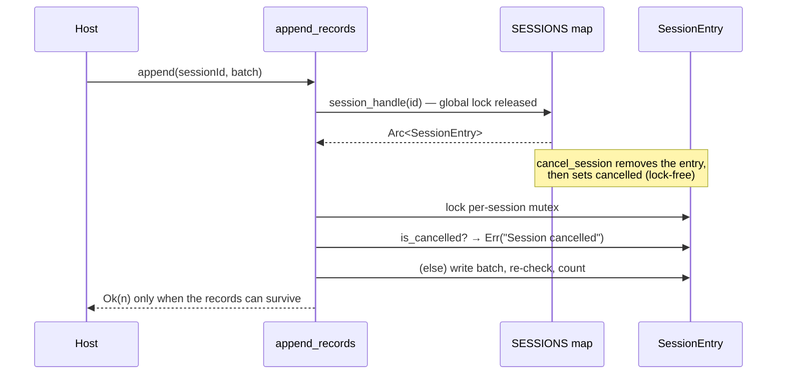

# Return an error when appending to a cancelled session

## Summary

`append_records` in `src/streaming.rs` could return `Ok(records_in_batch)` for a
session that `cancel_session` or the TTL sweep had already removed from the
global map. The #1751 restructure releases the global lock as soon as the
per-session `Arc` is cloned, so a cancellation landing in the window between the
clone and the per-session lock — or while a long append holds that lock — left
the appender writing into a `.parquet.tmp` file that was about to be deleted,
while the caller was told the records had been written. An error path that
reports success is the hardest kind to debug from the host side of an FFI
boundary.

Sessions now carry a cancellation tombstone. `SessionEntry` wraps the
`Mutex<RecordingSession>` alongside an `AtomicBool`, so `cancel_session` and
`cleanup_stale_sessions` mark a session dead **without** taking the per-session
lock — cancelling still never waits on an in-flight Parquet write.
`append_records` checks the flag after acquiring the per-session lock (fail fast,
before any disk write) and again after its writes but before counting the batch,
so a batch whose records cannot survive is rejected with
`Session cancelled: <sessionId>` and is not added to `records_written`.

`finish_session` is deliberately untouched: it removes the entry before locking
and never sets the tombstone, so a concurrent append + finish keeps its existing
behaviour.

Closes #1876.

## Evidence

Backend/FFI change with no web interface, so there is no screenshot. The
behaviour is verified by the tests listed below.



TDD evidence — with both `is_cancelled()` checks removed, the new unit tests fail
with the pre-fix behaviour:

```
---- streaming::tests::test_append_via_handle_cancelled_after_lookup_errors stdout ----
panicked: appending to a cancelled session must return an error: 3
---- streaming::tests::test_append_via_handle_swept_after_lookup_errors stdout ----
panicked: appending to a swept session must return an error: 3
```

With the fix in place all streaming tests pass:

```
cargo test --lib streaming::
test result: ok. 28 passed; 0 failed

cargo test --test issue_1876_cancelled_session_append --test issue_1751_streaming_session_locks
test result: ok. 2 passed; 0 failed
test result: ok. 3 passed; 0 failed
```

## Test Plan

Unit tests added in `src/streaming.rs` (they drive the internal
`append_to_handle`, which makes the cancel-after-lookup window directly
reproducible):

- `test_append_via_handle_cancelled_after_lookup_errors` — a handle resolved
  before `cancel_session` must not report the doomed batch as written.
- `test_append_via_handle_swept_after_lookup_errors` — same for a session evicted
  by `cleanup_stale_sessions`.
- `test_cancel_does_not_wait_for_an_in_flight_write` — cancelling while the
  per-session lock is held returns within the timeout, and the following append
  errors.
- `test_cancelled_append_does_not_count_records` — a rejected append leaves
  `records_written` at zero.

Integration tests added in `tests/issue_1876_cancelled_session_append.rs` (public
API only):

- `appending_to_a_cancelled_session_fails_loudly`
- `concurrent_cancel_stops_appends_reporting_success` — a worker appending in a
  loop starts failing once the session is cancelled, and the partial `.tmp` file
  is removed.

Existing tests are unchanged; `tests/issue_1751_streaming_session_locks.rs` and
the streaming unit tests continue to pass, confirming the per-session locking
behaviour from #1751 is preserved.

## Documentation

- `docs/STREAMING_GUIDE.md` — the Session Cancellation section now documents that
  cancellation is final and that later appends return `success: false`.
- `CHANGELOG.md` — entry under Unreleased → Fixed.
- Module docs in `src/streaming.rs` — new "Cancellation tombstone" section.
