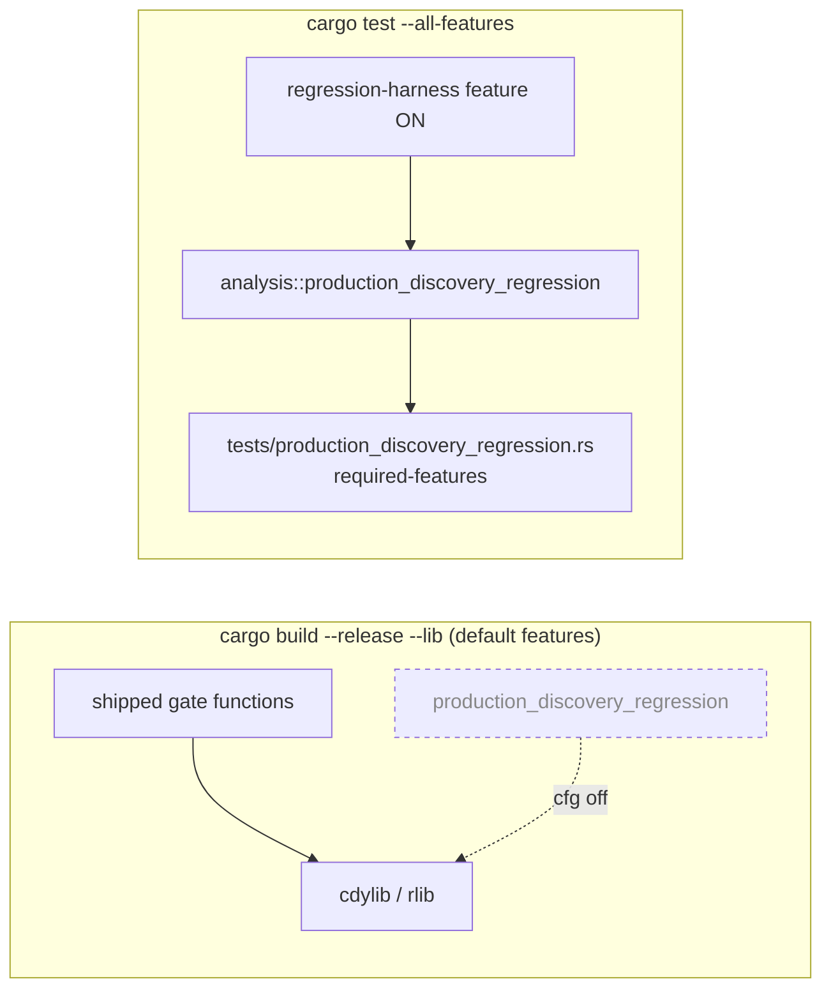

# Feature-gate the regression harness out of the shipping library (Issue #1877)

## Summary

`src/analysis/production_discovery_regression.rs` is regression-test scaffolding
— fixture parsing, disk I/O via `DiscoveryRunBatch::from_json_file`, plateau
constants — that was compiled unconditionally into the release `cdylib`/`rlib`.
Its only consumer outside its own unit tests is
`tests/production_discovery_regression.rs`.

The module is now gated behind a new **off-by-default** `regression-harness`
cargo feature, and the integration test declares
`required-features = ["regression-harness"]`. Release builds drop the harness
entirely; the acceptance functions it drives
(`validate_coordinated_candidate_gain`, `coordinated_post_discount_noise_floor`)
remain shipped and unconditional, so the harness still exercises the real gate.

`./quality.sh` and CI already run clippy, `cargo check` and `cargo test` with
`--all-features`, so the harness and its test target keep running on every PR
with no CI change. `cargo build --release --lib` uses default features and now
excludes the module.

Closes #1877.

## Evidence

Backend/library change — no web interface to screenshot. Verified by symbol
inspection of the built `rlib` plus the test suite below.

```bash
# default features — harness absent from the shipped artefact
cargo build --lib
nm -gU target/debug/libneat_ai_discovery.rlib | grep -c production_discovery_regression
0

# feature enabled — harness compiled in for the test target
cargo build --lib --features regression-harness
nm -gU target/debug/libneat_ai_discovery.rlib | grep -c production_discovery_regression
179
```



Harness suite with the feature enabled:

```
running 7 tests
test regression_harness_feature_is_off_by_default ... ok
test harness_test_target_requires_the_feature ... ok
test accepted_improvement_rate_meets_threshold ... ok
test fixture_matches_recorded_plateau ... ok
test majority_accepted_batch_meets_success ... ok
test yield_collapse_is_flagged_below_baseline ... ok
test snapshot_fixture_loads_through_export_pipeline ... ok
```

## Test Plan

Two new cases in `tests/production_discovery_regression.rs`, written first and
confirmed failing against the ungated tree (`the crate must declare a
regression-harness feature` / `found: []`):

- `regression_harness_feature_is_off_by_default` — reads the crate's real
  manifest through `cargo metadata` and asserts the `regression-harness` feature
  exists and is **not** pulled in by the default feature set, so the release
  artefact cannot regain the harness.
- `harness_test_target_requires_the_feature` — asserts the harness test target
  declares `required-features = ["regression-harness"]`, so a default-feature
  `cargo test` skips it rather than failing to compile.

Both bound the `cargo metadata` subprocess with a 60 s `recv_timeout` so a
wedged cargo fails loudly instead of hanging an unattended run.

The five pre-existing harness cases and the module's own unit tests are
unchanged and still pass under `--all-features`.

## Files changed

- `Cargo.toml` — `[features] regression-harness = []`; `[[test]]` entry with
  `required-features`; version `0.74.196` → `0.74.197`.
- `src/analysis/mod.rs` — `#[cfg(feature = "regression-harness")]` on the module
  declaration.
- `src/analysis/production_discovery_regression.rs` — module docs record the
  gate.
- `tests/production_discovery_regression.rs` — two new gate tests.
- `CONTRIBUTING.md` — new *Cargo Features* section documenting the feature and
  why `--all-features` is required when running tests.
- `docs/analysis/discovery-regression-harness-1741.md` — re-run command now
  passes `--features regression-harness`.
