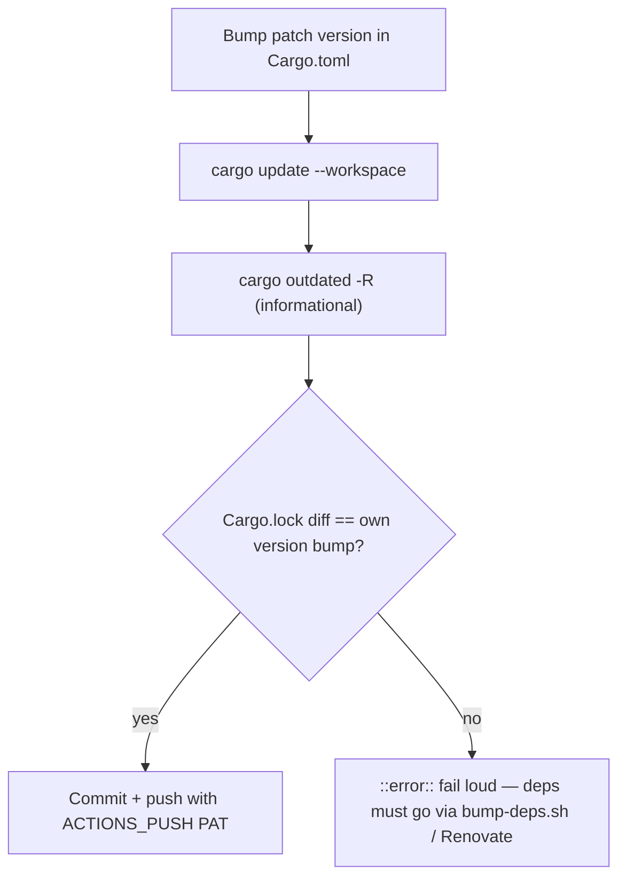

# CI `version-increment` no longer re-resolves `Cargo.lock` (Issue #1878)

## Summary

The `version-increment` job in `.github/workflows/ci.yml` bumped the patch
version and then ran a bare `cargo update`, re-resolving every direct **and**
transitive dependency to the newest published version with no age check. The
result was committed and pushed with the `ACTIONS_PUSH` PAT, so a crate
published minutes earlier landed in the committed lockfile on every PR — the
same bypass Issue #1865 removed from `./quality.sh`, on the CI path instead.

The job only ever needed `Cargo.lock` to record the crate's own new version:

- `cargo update` → `cargo update --workspace`, which updates only the workspace
  package and leaves every dependency resolution as recorded.
- A fail-loud guard now asserts the `Cargo.lock` diff is exactly this crate's
  own version bump. Anything else aborts the job rather than pushing an
  unquarantined dependency graph (this also covers a lockfile mutation by
  `cargo outdated`). Dependency movement stays with `./bump-deps.sh` (which
  enforces `VIBE_BUMP_QUARANTINE_HOURS`) and Renovate.

Closes #1878.

**CI approval:** `AGENTS.md` requires explicit approval for `ci.yml` changes.
The change is confined to the two lines named in the issue plus the guard; the
job's triggers, PAT-driven push, and skip logic are untouched. It needs a
sign-off from a human with CI approval rights before merge.

## Evidence



No web interface to screenshot — this is a CI/build-path change. Verification is
the behavioural test below, which extracts the real `run:` script from `ci.yml`
and executes it against a throwaway git repository with a stubbed `cargo`:

```
running 2 tests
test version_increment_step_fails_loud_when_dependencies_move ... ok
test version_increment_step_never_re_resolves_the_lockfile ... ok

test result: ok. 2 passed; 0 failed
```

Both tests fail against the pre-fix workflow — the first on
``` `cargo update` re-resolves every direct and transitive dependency ```, the
second because the step exited 0 after a simulated dependency re-resolve.

`actionlint .github/workflows/ci.yml` reports the same two pre-existing
SC2086 findings in an unrelated step, and nothing new for the changed step.

## Test Plan

Added `tests/issue_1878_ci_version_increment_no_reresolve.rs`:

- `version_increment_step_never_re_resolves_the_lockfile` — runs the real step
  script with a stubbed `cargo`; asserts the patch version is bumped in
  `Cargo.toml`, the new version is recorded in `Cargo.lock`, the fixture
  dependency's pinned version is unchanged, and every `cargo update` the step
  issues is scoped (`--workspace` / `--precise` / `-p`).
- `version_increment_step_fails_loud_when_dependencies_move` — regression test
  for the bypass: the stub also moves a dependency's version, and the step must
  exit non-zero naming `Cargo.lock`.

Full `./quality.sh` gate run clean (fmt, clippy, cargo deny, doc build, tests,
release build).
