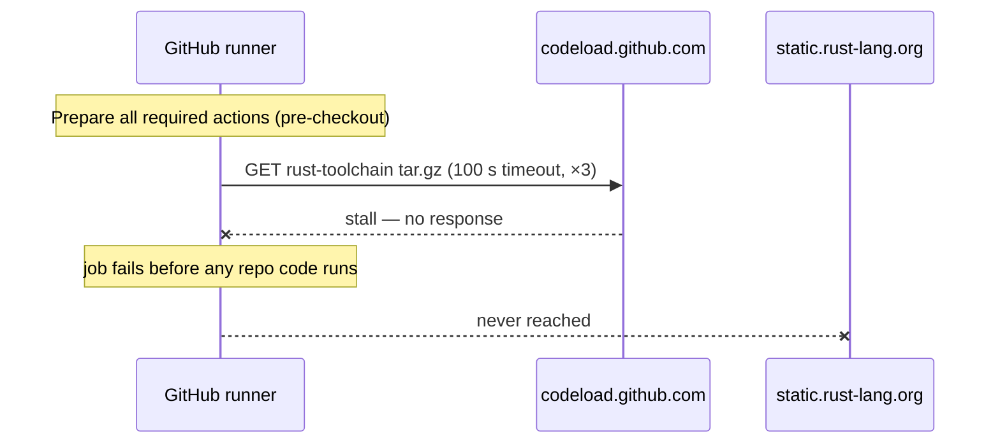
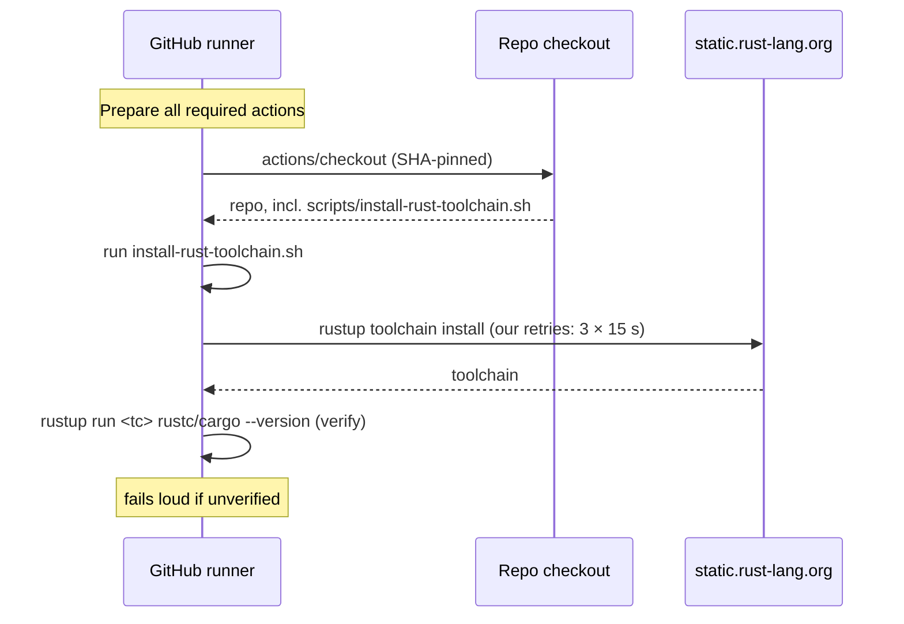

# PR Summary — Issue #1891

## Summary

The **Quality Checks** job on PR #1890 (run 30665006027) failed before any
repository code ran: the runner could not download
`dtolnay/rust-toolchain` from `codeload.github.com` during its *Prepare all
required actions* phase. That fetch has a fixed 100 s HttpClient timeout and a
3-attempt retry policy, both runner-internal and not tunable from a workflow, so
there was nothing the repository could do to survive a codeload stall. Every
sibling job in the same run used the same pinned SHA and passed, confirming this
is transport flakiness rather than a defect in the gate.

This change removes the action download from the critical path. All five call
sites now run a committed script, `scripts/install-rust-toolchain.sh`, which
drives the runner image's preinstalled `rustup`. Closes #1891.

Supply-chain posture (Issue #1216) is preserved rather than weakened: the SHA
pin existed so the executed third-party code was immutable, and the script keeps
that property by removing the third-party code entirely. The only executable
inputs left are the runner image's `rustup` and the toolchain it fetches from
`static.rust-lang.org` — which the action fetched anyway. Toolchain and
component names are validated against a strict `^[A-Za-z0-9][A-Za-z0-9._+-]*$`
allowlist before reaching `rustup`, so no caller-supplied string can be
interpreted as shell.

The residual network dependency (`static.rust-lang.org`) is now covered by
retries we control — three attempts with a 15 s delay by default, both tunable
via `RUST_TOOLCHAIN_MAX_ATTEMPTS` / `RUST_TOOLCHAIN_RETRY_DELAY` — which is
exactly what the codeload fetch did not allow.

### Approval note

`AGENTS.md` and `CONTRIBUTING.md` require explicit approval before
`.github/workflows/ci.yml` is modified. Issue #1891 is a human-filed, `work-on`
labelled issue that names the three ci.yml call sites (lines 102, 248, 447) as
the work to be done; that is the approval for this change. No triggers, job
graph, or the `ACTIONS_PUSH`-based `version-increment` push behaviour were
touched — only the toolchain-install step in each job.

## Changes

| File | Change |
|---|---|
| `scripts/install-rust-toolchain.sh` | New. Installs a toolchain via preinstalled `rustup`, with retries, input validation, and post-install verification. |
| `.github/workflows/ci.yml` | 3 call sites switched from the action to the script (`version-increment`; `quality` and `auto-format` with `rustfmt clippy`). |
| `.github/workflows/security.yml` | 1 call site switched. |
| `.github/workflows/cargo-quality.yml` | 1 call site switched (Coverage job). |
| `CONTRIBUTING.md` | CI Pipeline section documents the script and why it replaced the action. |
| `Cargo.toml` / `Cargo.lock` | Patch version `0.74.190` → `0.74.191`. |

## Evidence

This is a CI/CLI change with no web interface, so no screenshot applies. The
evidence is the test suite below plus the local quality gate.

### Before — the failure mode



### After — the action download is off the critical path



### Local quality gate

```
./quality.sh < /dev/null
...
✅ All quality checks passed!
```

`actionlint .github/workflows/*.yml` reports no new findings; the two `SC2086`
infos it emits for `$GITHUB_OUTPUT` in the `auto-format` job are pre-existing on
`Develop` and untouched here.

## Test Plan

New file `tests/issue_1891_rust_toolchain_install.rs` — 15 tests. The script
tests execute the real script with a stub `rustup` placed on `PATH`, asserting
on exit codes, stderr, and the commands actually invoked (recorded in a log the
stub writes), not on source text.

Behaviour of `scripts/install-rust-toolchain.sh`:

- `script_is_committed_and_executable` — present with the executable bit set.
- `help_flag_prints_usage_and_exits_zero` — `--help` surface.
- `installs_stable_by_default_and_sets_it_as_the_default_toolchain` — happy
  path; `rustup toolchain install stable --profile minimal --no-self-update`
  followed by `rustup default stable`.
- `passes_requested_components_through_to_rustup` — `stable rustfmt clippy` maps
  to `--component rustfmt --component clippy`.
- `accepts_components_as_a_single_comma_separated_argument` — the
  workflow-friendly `"rustfmt, clippy"` form.
- `verifies_the_toolchain_after_installing_it` — the install is positively
  confirmed by running `rustc`/`cargo` through the toolchain.
- `fails_loud_when_the_installed_toolchain_does_not_run` — a toolchain that
  installs but cannot run exits non-zero rather than reporting success.
- `retries_a_transient_install_failure` — two simulated network failures inside
  a 3-attempt budget still succeed, with exactly 3 attempts made. This is the
  regression test for #1891: it fails against the unfixed tree, where no
  repository-controlled retry existed at all.
- `fails_loud_when_the_retry_budget_is_exhausted` — exits non-zero, honours the
  budget, and names the attempt count in the error.
- `fails_loud_when_rustup_is_missing` — a missing `rustup` is a loud failure,
  not a silent skip.
- `rejects_toolchain_and_component_names_that_are_not_plain_identifiers` —
  injection-shaped inputs (`stable; rm -rf …`, `$(whoami)`, `clippy && curl …`)
  are rejected *before* `rustup` is invoked; the invocation log stays empty.
- `exports_cargo_bin_to_github_path_when_running_on_a_runner` — `~/.cargo/bin`
  is appended to `GITHUB_PATH` so later steps see the toolchain, matching what
  the action did.

Workflow regression guards:

- `no_workflow_downloads_the_rust_toolchain_action` — the action must not
  reappear in `ci.yml`, `security.yml`, or `cargo-quality.yml`.
- `every_toolchain_call_site_uses_the_committed_script` — 3 sites in `ci.yml`,
  1 each in `security.yml` and `cargo-quality.yml`.
- `call_sites_that_need_rustfmt_and_clippy_still_request_them` — the `quality`
  and `auto-format` jobs keep the components the action was previously given.

## Security Self-Check

- **Input validation** — toolchain and component names are allowlisted
  (`^[A-Za-z0-9][A-Za-z0-9._+-]*$`) before reaching `rustup`; rejection is
  covered by a test that asserts `rustup` is never invoked.
- **Injection surface** — no string concatenation into a shell; `rustup` is
  invoked as an argv array with quoted expansions.
- **Secrets** — none added; no hidden files staged.
- **Error handling** — `set -euo pipefail`, explicit non-zero exits with
  `::error::` annotations, and a positive post-install verification so a no-op
  install cannot pass as success.
- **Dependencies** — one third-party action removed; none added.
