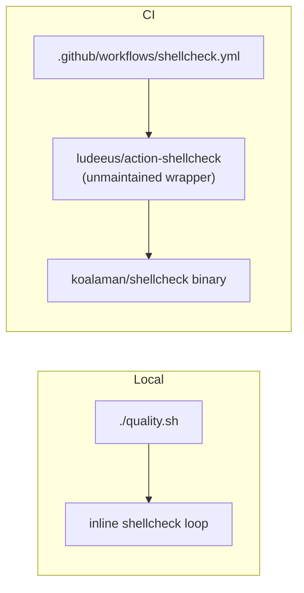
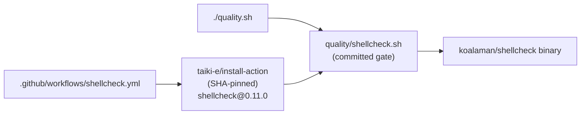

# Replace the unmaintained `ludeeus/action-shellcheck` wrapper with a committed gate

## Summary

The ShellCheck lint gate depended on `ludeeus/action-shellcheck`, an
unmaintained third-party wrapper (last release January 2023, last push to
`master` June 2024 — beyond the 24-month staleness threshold). An action nobody
maintains will never receive a fix, so if the runner environment or ShellCheck's
release layout changes, the gate breaks or silently degrades with no upstream to
repair it.

Rather than swapping one wrapper for another, this PR removes the wrapper layer
entirely — the option the issue names as the alternative, and the one that
matches the repository's own `quality/bash_syntax.sh` pattern:

- **Added `quality/shellcheck.sh`** — a committed gate script that runs
  ShellCheck over every `.sh` file. It fails loudly on a lint violation, on a
  missing scan root, when ShellCheck itself is not installed, and when it finds
  nothing to scan (a gate that scans nothing must not report success). It
  reports *every* offending script, not just the first.
- **`quality.sh` now calls it** instead of inlining its own shellcheck loop, so
  the local gate and the CI gate are the same code — one source of truth.
- **`.github/workflows/shellcheck.yml`** installs the ShellCheck binary straight
  from upstream `koalaman/shellcheck` releases via the already-vetted,
  SHA-pinned `taiki-e/install-action`, pinned to `shellcheck@0.11.0`, then runs
  the committed gate. No third-party wrapper action remains.

The underlying `koalaman/shellcheck` tool is actively maintained; only the
wrapper was orphaned, and it is now gone.

Closes #1898.

### Behaviour notes

- **Severity.** The wrapper ran with `severity: warning`; the committed gate uses
  ShellCheck's default severity, which is what `./quality.sh` has always enforced
  locally. CI is therefore now exactly as strict as the mandatory local gate
  rather than slightly looser. The repository passes cleanly at this severity
  (21 scripts).
- **SHA pinning (Issue #1215) is preserved.** Every action in the workflow is
  still pinned to a 40-character commit SHA with an auditable trailing version
  comment, and the ShellCheck binary version is pinned as well.
- **Repository isolation.** The gate is committed to and owned by this
  repository — nothing is centralised cross-repo.

## Evidence

This is a CI/CLI change with no web interface, so there is no screenshot.
Verification is the gate's own behavioural test suite plus a clean `./quality.sh`
run.

Before — the lint ran inside an orphaned wrapper action, and the local gate was
separate, duplicated logic:



After — one committed gate script, run identically in both places, with the
binary installed directly from upstream:



Gate output over this repository:

```text
shellcheck: OK — 21 script(s) passed ShellCheck
```

`actionlint .github/workflows/shellcheck.yml` passes, and the full
`./quality.sh` gate passes.

## Test Plan

Added `tests/issue_1898_shellcheck_gate.rs` (14 tests) — each runs the real
`quality/shellcheck.sh` against real fixture trees and asserts on exit codes and
output; none grep the script's source:

- `gate_passes_over_the_repository_itself`
- `gate_accepts_a_tree_of_clean_scripts`
- `gate_fails_loudly_on_a_lint_violation` — and names the offending script
- `gate_reports_every_failing_script_not_just_the_first`
- `gate_scans_scripts_with_spaces_in_their_path`
- `gate_ignores_build_artefacts_and_git_internals`
- `gate_fails_when_it_finds_nothing_to_scan` — no silent green
- `gate_fails_on_a_missing_root`
- `gate_fails_loudly_when_shellcheck_is_not_installed` — runs with an empty
  `PATH`; the gate must fail rather than skip the lint
- `quality_gate_invokes_the_committed_shellcheck_script`
- `a_ci_workflow_invokes_the_shellcheck_gate_on_pull_requests`
- `no_workflow_depends_on_the_orphaned_shellcheck_wrapper` — regression test for
  this issue: the wrapper cannot come back under any pin
- `shellcheck_workflow_actions_stay_sha_pinned` — Issue #1215 invariant, now
  asserted over every action rather than one named action
- `shellcheck_workflow_installs_a_pinned_shellcheck_version`

**Modified test (documented as required):**
`tests/test_shellcheck_workflow_pinning.sh` previously asserted pinning against
`ludeeus/action-shellcheck` *by name*, so it could not survive the action's
removal. It was rewritten — not weakened — to assert the same Issue #1215
invariant over **every** `uses:` reference in the workflow (40-char SHA, no
mutable branch, trailing version comment), plus a new check that the orphaned
wrapper has not returned. It still passes: 4 passed, 0 failed. No test was
commented out or deleted.

**Docs updated:** `CONTRIBUTING.md` (both the `./quality.sh` step list and the
CI workflow description) and the stale `ludeeus` comments in `ci.yml` and
`actionlint.yml` now point at `quality/shellcheck.sh`.
`docs/ci-doc-build-step.md`'s `quality.sh` line pointers were re-synced, since
replacing the inline shellcheck loop with a one-line call shifted the file.

> **Reviewer note:** `ci.yml` is touched, but the change is a **single stale
> comment** naming the removed action — no trigger, job, step, or permission is
> altered. Flagged here because `AGENTS.md` asks for approval before `ci.yml`
> changes.
