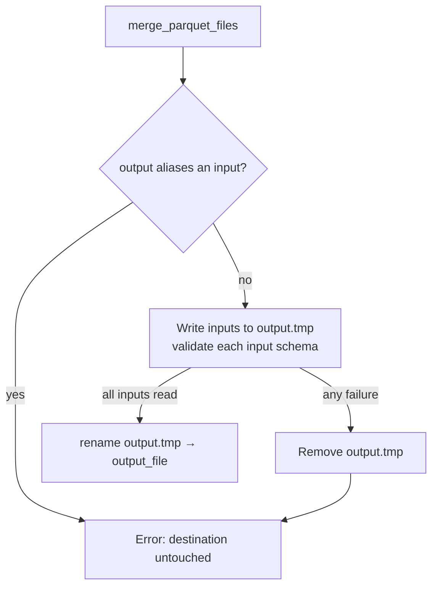

# Non-destructive, schema-validating parquet merge

## Summary

`merge_parquet_files` truncated the destination with `File::create` before it
had opened a single input, so any later failure — a missing input, an unreadable
footer, a corrupt batch — destroyed an existing merged parquet. It also skipped
the schema guard every read path enforces, letting arbitrary-schema parquet be
appended into a file downstream readers then trust.

The merge now:

- writes into a sibling `{output_file}.tmp` and `fs::rename`s it onto
  `output_file` only after every input has been read and the writer closed
  cleanly (the pattern already used by `src/streaming.rs`);
- removes the temporary file on any failure, leaving an existing destination
  byte-identical;
- calls `validate_parquet_schema(&builder, input_path, ColumnProfile::Full)` for
  each input before appending any batch (visibility relaxed to `pub(crate)`);
- rejects an `output_file` that resolves to one of `input_files` rather than
  silently truncating an input.

Closes #1900.

## Evidence

Backend/library change with no web interface, so no screenshot applies. The
evidence is the unit tests below, which fail against the unfixed code (verified
before implementing: three of the four failed, the fourth — the happy path —
passed) and pass afterwards.

Pre-fix failures (`cargo test --lib parquet_format::writer::tests`):

- `merge_preserves_destination_when_input_missing` — destination truncated to
  the 4-byte `PAR1` header.
- `merge_rejects_foreign_schema_and_leaves_destination_untouched` — failed only
  at batch-append time, after truncation.
- `merge_rejects_output_aliasing_input` — destination truncated, then the merge
  failed reading its own output.

Post-fix: all 20 `parquet_format` tests pass, and `./quality.sh` passes cleanly
(fmt, clippy, check, full test suite, docs, release build).

## Test Plan

Added to `src/parquet_format/writer.rs` (`#[cfg(test)] mod tests`):

- `merge_preserves_destination_when_input_missing` — pre-existing destination
  plus a nonexistent second input; asserts the destination's bytes are unchanged
  and no `.tmp` sibling remains.
- `merge_rejects_foreign_schema_and_leaves_destination_untouched` — input with a
  five-column non-discovery schema; asserts a schema-mismatch error, an
  unchanged destination, and no leftover `.tmp`.
- `merge_rejects_output_aliasing_input` — `output_file` listed in `input_files`;
  asserts an error rather than data loss.
- `merge_writes_all_inputs_and_leaves_no_temp_file` — happy path; asserts every
  input row reaches the merged file and no temporary file is left behind.

## Security Self-Check

- Input validation: each input parquet is schema-validated before its data is
  used; the aliasing check validates the caller-supplied path set reaching this
  code from `src/ffi_internal/utilities.rs`.
- No secrets, no new dependencies, no new shell/SQL/HTTP surface.
- Error handling: failures are returned with context and never masked as
  success; the only tolerated cleanup failure (`remove_file`) is logged via
  `tracing::warn!` while the original error still propagates.
