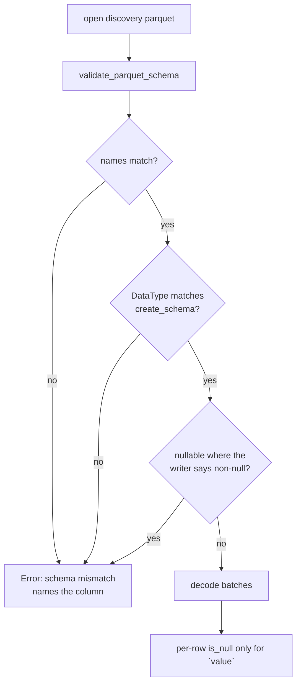

# Parquet schema validation now checks types and nullability, not just names

## Summary

`validate_parquet_schema` was the only gate on an incoming discovery Parquet and
it checked column **names** only. Arrow's `StringArray::value` /
`Float32Array::value` return the physical buffer contents for a null slot rather
than an error, so a file with a nullable `neuron_uuid` decoded as `""` — forming
a bogus group in the returned `HashMap<String, Vec<DiscoverRecord>>` — and a
nullable `activation` decoded as `0.0`, indistinguishable from a genuinely
recorded zero in MSE/MAE scoring. A wrong `DataType` was caught only incidentally
by the later `downcast_ref`, long after the file had been declared good.

The validator now checks each expected column's Arrow `DataType` **and**
nullability against the schema `create_schema()` produces, and fails the whole
file rather than substituting a default. `value` stays legitimately nullable and
keeps its per-row `is_null` handling. Closes #1901.

## Evidence

Backend/library change — no web interface to screenshot. Verified by the new
regression tests below; before the fix all six rejection cases decoded silently
(e.g. the null-UUID file produced a `""` group and the null-activation file an
`activation: 0.0` record), and after the fix each fails with a `schema mismatch`
error naming the offending column.

List columns are matched on element type and element nullability, not on the
element field's *name* — producers vary between `item` and `element` and the name
has no bearing on decoding.

## Test Plan

New `tests/issue_1901_parquet_schema_nullability.rs`:

- `nullable_activation_with_null_row_is_rejected` — nullable `activation` with a
  null row is rejected, error names the column.
- `nullable_neuron_uuid_with_null_row_is_rejected` — same for `neuron_uuid`, via
  both the grouped and the filtered read path.
- `nullable_obs_index_is_rejected` — same for `obs_index`.
- `wrong_data_type_is_rejected_by_validation_not_the_downcast` — `activation`
  typed `Float64` is rejected by the validator; the assertion fails if the error
  is the later "Failed to cast" downcast message.
- `nullable_column_is_rejected_under_the_without_errors_profile` — the projected
  read does not skip nullability validation.
- `nullable_errors_elements_are_rejected` — null error values would decode as
  `0.0`, so nullable list elements are rejected too.
- `writer_output_still_reads_back_unchanged` — round-trip guard: a file from
  `write_records_to_parquet` (including a legitimately null `value`) still reads
  through all four public read paths.

Existing coverage kept green: `tests/parquet_integrity_validation.rs`,
`tests/issue_1869_parquet_decode_bound.rs`, `tests/parquet_column_pruning.rs`,
`tests/issue_1406_shared_parquet_decode.rs`, `tests/cache_missing_parquet.rs`,
and the `merge_parquet_files` unit tests in `src/parquet_format/writer.rs`.

Documentation: `docs/FFI_API.md` gains a "Discovery Parquet Schema Validation"
section with the per-column type/nullability table.
