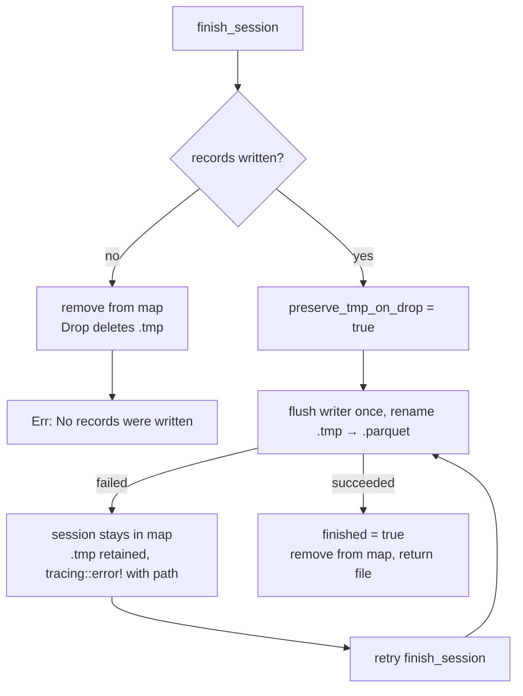

# Failed `finish_session` no longer deletes the complete recording

## Summary

`finish_session` removed the session handle from the global map *before*
finalising, and `RecordingSession::drop` deleted `{parquet_path}.tmp` whenever
`finished` was false. A transient `ENOSPC` on the writer flush, or an
`EXDEV`/`EACCES` on the rename, therefore dropped the last `Arc` with
`finished == false` and destroyed a recording that was fully written and
recoverable by retrying — and the session could not be retried, because the
handle was already gone ("Session not found").

Two changes fix this in `src/streaming.rs`:

- **The handle stays in the map until finalisation succeeds.** `finish_session`
  now looks the handle up, finalises, and only removes it once the flush *and*
  the rename have both succeeded. The writer is flushed at most once, so a retry
  after a failed rename renames the already-finalised file instead of erroring
  with "Session writer already consumed".
- **`Drop` distinguishes a failed finalisation from an abandoned session.** A new
  `preserve_tmp_on_drop` flag is set before the flush/rename; when set, `Drop`
  retains the `.tmp` file and logs at `error` level naming the retained path.
  Both failure paths in `finish_session` also log at `error` level with the
  retained path.

Existing behaviour is preserved for genuinely discardable sessions: a session
cancelled, TTL-swept, or dropped without any `finish_session` call still has its
`.tmp` removed, as does the `records_written == 0` bail (which now also retires
the session, matching the previous semantics).

Closes #1902.

## Evidence

Backend/library change — no web interface to screenshot. Verified by unit tests
in `src/streaming.rs` (`cargo test`) plus the full `./quality.sh` gate (fmt,
clippy, check, test, release build).

## Test Plan

Added to `src/streaming.rs`:

- `test_failed_finish_preserves_tmp` — blocks the rename with a non-empty
  directory at the destination, then asserts `finish_session` returns `Err`, the
  `.tmp` file still exists, its parquet contents hold every appended record, and
  the session is still registered. Clearing the obstruction and retrying
  `finish_session` succeeds and returns the full record count. This test fails
  against the unfixed code on both counts (the `.tmp` file is deleted and the
  retry returns "Session not found").
- `test_empty_session_finish_removes_tmp` — guards against over-correction: the
  `records_written == 0` bail must still delete the `.tmp` file and retire the
  session.

Unchanged and still green (over-correction guards):
`test_drop_without_finish_cleans_up_file`,
`test_cancel_session_cleans_up_incomplete_file`,
`test_finished_session_preserves_file`,
`test_streaming_empty_session_fails_to_finish`,
`test_streaming_session_lifecycle`.

Documentation: `docs/STREAMING_GUIDE.md` gains a "Failed Finalisation Is
Retryable" section with a Mermaid flowchart, and the `src/streaming.rs` module
docs gain a matching note.
