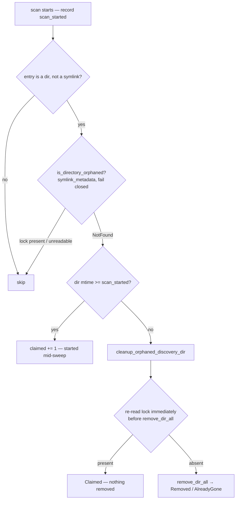

# Orphan sweep re-checks the lock before deleting (Issue #1903)

## Summary

The orphan sweep decided a directory was abandoned in `is_directory_orphaned`
and deleted it in a later, separate call. A discovery session that created
`discovery.lock` inside that window had its whole directory removed while it was
writing into it — the opposite of the invariant the docstring asserts.
Separately, `Path::exists()` follows symlinks and maps *every* error to `false`,
so a dangling-symlink lock file, or one that could not be stat'd because of a
permissions error, read as "no lock" and made the directory eligible for
deletion. Closes #1903.

Three changes in `src/discovery_cleanup.rs`:

1. **Last-moment lock re-check.** `cleanup_orphaned_discovery_dir` (the sweep's
   removal path) re-reads the lock immediately before `remove_dir_all` and
   returns `CleanupOutcome::Claimed` without removing anything when it is
   present. This narrows the window to the interval between the final probe and
   the syscall rather than closing it — the practical limit without a
   directory-level lock. The self-cleanup path `cleanup_discovery_dir` keeps its
   existing behaviour: a session cleaning up its *own* directory legitimately
   holds the lock, so re-checking there would break the Issue #1100 flow.
2. **Fail-closed lock probe.** `is_directory_orphaned` now uses
   `fs::symlink_metadata`; only `NotFound` counts as "no lock". Any other error
   — dangling symlink, permissions — is logged and treated as *in use*.
3. **Age floor.** `clean_orphaned_discovery_dirs_since(base_dir, scan_started)`
   sweeps only directories last modified before the scan started;
   `clean_orphaned_discovery_dirs` passes `SystemTime::now()`. Creating a
   directory or writing `discovery.lock` into it bumps the directory's mtime, so
   a session starting mid-sweep is never a candidate.

`OrphanCleanupResult.claimed` counts both cases, distinct from `removed`,
`already_gone`, and `errors`; the FFI `clean_orphaned_discovery_dirs` output
gained a `claimed` field and the summary log line now reports it.

## Evidence

Backend/FFI change with no web interface, so there is no screenshot. The
evidence is the test run below plus the flow the change enforces:



Test run (`cargo test --test issue_1903_orphan_sweep_lock_recheck --test
issue_1866_cleanup_dir_path_guard`, plus the in-module suite):

```text
running 5 tests  (tests/issue_1903_orphan_sweep_lock_recheck.rs)
test claimed_defaults_to_zero ... ok
test genuinely_orphaned_directory_is_still_removed_by_the_sweep_path ... ok
test dangling_symlink_lock_is_not_orphaned ... ok
test lock_created_after_orphan_check_survives_sweep ... ok
test claimed_counter_reported_separately ... ok

running 10 tests (tests/issue_1866_cleanup_dir_path_guard.rs) ... ok
running 16 tests (src/discovery_cleanup.rs — Issue #1100 / #1218) ... ok
```

## Test Plan

New file `tests/issue_1903_orphan_sweep_lock_recheck.rs`:

- `lock_created_after_orphan_check_survives_sweep` — reproduces the race
  exactly: `is_directory_orphaned` returns true, a lock file is then created in
  the window, and the removal must report `CleanupOutcome::Claimed` with the
  directory and its parquet data intact. Fails against the unfixed code, where
  the directory is removed.
- `dangling_symlink_lock_is_not_orphaned` (unix) — a `discovery.lock` symlink
  pointing at a missing target must make `is_directory_orphaned` return false,
  and the full sweep must leave the directory alone. Fails against the unfixed
  `Path::exists()` probe.
- `claimed_counter_reported_separately` — an end-to-end sweep with an age floor
  an hour in the past counts the fresh directory as `claimed` (not `removed`,
  not an error) and leaves it in place; a second sweep with the real scan-start
  removes it, proving `claimed` is not a blanket veto.
- `genuinely_orphaned_directory_is_still_removed_by_the_sweep_path` — regression
  guard so the re-check does not block the case it exists to allow.
- `claimed_defaults_to_zero` — `OrphanCleanupResult` exposes the counter.

Unchanged and green: the in-module `#[cfg(test)]` suite in
`src/discovery_cleanup.rs` (Issue #1100 idempotence and `AlreadyGone`, Issue
#1218 root scoping and symlink skipping) and
`tests/issue_1866_cleanup_dir_path_guard.rs`. No existing test was modified or
removed.

## Security Self-Check

- **Input validation**: the new `scan_started` parameter is an in-process
  `SystemTime`; the existing `.discovery` allowlist and `..`/symlink guards on
  `base_dir` and `temp_dir` are untouched.
- **Injection surface**: no new shell, SQL, or HTTP calls; filesystem access is
  via typed `std::fs` APIs.
- **Error handling**: the lock probe and the mtime read fail closed — an
  unreadable timestamp is reported in `errors` and the directory is skipped,
  never silently treated as old.
- **Dependencies**: none added.
