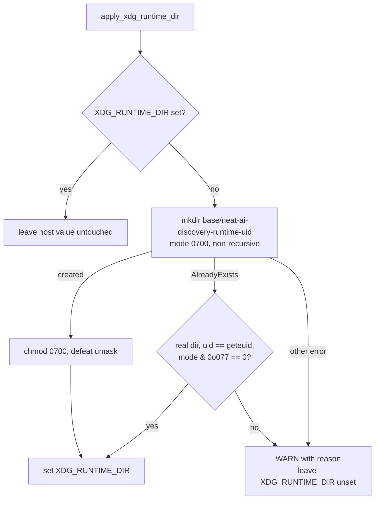

# XDG_RUNTIME_DIR fallback no longer adopts an untrusted /tmp directory (Issue #1904)

## Summary

The `XDG_RUNTIME_DIR` fallback pointed at the fixed, world-guessable path
`/tmp/neat-ai-discovery-runtime` created with `create_dir_all`, which returns
`Ok(())` for a pre-existing directory of **any** owner and **any** mode. Any
local user could pre-create that path mode `0777`, and the library would hand it
to wgpu as the runtime directory; when the library did create it, the mode was
`0777 & !umask` — typically world-readable `0755`, not the `0700` the XDG Base
Directory specification requires.

`src/analysis/utils/platform.rs` now prepares the directory through
`prepare_runtime_dir`, which:

- uses a **per-uid** leaf name (`neat-ai-discovery-runtime-<uid>`) so two users
  on one host never contend for the same path;
- creates it **non-recursively** with `DirBuilder::mode(0o700)` so a
  pre-existing entry surfaces as `AlreadyExists` instead of being adopted
  silently, then `chmod`s it to `0700` because `mkdir` masks the requested mode
  with the process umask;
- adopts a pre-existing entry only when `symlink_metadata` shows a real
  directory (not a symlink), `uid == geteuid()`, and `mode & 0o077 == 0`;
- otherwise **fails loud** — logs a `WARN` naming the reason and leaves
  `XDG_RUNTIME_DIR` unset, which wgpu tolerates, rather than adopting a
  directory another local user controls.

An already-set `XDG_RUNTIME_DIR` is still respected untouched, and the
single-threaded guard from Issue #1873 is unchanged.

Closes #1904.

## Evidence

This is a library/CLI change with no web interface, so there is no screenshot.
The evidence is the unit tests below, plus a manual regression check: with
`prepare_runtime_dir` temporarily reverted to bare `create_dir_all`, the two
rejection tests fail —

```
xdg_runtime_dir_rejects_preexisting_world_writable ... FAILED
  panicked: a world-writable directory must never be adopted
xdg_runtime_dir_rejects_symlink ... FAILED
  panicked: a symlinked path must never be adopted
```

and pass again once the check is restored.



## Test Plan

New unit tests in `src/analysis/utils/platform.rs` (`mod tests`). The directory
logic is `unix`-gated rather than `linux`-gated so it compiles and runs on both
the Linux CI runner — where the acceptance criteria require it, via
`cargo test --lib --tests --bins --all-features` in the `Quality Checks` job —
and on developer machines:

- `xdg_runtime_dir_created_with_mode_0700` — sets a permissive umask (`0`) for
  the call and asserts the newly created directory is exactly mode `0700` and
  carries the per-uid leaf name.
- `xdg_runtime_dir_rejects_preexisting_world_writable` — pre-creates the path
  mode `0777`, asserts preparation refuses it, asserts a warning was captured
  from `tracing`, and (via `TMPDIR`) asserts `apply_xdg_runtime_dir` leaves
  `XDG_RUNTIME_DIR` unset.
- `xdg_runtime_dir_rejects_symlink` — a symlink at the target path is refused
  with a warning.
- `xdg_runtime_dir_adopts_own_owner_only_directory` — the common case still
  works: an owner-only directory from an earlier run is reused, so preparation
  is idempotent.
- `xdg_runtime_dir_preserves_host_value` — an already-set `XDG_RUNTIME_DIR` is
  left untouched.

No existing tests were removed or modified.

## Notes

- `libc` (already in `Cargo.lock` transitively) is added as a `cfg(unix)`
  dependency for `geteuid` and, in tests, `umask`.
- `docs/GPU_GUIDE.md` documents the per-user path, the `0700` mode, and the
  refuse-and-warn behaviour.
- Version bumped `0.74.203` → `0.74.204`.
