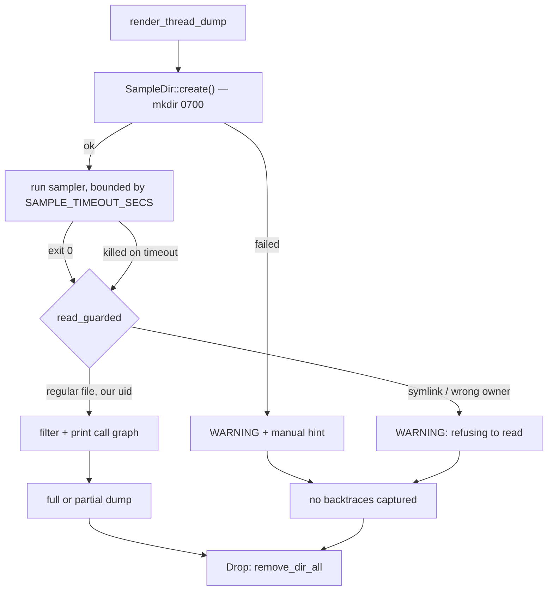

# Private, transient capture directory for the macOS sampler (Issue #1905)

## Summary

The macOS `sample` output path was fully predictable —
`$TMPDIR/neat_ai_discovery.sample.<pid>.<millis>.txt` — in a world-writable
directory, created by an external process that never got to pass `O_EXCL`, then
read back and echoed to stderr into the operator's log. A local user who won the
race chose what the operator read, and the kill-on-timeout path leaked the file
besides.

The sampler now writes into a per-invocation directory created with mode `0700`
and removed on every exit path, and the capture is only read after it is
confirmed to be a regular file owned by the current uid. `Closes #1905.`

- **`src/debug/sample_dir.rs`** (new): `SampleDir` creates the owner-only
  directory non-recursively (so an existing path fails loudly rather than being
  adopted) and removes it in `Drop`; `read_guarded` refuses anything that is not
  a regular file owned by this effective uid.
- **`src/debug/sample_capture.rs`**: holds the `SampleDir` for the whole
  capture, so cleanup covers the clean-exit, failure, and kill-on-timeout paths
  alike; refusals are written into the dump rather than swallowed.
- **`docs/GPU_GUIDE.md`**: documents that the capture is private and transient —
  the dump no longer prints a path to `cat` afterwards.

### Design



### Notes

- **No new dependency.** `tempfile` is a dev-dependency only, so the directory
  uses `DirBuilderExt::mode` plus an explicit `set_permissions` (umask masks the
  requested `mkdir` mode) — the same pattern as the runtime-directory
  preparation added for Issue #1904.
- **The "must NEVER hang" contract is preserved.** No blocking operation was
  added: creation is one `mkdir`, cleanup is one `remove_dir_all` over a
  single-file directory, and the timing assertions below still bound the dump.
- **Deliberately `#[cfg(unix)]`, not `#[cfg(target_os = "macos")]`.** The issue
  asked for macOS-gated tests but also noted that CI runs on `ubuntu-latest`, so
  macOS-gated tests never execute in GitHub CI. Gating on `unix` keeps them
  running on macOS *and* makes Linux CI the enforcing gate.
- **Behaviour change:** the dump previously printed
  `Full 'sample' output saved to: <path>` and the operator could `cat` it. The
  capture is now removed with its directory, so the dump reports the captured
  size instead, and `GPU_GUIDE.md` points operators at the manual-inspection
  recipe when they want a copy on disk.

## Evidence

Backend/CLI change with no web interface, so no screenshot applies. Evidence is
the test run: the four integration tests were written first and three of them
failed against the unfixed code (the fourth, the mode check, initially passed
spuriously because macOS `$TMPDIR` is itself `0700` — it was strengthened to
assert the capture lives in a *dedicated* directory, which the old code
violated).

Before the fix:

```text
---- the_capture_directory_is_removed_when_the_sampler_exits stdout ----
assertion `left == right` failed: a clean sampler exit must leave no temp directory behind
  left: ["/var/folders/.../T/neat_ai_discovery.sample.27679.1785757467172.txt", ...]
 right: []

failures:
    a_symlink_at_the_output_path_is_refused
    the_capture_directory_is_removed_when_the_sampler_exits
    the_capture_directory_is_removed_when_the_sampler_is_killed
test result: FAILED. 1 passed; 3 failed
```

After the fix:

```text
running 4 tests
test the_capture_directory_is_created_owner_only ... ok
test a_symlink_at_the_output_path_is_refused ... ok
test the_capture_directory_is_removed_when_the_sampler_exits ... ok
test the_capture_directory_is_removed_when_the_sampler_is_killed ... ok
test result: ok. 4 passed; 0 failed
```

`./quality.sh` passes end to end (fmt, clippy `-D warnings`, `cargo deny`, full
test suite, docs, release build): `✅ All quality checks passed!`

### Security self-check

- **Input validation**: the only external input is the capture file; it is
  validated as a regular file owned by this uid before being read.
- **Injection surface**: no new shell or SQL; the sampler is still spawned with
  an argument vector, not a shell string.
- **Error handling**: refusals and failed cleanup are reported loudly (into the
  dump and to stderr) rather than swallowed; nothing new is leaked to a
  user-facing response.
- **Secrets / dependencies**: no new dependency, no hidden files staged.

## Test Plan

New — `tests/issue_1905_sample_temp_dir.rs` (drives the real dump path via
`NEAT_AI_DISCOVERY_SAMPLE_PROGRAM`):

- `the_capture_directory_is_created_owner_only` — the sampler records its
  containing directory; it is not the shared temp dir and its mode is `700`.
- `a_symlink_at_the_output_path_is_refused` — a sampler that replaces the
  capture with a symlink to a bait file: the bait's contents never appear, the
  refusal is reported, and the banner says `no backtraces captured`.
- `the_capture_directory_is_removed_when_the_sampler_exits` — a full dump leaves
  no scratch space behind.
- `the_capture_directory_is_removed_when_the_sampler_is_killed` — the
  kill-on-timeout path still reports a partial dump, leaks nothing, and stays
  inside the sampler's time bound.

New — `src/debug/sample_dir.rs::tests`:

- `the_capture_directory_is_created_with_mode_0700`
- `two_capture_directories_are_distinct`
- `dropping_the_capture_directory_removes_it_and_its_contents`
- `a_regular_file_we_own_is_read`
- `a_symlink_at_the_capture_path_is_refused`
- `a_directory_at_the_capture_path_is_refused`
- `a_missing_capture_is_not_found`

Modified — `src/debug/sample_capture.rs::tests`: no test was removed or
disabled. `an_empty_output_file_is_not_readable_content` follows
`read_non_empty` → `read_capture` (which now takes the dump buffer so refusals
are logged) and additionally asserts that missing/empty captures are *not*
logged as refusals; the two `write_filtered_sample_output` tests drop the
now-removed path argument.

Unchanged and still passing — `tests/issue_1934_sample_fallback.rs` (all five
cases), which pins the degrade-never-disappear contract and the timing bound.
