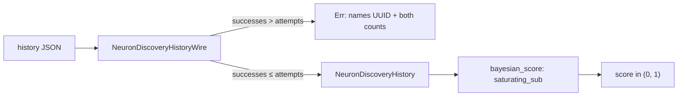

# PR Summary — Issue #1906

## Summary

`NeuronDiscoveryHistory` derived `Deserialize` with no invariant check, so a
corrupt or hand-edited history JSON such as `{"attempts":1,"successes":5}`
reached `bayesian_score()`, where the plain `u32` subtraction
`self.attempts - self.successes` panicked in debug builds and wrapped to
`4294967292` in release builds — silently returning a score of ≈ `1.4e-9` and
permanently deprioritising the neuron via `bayesian_score_for`.

Two changes close it, one at the boundary and one in the arithmetic:

- **Reject at the boundary.** `NeuronDiscoveryHistory` now deserialises via
  `#[serde(try_from = "NeuronDiscoveryHistoryWire")]`. The conversion fails with
  a descriptive error naming the neuron UUID and both counts when
  `successes > attempts`, so bad data is rejected rather than quietly clamped.
  Every load path inherits this — including the `get_calibration_summary` FFI
  entry point, which surfaces it as
  `Failed to parse discovery history: invalid discovery history for neuron 'n1': successes (5) exceeds attempts (1)`.
- **Make the arithmetic total.** `bayesian_score()` uses
  `self.attempts.saturating_sub(self.successes)`, so even an instance
  constructed directly in-process (bypassing deserialisation) can never panic in
  debug or wrap in release.

Valid histories are untouched: the Beta posterior for `successes <= attempts` is
byte-for-byte the same, and `saturating_sub` is identical to `-` in that range.

Closes #1906.

## Evidence

Backend/library change with no web interface — no screenshot applies. Evidence
is the test run below.

Before the fix (debug), the new tests reproduced both halves of the defect:

```text
---- discovery_history::tests::test_deserialize_rejects_successes_exceeding_attempts stdout ----
successes > attempts must not deserialise: NeuronDiscoveryHistory { uuid: "n1", attempts: 1, successes: 5, ... }

---- discovery_history::tests::test_bayesian_score_invalid_counts_saturates stdout ----
panicked at src/discovery_history.rs:310:20: attempt to subtract with overflow

test result: FAILED. 4 passed; 2 failed
```

After the fix, both profiles pass:

```text
cargo test --lib discovery_history::            → test result: ok. 6 passed; 0 failed
cargo test --release --lib discovery_history::  → test result: ok. 6 passed; 0 failed
```

The release run matters: it is the only profile that exercises the silent-wrap
variant. `test_bayesian_score_invalid_counts_saturates` asserts the exact
saturated value `6/7`, not merely "within (0.0, 1.0)" — a wrapped result of
`1.4e-9` is technically inside that range and would otherwise slip through.



## Test Plan

Added to the `#[cfg(test)]` module in `src/discovery_history.rs`:

- `test_deserialize_rejects_successes_exceeding_attempts` — deserialising
  `{"uuid":"n1","attempts":1,"successes":5}` returns a descriptive `Err` naming
  the neuron and both counts, both standalone and nested inside a
  `DiscoveryHistory` container. Fails if the boundary check is removed or
  loosened to a silent clamp.
- `test_bayesian_score_invalid_counts_saturates` — an out-of-range instance
  built directly scores a finite `6/7`. Fails as a panic under debug and as an
  out-of-range value under release if `saturating_sub` is reverted to `-`.
- `test_deserialize_accepts_valid_counts` — `successes == attempts` still
  deserialises, guarding against an over-strict check.

Unchanged and still green: `test_bayesian_score_progression`,
`test_neuron_history_new`, `test_discovery_history_prune`, and the
`tests/recording/issue_227_discovery_history.rs` suite, which pin the happy-path
Beta posterior.

## Notes

- CI runs `cargo test` in the debug profile only. The new score test is
  profile-agnostic — it catches the panic under debug and the wrap under release
  — so no CI change was needed, and `.github/workflows/ci.yml` is untouched per
  AGENTS.md.
- `Cargo.toml` version bumped `0.74.205` → `0.74.206`.
- `docs/FFI_API.md` documents the new rejection on the `get_calibration_summary`
  error path.
