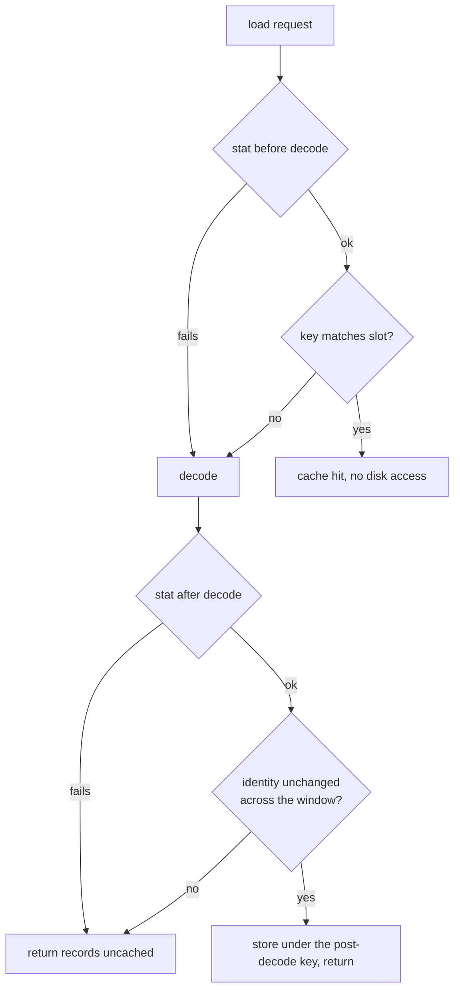

# Shared-records cache key describes the bytes actually cached (Issue #1907)

## Summary

The process-wide shared-decode cache
(`src/parquet_format/shared_records.rs`) keyed on file metadata sampled
**before** the decode, so the cached records need not be the bytes that were
`stat`'d, and every `stat` failure collapsed to the perfectly matchable key
`(path, 0, None)`. Closes #1907.

Three changes close the TOCTOU window:

1. **Unknown identity is not cacheable.** `CacheKey::for_path` now returns
   `Option<CacheKey>` — a failed `stat` (or an mtime the platform cannot express
   as a duration since the unix epoch) yields `None`, so two consecutive
   failures can no longer match each other.
2. **Device/inode in the key.** On unix the key carries `(dev, ino)` via
   `std::os::unix::fs::MetadataExt`, so a replacement file that reproduces the
   original's length and mtime is still a different file. Non-unix targets fall
   back to `None`.
3. **Post-decode identity.** The file is `stat`'d again after the decode and the
   records are stored only when the identity is unchanged across the whole
   window. If it changed — or is unknown at either end — the decoded records are
   returned to the caller **uncached**, so no later caller can hit an entry
   keyed to a superseded identity.

The cache logic moved behind `load_shared_with_decoder(path, decode)`, a private
seam that lets the unit test act inside the stat → decode window. The public API
(`load_grouped_records_shared`, `load_grouped_records_shared_with_budget`,
`decodes_for_path`, `invalidate`) and the `decodes` counter semantics are
unchanged.

A pre-existing rustdoc failure on the base branch (`private_intra_doc_links` on
`NeuronDiscoveryHistoryWire`, from the Issue #1906 merge) blocked `./quality.sh`
and is fixed in the same commit — one line, no behaviour change.

## Evidence

This is a library-internal change with no web interface to screenshot. Evidence
is the test suite: `./quality.sh` passes cleanly (fmt, clippy `-D warnings`,
`cargo check --all-targets --all-features`, `cargo test --lib --tests
--all-features`, rustdoc `-D warnings`, release build).

Regression linkage — with `src/parquet_format/shared_records.rs` reverted to the
unfixed version, `replacement_file_with_matching_len_and_mtime_is_not_a_cache_hit`
fails:

```text
test replacement_file_with_matching_len_and_mtime_is_not_a_cache_hit ... FAILED
panicked at tests/issue_1907_shared_records_cache_key.rs:81:5:
a different file must not be served from the previous file's cache entry
test result: FAILED. 2 passed; 1 failed
```

All six tests pass after the fix, alongside the existing Issue #1406 suite:

```text
running 3 tests (tests/issue_1907_shared_records_cache_key.rs)
test missing_path_never_seeds_cache ... ok
test unchanged_file_still_hits_cache ... ok
test replacement_file_with_matching_len_and_mtime_is_not_a_cache_hit ... ok

running 3 tests (tests/issue_1406_shared_parquet_decode.rs)
test second_load_is_a_cache_hit ... ok
test focus_then_analysis_decodes_parquet_once ... ok
test changed_file_invalidates_cache ... ok

running 1 test (src/parquet_format/shared_records.rs)
test parquet_format::shared_records::tests::rewrite_between_stat_and_decode_does_not_serve_stale_identity ... ok
```

Cache decision after the change:



## Test Plan

Added `tests/issue_1907_shared_records_cache_key.rs`:

- `replacement_file_with_matching_len_and_mtime_is_not_a_cache_hit` — swaps in a
  byte-identical file stamped with the original's mtime (same path, length and
  mtime, new inode) and asserts the second load is not served from the previous
  entry. Fails against the unfixed code.
- `missing_path_never_seeds_cache` — two loads of a non-existent path both fail
  and leave `decodes_for_path == 0`, guarding the `(path, 0, None)` collapse.
- `unchanged_file_still_hits_cache` — guards the Issue #1406 once-per-cycle
  contract: a repeated load of an unchanged file still hits the cache, hands back
  the identical `Arc`, and leaves the `decodes` counter at 1.

Added `src/parquet_format/shared_records.rs::tests`:

- `rewrite_between_stat_and_decode_does_not_serve_stale_identity` — rewrites the
  parquet inside the stat → decode window via the `load_shared_with_decoder`
  seam and asserts the caller receives the decoded bytes while nothing is
  cached, so no later load can be served the stale identity. This test needs to
  inject into the window, which an out-of-crate integration test cannot do, so
  it lives with the module rather than in `tests/`.

Unchanged and still passing: `tests/issue_1406_shared_parquet_decode.rs`, which
covers the decode-count semantics of this cache.
