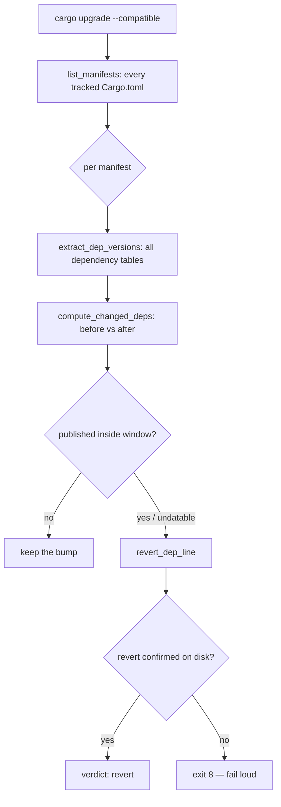

# PR Summary — Issue #1908

## Summary

The `bump-deps.sh` quarantine gate only age-checked `[dependencies]` and
`[dev-dependencies]` in the **root** `Cargo.toml`. Every other dependency
surface was bumped with no publish-age check at all: `[build-dependencies]`
(code that runs at compile time with the developer's/CI's privileges),
`[target.<spec>.dependencies]` — live in this repo since Issue #1904 pulled in
`libc` — `[<table>.<name>]` sub-tables, and the whole of `fuzz/Cargo.toml`,
which was never passed to the gate.

This change makes the manifest gate cover every tracked manifest and every
dependency table Cargo recognises. Closes #1908.

- `bump_deps::extract_dep_versions` now parses `[dependencies]`,
  `[dev-dependencies]`, `[build-dependencies]`, their `[target.<spec>.*]`
  forms, and `[<table>.<name>]` sub-tables (inline and sub-table version keys).
- `bump_deps::list_manifests` enumerates every **tracked** `Cargo.toml` via
  `git ls-files` (falling back to `find` outside a git checkout), so
  `fuzz/Cargo.toml` is gated and untracked/vendored manifests are not.
- `bump_deps::apply_manifest_quarantine` is the new per-manifest gate: it
  age-checks each changed requirement, reverts the in-quarantine ones and
  emits machine-readable `keep`/`revert` verdicts. It **fails loud** — a
  revert that does not actually rewrite the manifest returns non-zero and the
  run exits 8, rather than reporting a clean bump with an in-quarantine
  version still on disk.
- `bump_deps::revert_dep_line` now also rewrites the `version = …` key inside
  a matching `[<table>.<name>]` sub-table.
- The bump path loops over the manifest set for both the before/after snapshot
  and the gate; `--print-config` lists the gated manifests.

The awk parser was extended rather than replaced with `cargo metadata`: the
gate must run before `cargo` is trusted to resolve the bumped tree, `fuzz/` is
a separate workspace that `cargo metadata --no-deps` at the root does not
report, and the revert path needs manifest **text** positions, not resolved
metadata.

### Gate flow



## Evidence

Backend/CLI change — no web interface to screenshot. Verified by tests.

The four new tests were confirmed to **fail against the unfixed script** and
pass after the fix (`git stash push -- bump-deps.sh`):

```text
test extract_covers_all_dependency_tables ... FAILED
test build_dependency_bump_inside_window_is_reverted ... FAILED
test gate_scans_all_tracked_manifests ... FAILED
test target_dependency_bump_inside_window_is_reverted ... FAILED
test result: FAILED. 0 passed; 4 failed
```

After the fix:

```text
test extract_covers_all_dependency_tables ... ok
test gate_scans_all_tracked_manifests ... ok
test build_dependency_bump_inside_window_is_reverted ... ok
test target_dependency_bump_inside_window_is_reverted ... ok
test result: ok. 4 passed; 0 failed
```

`./bump-deps.sh --dry-run --no-network` now reports the gated set:

```text
🗂️  Manifests under the quarantine gate:
   - Cargo.toml
   - fuzz/Cargo.toml
```

## Test Plan

Added `tests/issue_1908_manifest_coverage.rs` (runs under the standard
`cargo test` CI gate):

- `extract_covers_all_dependency_tables` — a fixture manifest with
  `[dependencies]`, `[dev-dependencies]`, `[build-dependencies]`,
  `[target.'cfg(unix)'.dependencies]`,
  `[target.'cfg(windows)'.build-dependencies]`, `[dependencies.foo]` and
  `[dev-dependencies.mockito]` must yield all eight entries.
- `gate_scans_all_tracked_manifests` — the scanned set must equal
  `git ls-files -- Cargo.toml '*/Cargo.toml'`, and must include
  `fuzz/Cargo.toml`.
- `build_dependency_bump_inside_window_is_reverted` — a `[build-dependencies]`
  bump published 1h ago is reverted on disk; a `[dependencies]` bump published
  300h ago is kept.
- `target_dependency_bump_inside_window_is_reverted` — a target-table bump
  inside the window and an undatable `[build-dependencies.cc]` sub-table bump
  are both reverted (fail-closed), with the rest of the line, comments
  included, preserved.

Existing suites re-run:

- `tests/issue_1234_quarantine_enforcement.rs` — green (unchanged).
- `tests/issue_1870_cargo_deny_ci_enforcement.rs` — green (unchanged).
- `tests/bump_deps_test.sh` — 61 assertions pass; the single failure
  ("no-network mode reports skipped network") is pre-existing and
  environmental: `cargo-edit` is not installed on this host, so the script
  short-circuits before the `--no-network` branch. It fails identically on
  `origin/Develop`.

## Security Self-Check

- **Input validation** — manifest paths come from `git ls-files` under the
  project root; parsed values are matched against `^[A-Za-z0-9_-]+$` before
  being used as dependency names.
- **Injection surface** — no new shell/SQL/HTTP construction; the crates.io
  lookup path is unchanged.
- **Error handling** — the new failure mode exits non-zero with the manifest
  path and dependency name, no internal state leaked.
- **Secrets / dependencies** — no new dependency, no credential handling.
