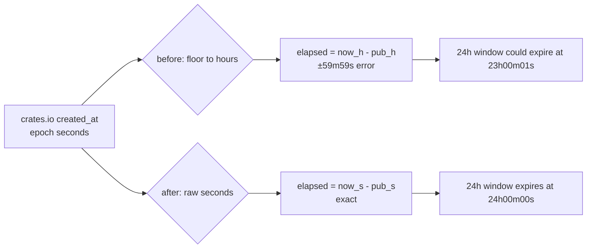

# PR Summary — Issue #1909

## Summary

The supply-chain quarantine gate in `bump-deps.sh` floor-divided **both** sides
of its comparison to whole hours before subtracting. Truncating each side
independently discards up to 59m59s from `published` and credits the same to
`now`, so the advertised 24h window could expire after **23h00m01s** of real
elapsed time. Worked example: a crate published at `10:59:59` checked at
`10:00:00` the next day floors to hours 10 and 34 — `34 - 10 = 24 ≥ 24` — and
was released early.

The comparison now runs end to end in epoch **seconds**;
`VIBE_BUMP_QUARANTINE_HOURS` stays the hours-valued public knob and whole hours
are used only for the human-readable log lines. Closes #1909.

Changed:

- `bump_deps::is_quarantine_expired NOW_EPOCH PUBLISHED_EPOCH THRESHOLD_HOURS`
  compares `now - published >= threshold_hours * 3600`.
- `bump_deps::plan_lock_quarantine` takes `NOW_EPOCH` (seconds) and dates each
  package from its raw publish epoch; the `age` column keeps its `<N>h` form.
- The manifest gate and the lockfile gate pass `NOW_EPOCH` / `PUB_EPOCH`
  straight through — the four `/ 3600` pre-divisions at the call sites are gone.



## Evidence

CLI/shell change with no web interface, so no screenshot applies. Verification
is by test:

```
$ cargo test --test issue_1909_quarantine_second_precision
running 6 tests
test zero_hour_window_releases_immediately ... ok
test held_one_second_before_the_window_closes ... ok
test released_exactly_on_the_window_boundary ... ok
test worst_case_hour_straddle_is_still_held ... ok
test lockfile_planner_releases_at_the_boundary ... ok
test lockfile_planner_holds_the_worst_case_straddle ... ok
test result: ok. 6 passed; 0 failed

$ bash tests/bump_deps_test.sh
Passed: 65
Failed: 0
```

Three of the six Rust cases (`held_one_second_before_the_window_closes`,
`worst_case_hour_straddle_is_still_held`,
`lockfile_planner_holds_the_worst_case_straddle`) fail against the unfixed
script and pass after the change, so they are genuine regression tests.
`tests/issue_1234_quarantine_enforcement.rs` stays green.

## Test Plan

- **Added `tests/issue_1909_quarantine_second_precision.rs`** — drives the real
  shell helpers via `BUMP_DEPS_SOURCE_ONLY=1`:
  - published `23h59m59s` ago is **held** with a 24h window;
  - published exactly `24h00m00s` ago is **released**;
  - worst-case straddle (published `HH:59:59`, checked `HH+23:00:01`) is
    **held** — the case the hour-floored comparison mis-released;
  - a zero-hour window (internal deps) never quarantines;
  - `plan_lock_quarantine` holds the same straddle and still reports the age in
    whole hours (`23h`), and releases at the exact 24h boundary.

  These live in the Rust suite deliberately: `tests/bump_deps_test.sh` is not
  wired into `quality.sh` or CI, so a Rust test is what actually blocks a
  regression back to hour-floored arithmetic on the PR gate.

- **Updated `tests/bump_deps_test.sh`** — business-logic change, documented
  inline: test 9 now passes epoch **seconds** to `is_quarantine_expired`
  (`360000/180000` for the 50h case, `360000/324000` for the 10h case) rather
  than hour-floored values, and tests 22/23 pass `1748736000` epoch seconds to
  `plan_lock_quarantine` instead of `485760` hours. Their assertions are
  unchanged. Added test 9b covering the three sub-hour boundary cases. No test
  was removed or commented out.

## Security Self-Check

- Input validation: `VIBE_BUMP_QUARANTINE_HOURS` is still constrained to a
  non-negative integer by `bump_deps::validate_hours`; no new external input.
- Secrets: none staged.
- Injection surface: no new shell/HTTP calls; the crates.io lookup is unchanged.
- Error handling: unknown publish times still fail closed (treated as
  in-quarantine), and the post-pin recheck still fails loud.
