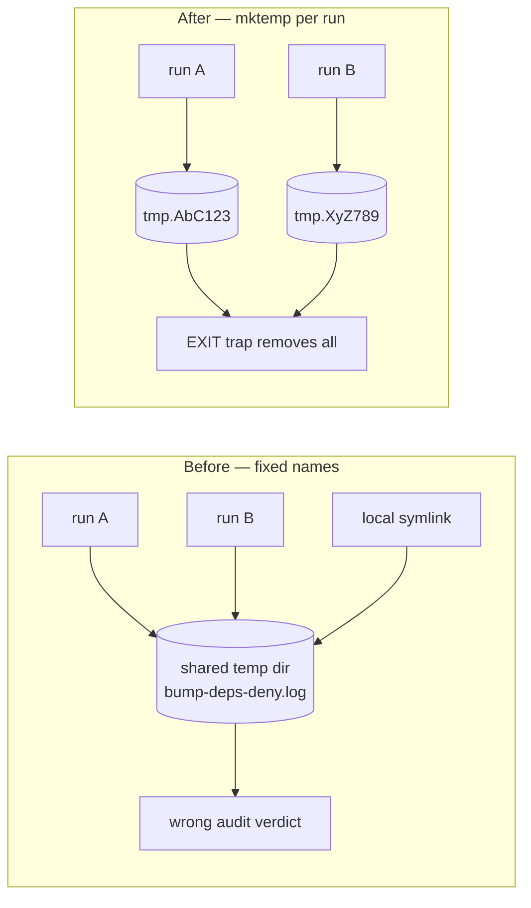

# Allocate every `bump-deps.sh` temp path with `mktemp` (Issue #1910)

## Summary

`bump-deps.sh` allocated four temp paths with `mktemp` and hard-coded five
others under the shared temp directory — in the same script, for the same kind
of data. On a shared build host every user resolves a fixed name to the same
file, which cost the script two ways:

1. **Interference / stale reads.** Two concurrent runs clobbered each other's
   logs. Two of those logs are read back to decide what the run reports — the
   audit gate extracts the offending crate name from the deny log — so a stale
   or foreign file produced a wrong verdict.
2. **Redirect target control.** `>` and `tee` follow symlinks, so a local user
   who pre-created the predictable name captured this script's output.

All six temp paths (three logs, two lockfile snapshots, one manifest snapshot
directory) are now allocated with `mktemp` at the top of the bump action and
removed by a single `EXIT`/`INT`/`TERM` trap, which replaces the three
scattered `rm` calls. Log contents and every operator-facing message are
byte-identical — this is a path change only.

Closes #1910.



## Evidence

Backend/CLI change — no web interface to screenshot. Verified by running the
real script under a recording `mktemp` shim, and by the acceptance greps:

```
$ grep -n '/tmp/bump-deps' bump-deps.sh
$ shellcheck bump-deps.sh && echo SHELLCHECK_OK
SHELLCHECK_OK
$ cargo test --test issue_1910_bump_deps_no_fixed_tmp
test script_carries_no_fixed_temp_log_path ... ok
test temp_files_are_removed_on_the_failure_path ... ok
test concurrent_runs_never_share_a_temp_path ... ok
test result: ok. 3 passed; 0 failed
$ bash tests/bump_deps_test.sh
Test 24: temp paths are unique per run and removed on exit
  PASS: instrumented dry-run exits 0
  PASS: every temp path is allocated with mktemp (6 allocations)
  PASS: two invocations share no temp path
  PASS: no temp file survives the run
```

All three Rust tests fail against the unfixed script (`git stash` of
`bump-deps.sh` → `expected every temp path to come from mktemp; recorded only
["…/tmp.CnOpRYSDhZ"]`), so they are genuine regression tests rather than
tautologies.

### Pre-existing failure on the milestone branch — not caused by this change

`./quality.sh` still reports three failures in
`tests/issue_1909_quarantine_second_precision.rs` (and the matching five in
`tests/bump_deps_test.sh`). They fail identically at the base commit
`d91dbda` with this branch's changes stashed: PR #1969 landed the Issue #1909
*tests* but not the `bump-deps.sh` half of that fix, so
`bump_deps::is_quarantine_expired` still compares floored hours. Filed as
stSoftwareAU/NEAT-AI-Discovery#1970 — out of scope here, and untouched by this
change.

## Test Plan

- **Added** `tests/issue_1910_bump_deps_no_fixed_tmp.rs`:
  - `concurrent_runs_never_share_a_temp_path` — runs the real script twice with
    a `mktemp` shim on `PATH` that records every allocation; asserts at least
    six allocations, none reused within a run, none shared between runs, and
    none surviving a successful run.
  - `temp_files_are_removed_on_the_failure_path` — runs the script with no
    `cargo` on `PATH` so it aborts after allocating; asserts the trap still
    removed every allocated path.
  - `script_carries_no_fixed_temp_log_path` — cheap guard against a fixed
    literal returning to the script.
- **Extended** `tests/bump_deps_test.sh` with Test 24, the same behavioural
  check inside the script's own suite (unique paths per run, nothing left
  behind).
- No existing tests were modified or removed.

## Security self-check

- Input validation: no new external input is parsed.
- Secrets: none staged; only `bump-deps.sh` and two test files changed.
- Injection surface: no new shell interpolation of untrusted data; the temp
  paths now come from `mktemp` and are quoted at every use.
- Error handling: cleanup runs on the failure path too; no message text or exit
  code changed, so no new detail is leaked.
- Dependencies: unchanged.
