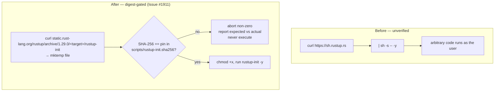
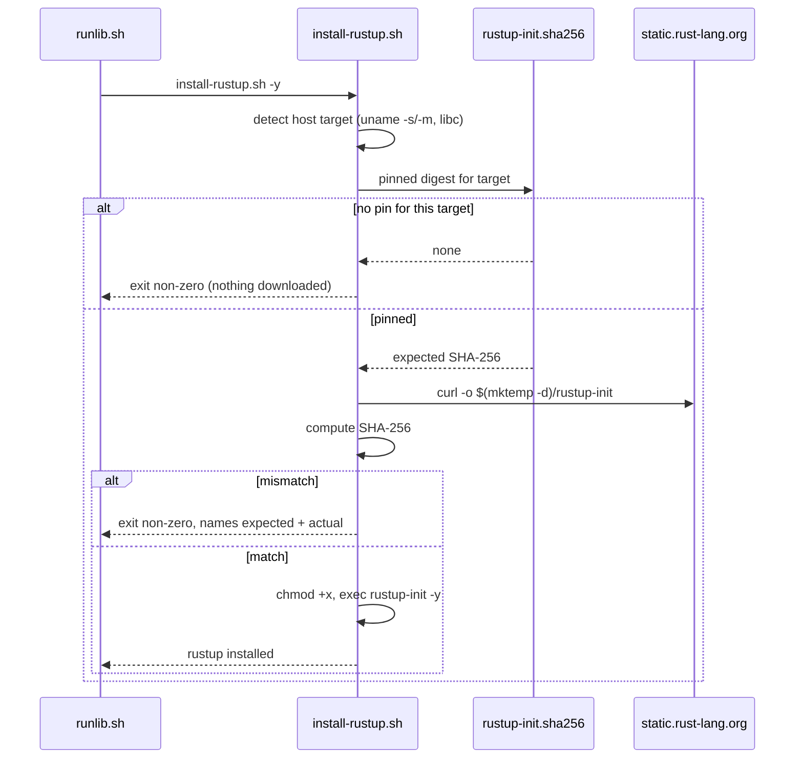

# Verify a pinned digest before running the rustup installer (Issue #1911)

## Summary

`scripts/runlib.sh` bootstrapped Rust by piping `https://sh.rustup.rs` straight
into `sh`. `--proto "=https" --tlsv1.2` pins the transport, but transport
security only proves the bytes came from that host — not that they are the bytes
anyone reviewed. A hijacked distribution point, or a proxy holding a CA the
machine trusts, would have executed arbitrary code as the invoking user, and
that code installs the compiler that subsequently runs `build.rs` for every
dependency.

The bootstrap now goes through a new `scripts/install-rustup.sh`, which
downloads the pinned `rustup-init` binary for the detected host target from
`static.rust-lang.org` and executes it **only** when its SHA-256 matches the
digest committed in `scripts/rustup-init.sha256`. This is the same posture the
repository already applies to the far less privileged gitleaks download
(`.github/workflows/gitleaks.yml`, Issue #1217).

Pinning the released binary rather than the `rustup-init.sh` shell script avoids
re-pinning a script upstream edits frequently — the archived binary for a given
version is immutable.

Everything fails closed: a digest mismatch, a failed download, a missing digest
manifest, or a host target with no pinned digest all exit non-zero **without
executing the downloaded file**. The PATH-persistence block and the
`rustup show` sanity check in `runlib.sh` are unchanged.

Closes #1911.

## Evidence

This is a CLI/build-script change with no web interface, so there is no
screenshot. The evidence is the test suite below, which runs the real script
against a stub `curl` and asserts on observable behaviour — exit codes, stderr,
and whether the downloaded file was executed at all.

### Before → after



### Verification flow



### Quality gate

`./quality.sh` passes for every stage except a **pre-existing, unrelated**
failure in `tests/issue_1909_quarantine_second_precision.rs` (3 tests). That
suite fails identically on a clean checkout of this branch's base — confirmed by
stashing this PR's changes and re-running it — and concerns the dependency
quarantine window, not the rustup bootstrap. It is out of scope here.

`shellcheck -s bash` and `bash -n` are clean on both `scripts/install-rustup.sh`
and `scripts/runlib.sh`.

## Test Plan

New suite `tests/issue_1911_rustup_digest_verification.rs` (11 tests). Each
behavioural test copies the real script into a sandbox with a generated digest
manifest and a stub `curl` that serves a chosen payload; the payload records
its arguments to a sentinel file, so "was the download executed?" is directly
observable.

| Test | Asserts |
| --- | --- |
| `executes_the_installer_when_the_digest_matches` | A verified installer runs, with arguments forwarded |
| `defaults_to_the_unattended_flag_when_no_arguments_are_given` | Bootstrap stays unattended (`-y`) |
| `rejects_a_tampered_download_without_executing_it` | **Acceptance criterion**: tampered bytes → non-zero exit, sentinel absent, stderr names expected and actual digests |
| `fails_loud_when_the_download_fails` | A failed `curl` is not reported as success and executes nothing |
| `fails_closed_when_no_digest_is_pinned_for_the_host_target` | Unpinned target aborts *before* any download |
| `fails_closed_when_the_digest_manifest_is_missing` | Missing manifest aborts before any download |
| `the_host_target_resolves_to_a_pinned_digest` | Sources the real script and resolves this machine's target against the committed manifest |
| `committed_manifest_pins_a_valid_digest_for_every_supported_target` | All six targets pinned with 64-char hex digests |
| `script_is_committed_and_executable` | `scripts/install-rustup.sh` is committed with the executable bit |
| `runlib_no_longer_pipes_a_network_download_into_a_shell` | Regression guard: no `curl … \| sh` in `runlib.sh` |
| `runlib_keeps_its_path_persistence_and_sanity_check` | The surrounding rc-file writes and `rustup show` check are untouched |

Run with:

```bash
cargo test --test issue_1911_rustup_digest_verification
```

## Files changed

| File | Change |
| --- | --- |
| `scripts/install-rustup.sh` | New. Detects the host target, resolves its pinned digest, downloads `rustup-init` to a `mktemp` dir, verifies SHA-256, and only then executes it. |
| `scripts/rustup-init.sha256` | New. Pinned digests for rustup 1.29.0 across the six supported targets, with provenance and bump instructions. |
| `scripts/runlib.sh` | Replaced `curl … \| sh -s -- -y` with a call to `install-rustup.sh -y`. Nothing else changed. |
| `tests/issue_1911_rustup_digest_verification.rs` | New behavioural test suite. |
| `CONTRIBUTING.md` | Documents the verified bootstrap and how to bump the pinned rustup version. |

## Security self-check

- **Input validation** — the digest manifest is parsed field-wise; only an exact
  target-triple match yields a digest, and a missing entry aborts.
- **Secrets** — none staged; no hidden files touched.
- **Injection surface** — no user input reaches a shell. The download URL is
  built from a hard-coded base, a hard-coded version, and a target triple
  derived from `uname` through a closed `case` allowlist.
- **Error handling** — every failure path exits non-zero with a message naming
  the cause; the digest mismatch prints the expected and actual values and
  explicitly refuses to run the file.
- **Dependencies** — the pinned rustup version and its digests come from the
  Rust project's published `.sha256` files; no new third-party dependency.
