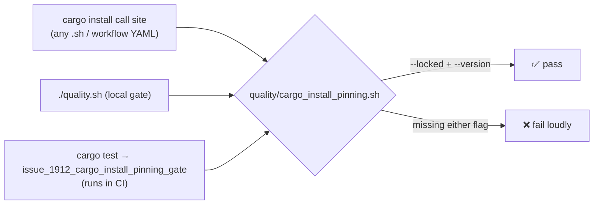

# Pin `cargo install cargo-fuzz` and enforce the pinning rule repo-wide

## Summary

`scripts/fuzz-ci.sh` installed `cargo-fuzz` with neither `--locked` nor
`--version` — the exact gap Issue #1223 closed for the workflow call sites.
Without `--version` whatever crates.io served at run time was fetched; without
`--locked` `cargo install` re-resolved the full transitive graph, so a freshly
published dependency's `build.rs` executed on the runner.

The call site is now pinned to `cargo-fuzz 0.13.2`, and — the part that stops
this regressing again — the #1223 invariant is enforced by a committed gate that
scans the **whole repository**, not just `.github/workflows/`. The gate
immediately found a second unpinned call site the issue did not mention:
`docs/ci-fuzzing-workflow.yml`, the fuzzing workflow template users copy.

Closes #1912.

### What changed

| File | Change |
| --- | --- |
| `scripts/fuzz-ci.sh` | `cargo +nightly install --locked --version 0.13.2 cargo-fuzz`, with a comment citing #1223 so the pin has a home |
| `docs/ci-fuzzing-workflow.yml` | Same pin in the published workflow template (found by the new gate) |
| `quality/cargo_install_pinning.sh` | **New** committed gate — repo-wide `cargo install` pinning check |
| `quality.sh` | Runs the gate before the long build/test steps |
| `README.md` | Fuzzing prerequisites show the pinned install |
| `tests/test_cargo_install_pinning.sh` | Removed — superseded by the gate (see below) |

The nightly toolchain deliberately keeps floating rather than moving to
`nightly-YYYY-MM-DD`: cargo-fuzz builds the targets with `-Z sanitizer` and a
dated nightly goes stale against the sanitiser/`libfuzzer-sys` support the
targets need. The toolchain comes from rustup's signed channel, not crates.io,
so it carries no third-party `build.rs`. That reasoning is now a comment in the
script, so the divergence from the pinned-tool policy is deliberate rather than
accidental.

### Removed test — justification

`tests/test_cargo_install_pinning.sh` (added by #1223) scanned only
`.github/workflows/` and was wired into nothing — neither `quality.sh` nor any
workflow ran it, which is precisely why `scripts/fuzz-ci.sh` was missed. Its
coverage is strictly subsumed by `quality/cargo_install_pinning.sh`, which
applies the same two assertions to every shell script and workflow YAML in the
tree and *is* enforced (by `quality.sh` and by `cargo test` in CI).

## Evidence

This is a CLI/CI change with no web interface, so there is no screenshot. The
evidence is the gate catching the real regression and the stub-driven script
tests.

The gate on the unfixed tree:

```text
FAIL: ./docs/ci-fuzzing-workflow.yml:47 — 'cargo install' missing --locked:      run: cargo +nightly install cargo-fuzz
❌ cargo install pinning gate failed: 1 unpinned invocation(s), 4 pinned
```

After the fix:

```text
✅ cargo install pinning gate passed: 5 pinned invocation(s) across 32 file(s)
```

Regression linkage — reverting `scripts/fuzz-ci.sh` to the unpinned line fails
the new test against the real repository:

```text
test this_repository_pins_every_cargo_install ... FAILED
```

Where the gate now sits:



Shell gates stay clean:

```text
bash-syntax: OK — 22 script(s) passed 'bash -n'
shellcheck: OK — 22 script(s) passed ShellCheck
```

## Test Plan

`tests/issue_1912_fuzz_ci_pinned_install.rs` — runs the real
`scripts/fuzz-ci.sh` with stub `cargo`/`rustup` binaries on `PATH` and asserts on
the commands actually invoked:

- `cargo_fuzz_is_installed_with_locked_and_a_version_pin` — the install carries
  `--locked` and `--version 0.13.2` (fails against the unfixed script).
- `both_fuzz_targets_still_run_with_the_requested_budget` — both targets still
  run with `-max_total_time` (acceptance criterion 4).
- `an_already_installed_cargo_fuzz_is_not_reinstalled` — the probe still
  short-circuits the install.
- `a_failing_target_exits_non_zero` — a crashing target fails loudly.

`tests/issue_1912_cargo_install_pinning_gate.rs` — executes the gate against
fixture trees and this repository:

- `this_repository_pins_every_cargo_install` — the repo-wide assertion
  (acceptance criterion 2).
- `unpinned_install_in_a_shell_script_fails`, `install_without_a_version_pin_fails`,
  `unpinned_install_in_a_workflow_fails` — each missing flag is caught and the
  offending file named.
- `fully_pinned_install_passes` — no false positives on a correct call site.
- `mentions_in_messages_and_comments_are_not_invocations` — install hints in
  `echo` strings, comments, and usage heredocs (as in `bump-deps.sh`) are not
  invocations.
- `empty_and_missing_roots_fail_loudly` — a gate that scans nothing must not
  report success.

## Known unrelated failure

`tests/issue_1909_quarantine_second_precision.rs` fails three tests on the
milestone branch head (`1c0d667`) before any change in this PR — verified by
stashing this branch's changes and re-running. It is untouched by this work.
