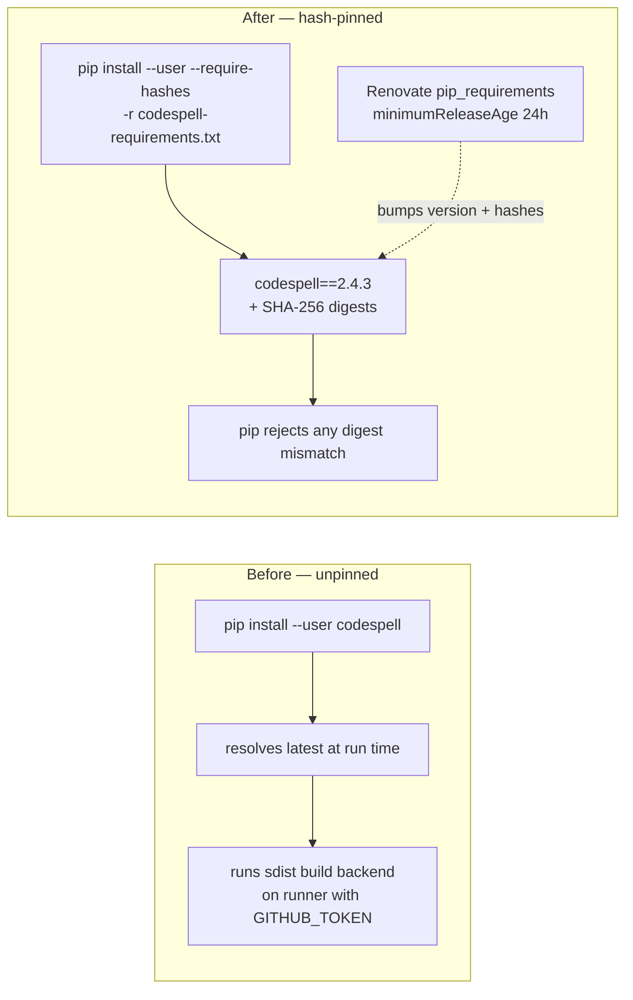

# Pin and hash-verify the CI codespell install (Issue #1913)

## Summary

The `spell-check` job in `.github/workflows/ci.yml` installed codespell with a
bare `pip install --user codespell` — the last unpinned, unhashed tool install
in the repository. It resolved the newest release, and whatever build backend
that release's sdist shipped, fresh on every pull request, on a runner holding a
`GITHUB_TOKEN`. Every sibling install is already pinned: `cargo install --locked
--version …` (enforced by `quality/cargo_install_pinning.sh`, Issue #1912) and
the inline `markdownlint-cli2@0.23.0` npm pin (Issue #1484).

This change replaces the moving target with a hash-verified requirements file
and wires Renovate to keep it current under the same 24h quarantine window as
every other external dependency. Closes #1913.

**Approval note:** `AGENTS.md` and `CONTRIBUTING.md` both say "do NOT modify
`.github/workflows/ci.yml` without explicit approval". Issue #1913 is that
approval — it names the file, the lines, and the replacement command. The
load-bearing parts of the workflow (triggers, `auto-format`, `version-increment`
and its `ACTIONS_PUSH` handling) are untouched; only the two lines of the
codespell install step changed.

### What changed

- **`.github/requirements/codespell-requirements.txt`** (new) — pins
  `codespell==2.4.3` with the SHA-256 of both the wheel and the sdist. codespell
  has no mandatory runtime dependencies (`chardet` and `tomli` are optional
  extras we do not install), so this single entry pins the complete tree.
- **`.github/workflows/ci.yml`** — the install step now runs
  `pip install --user --require-hashes -r .github/requirements/codespell-requirements.txt`.
  `--require-hashes` makes pip refuse any artefact whose digest does not match,
  **and** refuse the whole install if any requirement is unpinned — so the file
  cannot silently drift back to a floating resolve. The `Run codespell` step and
  its flags are unchanged, so it reports the same findings.
- **`renovate.json`** — a `pip_requirements.managerFilePatterns` entry covers
  `.github/requirements/*-requirements.txt` (Renovate's default pattern for that
  manager does not reach into `.github/`), plus a `packageRule` holding
  `pip_requirements` bumps for `minimumReleaseAge: "24h"`. Renovate's
  `pip_requirements` manager regenerates `--hash=` digests when it bumps a
  version, so the pin stays coherent across updates.
- **`CONTRIBUTING.md`** — the `spell-check` bullet in the CI job list now
  documents the pinned install.

### Supply-chain flow



## Evidence

Backend/CI change — no web interface to screenshot.

**The hash-pinned install actually works** (clean virtualenv, same command shape
as CI):

```text
$ pip install --require-hashes -r .github/requirements/codespell-requirements.txt
Collecting codespell==2.4.3 (from -r .github/requirements/codespell-requirements.txt (line 1))
  Downloading codespell-2.4.3-py3-none-any.whl (340 kB)
Installing collected packages: codespell
Successfully installed codespell-2.4.3
$ codespell --version
2.4.3
```

**codespell still reports the same findings** — the CI invocation, run
unchanged against the new and modified files, exits 0:

```text
$ codespell --check-filenames --check-hidden \
    --skip "./target,./.git,./tests/data" \
    --ignore-words-list "renderD,nknown,MAPE,OT,ND,MOT,BU" \
    .github/requirements/codespell-requirements.txt \
    tests/issue_1913_codespell_pin.rs renovate.json
codespell exit=0
```

**Workflow still lints clean:** `actionlint .github/workflows/ci.yml` → exit 0.

**New tests fail against the unfixed workflow and pass after the fix** —
before:

```text
running 5 tests
test codespell_install_uses_the_hash_pinned_requirements_file ... FAILED
test renovate_tracks_the_codespell_requirements_file ... FAILED
test no_unpinned_pip_install_in_workflows ... FAILED
  Unpinned: ["ci.yml:534 — run: pip install --user codespell"]
test result: FAILED. 2 passed; 3 failed
```

after:

```text
running 5 tests
test no_unpinned_pip_install_in_workflows ... ok
test codespell_install_uses_the_hash_pinned_requirements_file ... ok
test requirements_file_pins_an_exact_version_with_hashes ... ok
test renovate_tracks_the_codespell_requirements_file ... ok
test spell_check_job_still_runs_codespell ... ok
test result: ok. 5 passed; 0 failed
```

### Quality gate

`./quality.sh` passes every stage (bash syntax, ShellCheck, cargo-install
pinning, PR-summary layout, `cargo deny`, build, fmt, Clippy `-D warnings`,
`cargo check`, doc build) except one **pre-existing, unrelated** test failure:
`tests/issue_1909_quarantine_second_precision.rs` (3 of 6 tests —
`held_one_second_before_the_window_closes`,
`worst_case_hour_straddle_is_still_held`,
`lockfile_planner_holds_the_worst_case_straddle`). Confirmed pre-existing by
stashing this branch's changes and re-running on a clean tree — identical
failures. It exercises `bump-deps.sh` quarantine arithmetic, which this change
does not touch. `cargo test --no-fail-fast` shows that binary is the only
failing target.

### Security self-check

- **Input validation** — n/a, no new runtime code paths.
- **Secrets** — none staged; the change adds only a requirements file, workflow
  lines, Renovate config, docs and a test.
- **Injection surface** — the install command is a fixed literal with no
  interpolation; the requirements file is committed and hash-verified.
- **Dependencies** — `codespell==2.4.3` is pinned, hash-verified, published
  2026-07-15 (far beyond the 24h quarantine), and comes from PyPI. Future bumps
  are held 24h by the new Renovate rule.

## Test Plan

Added `tests/issue_1913_codespell_pin.rs`, which reads the real committed files
and asserts on their contents (5 tests):

- `no_unpinned_pip_install_in_workflows` — scans **every** `*.yml`/`*.yaml`
  under `.github/workflows/`, ignoring commented lines, and fails on any
  `pip install` that pins neither via `--require-hashes -r …` nor an inline
  `package==X.Y.Z`. This is the regression test for the reported defect: it
  fails against the unfixed workflow. It also fails loud if it finds *no*
  `pip install` at all, so it cannot pass vacuously if the step is renamed or
  moved.
- `codespell_install_uses_the_hash_pinned_requirements_file` — the ci.yml
  install passes `--require-hashes`, points at
  `.github/requirements/codespell-requirements.txt`, and that file exists.
- `requirements_file_pins_an_exact_version_with_hashes` — the requirements file
  pins `codespell==X.Y.Z` and carries at least one `--hash=sha256:` digest, each
  a valid 64-character hexadecimal string.
- `renovate_tracks_the_codespell_requirements_file` — parses `renovate.json` and
  asserts a `pip_requirements.managerFilePatterns` entry covers the requirements
  file, and a `packageRule` matching `pip_requirements` sets
  `minimumReleaseAge: "24h"`.
- `spell_check_job_still_runs_codespell` — the job still invokes the installed
  binary with `--check-filenames` and `--check-hidden`, so the acceptance
  criterion "still runs and still reports the same findings" is guarded.

No existing tests were modified or removed.
