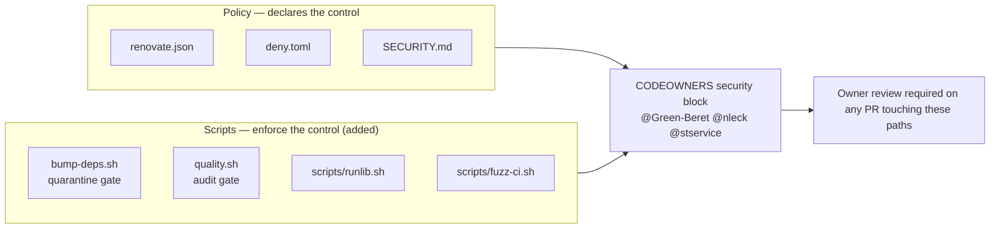

# PR Summary — Issue #1914

## Summary

The `CODEOWNERS` security block owned the supply-chain *policy* files
(`deny.toml`, `renovate.json`, `SECURITY.md`) but not the scripts that
*implement* those policies. Editing `bump-deps.sh` disables the
`VIBE_BUMP_QUARANTINE_HOURS` gate (Issue #1234) just as effectively as editing
`renovate.json` — and the enforcement script is what a supply-chain attacker
targets first, precisely because it is the enforcement and not the declaration.

Added to `.github/CODEOWNERS` under the security-sensitive block, with the same
`@Green-Beret @nleck @stservice` owners:

- `/bump-deps.sh` — implements the quarantine gate.
- `/quality.sh` — the mandated pre-commit gate that runs `cargo deny check`.
- `/scripts/runlib.sh`, `/scripts/fuzz-ci.sh` — both install toolchains from the
  network.

The block comment now states the inclusion criterion — *files that enforce or
bypass a supply-chain control* — so future additions are obvious.
`CONTRIBUTING.md` records the same criterion beside the existing Code Owners
section.

Closes #1914.

## Evidence

This is a repository-configuration change with no web interface, so there is no
screenshot. The evidence is the new test binary asserting on the real committed
`.github/CODEOWNERS` artefact.

Before the change, two of the four new tests failed:

```text
test enforcement_scripts_are_named_explicitly ... FAILED
test security_block_states_its_inclusion_criterion ... FAILED
test result: FAILED. 2 passed; 2 failed
```

After the change:

```text
test enforcement_paths_exist_on_disk ... ok
test enforcement_scripts_are_named_explicitly ... ok
test enforcement_scripts_share_the_policy_owner_set ... ok
test security_block_states_its_inclusion_criterion ... ok
test result: ok. 4 passed; 0 failed
```

The pre-existing `issue_1486_codeowners` suite still passes (5/5), confirming
the file remains a valid CODEOWNERS document that GitHub can parse.

What the block now guards:



### Known pre-existing failures (not introduced here)

`tests/issue_1909_quarantine_second_precision.rs` has three failing tests on
`milestone/clean-up-20260803`. They were verified as failing on the base commit
before this change and are already tracked by issue #1970 (*"PR #1969 landed the
Issue #1909 tests but not the bump-deps.sh implementation"*). Nothing in this PR
touches `bump-deps.sh` behaviour — only its CODEOWNERS entry.

## Test Plan

Added `tests/issue_1914_codeowners_enforcement_scripts.rs`:

- `enforcement_scripts_are_named_explicitly` — regression test for the issue:
  each of the four enforcement paths must be named by its own rule, not merely
  swept up by the `*` fallback. Fails against the unfixed `CODEOWNERS`.
- `enforcement_scripts_share_the_policy_owner_set` — the effective owners of
  each enforcement path (resolved with GitHub's last-match-wins precedence)
  equal the owners of `renovate.json`, the policy they enforce.
- `enforcement_paths_exist_on_disk` — every named path exists, so a rename never
  leaves a stale rule that silently enforces nothing.
- `security_block_states_its_inclusion_criterion` — the acceptance criterion
  that the comment records why a file belongs in the block.

All assertions read the real committed `.github/CODEOWNERS` and parse it with
the CODEOWNERS grammar; none inspect source code for patterns.
