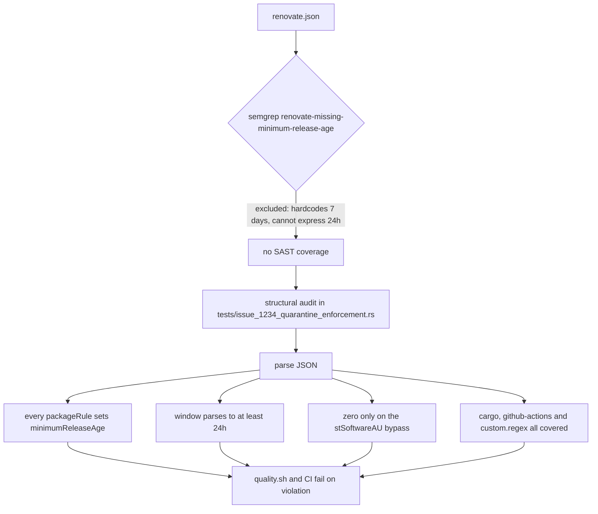

# PR Summary — Issue #1915

## Summary

The semgrep rule `renovate-missing-minimum-release-age` is excluded in
`.github/workflows/semgrep.yml` (correctly — it hardcodes a ≥7-day threshold
and cannot express this org's deliberate 24h standard). The only control left
behind that exclusion was a whole-file substring assertion in
`tests/issue_1234_quarantine_enforcement.rs`: it passed as long as *any*
`packageRule` anywhere in `renovate.json` still carried `"24h"`. Deleting
`minimumReleaseAge` from the cargo rule left the assertion green and the
quarantine silently gone.

This PR replaces those substring assertions with a structural audit that parses
`renovate.json` and checks each rule:

- every `packageRule` must set a string `minimumReleaseAge` that parses to
  ≥ 24h;
- the only rule permitted to set `0` is the `https://github.com/stSoftwareAU/`
  internal-dependency bypass (`vulnerabilityAlerts` is not a `packageRule` and
  is unaffected);
- each covered dependency class — `cargo`, `github-actions` and the npm
  `custom.regex` manager — must have at least one rule holding it for ≥ 24h;
- an unparseable window (`"soon"`, `"7"`, a bare JSON number) is a violation,
  not a silently-accepted zero.

The semgrep exclusion is kept and its justification comment now names the
structural tests, so the "enforced independently" claim is true. No local
semgrep rule was added — the Rust test runs in `./quality.sh` and CI, which is
where this repo's other config invariants are enforced.

Closes #1915.

## Evidence

Backend/CLI change with no web interface, so there is no screenshot. Evidence
is the test run plus a live mutation of `renovate.json`.

**The gap, demonstrated.** With `minimumReleaseAge` removed from the crates.io
cargo `packageRule` (the file still contained 8 occurrences of `24h`, so the
old substring assertion would have passed):

```text
test renovate_json_configures_minimum_release_age ... FAILED

renovate.json violates the 24h quarantine policy (Issue #1234): [
    "packageRule[1] (External crates.io dependencies: hold for 24h after publish.) does not set `minimumReleaseAge` — every rule must carry the quarantine window explicitly (Issue #1234)",
]
```

`renovate.json` was restored unchanged afterwards; this PR modifies no
Renovate configuration.

**All tests pass against the committed config:**

```text
running 11 tests
test renovate_json_configures_minimum_release_age ... ok
test removing_the_cargo_rule_window_is_detected ... ok
test lowering_a_window_below_24h_is_detected ... ok
test zeroing_a_covered_rule_is_detected ... ok
test a_new_zero_age_rule_outside_the_internal_bypass_is_detected ... ok
test dropping_a_covered_dependency_class_is_detected ... ok
test dropping_the_internal_bypass_is_detected ... ok
test release_age_parser_accepts_the_documented_forms ... ok
test release_age_parser_rejects_unparseable_windows ... ok
test scheduled_upgrade_workflow_has_been_removed ... ok
test bump_deps_script_enforces_quarantine ... ok

test result: ok. 11 passed; 0 failed
```

**Control flow — what now stands behind the semgrep exclusion:**



## Test Plan

All in `tests/issue_1234_quarantine_enforcement.rs`.

**Modified (business-logic change, documented in the module header):**

- `renovate_json_configures_minimum_release_age` — was three whole-file
  substring assertions; now parses `renovate.json` and asserts the structural
  audit reports no violations.

**Added:**

- `removing_the_cargo_rule_window_is_detected` — deletes `minimumReleaseAge`
  from the crates.io cargo rule and asserts the violation is reported *while
  the config still contains `"24h"` elsewhere*, which is precisely what the old
  substring check missed.
- `lowering_a_window_below_24h_is_detected` — `"1h"`, `"60 minutes"`, `"23h"`.
- `zeroing_a_covered_rule_is_detected` — `"0"` on a covered rule.
- `a_new_zero_age_rule_outside_the_internal_bypass_is_detected` — a smuggled
  all-cargo bypass, a third-party source-URL bypass, and a numeric `0`.
- `dropping_a_covered_dependency_class_is_detected` — removes every rule for
  each of `cargo`, `github-actions`, `custom.regex` in turn.
- `dropping_the_internal_bypass_is_detected` — the stSoftwareAU exemption must
  remain present.
- `release_age_parser_accepts_the_documented_forms` /
  `release_age_parser_rejects_unparseable_windows` — happy path (`"24h"`,
  `"1 day"`, `"3 days"`, `"1 week"`, `" 90 minutes "`, `"0"`) and error path
  (`""`, `"soon"`, `"24 fortnights"`, `"h24"`, `"7"`).

**Unchanged:** `scheduled_upgrade_workflow_has_been_removed`,
`bump_deps_script_enforces_quarantine`.

## Pre-existing failure on the milestone branch (not from this PR)

`./quality.sh` stops at `tests/issue_1909_quarantine_second_precision.rs`,
which fails **on `origin/milestone/clean-up-20260803` with this PR's changes
absent** (verified in a clean worktree). PR #1969 landed the Issue #1909 tests
without the `bump-deps.sh` change — `git show --stat d91dbda` does not list
`bump-deps.sh`, and the helper still floor-divides both epochs to hours. This
PR does not touch `bump-deps.sh`. Recorded as follow-up issue
stSoftwareAU/NEAT-AI-Discovery#1979 rather than fixed here, to keep this change
in scope.

Every other test target passes, including the 11 tests in
`tests/issue_1234_quarantine_enforcement.rs`.
