# PR Summary — Issue #1916

## Summary

The internal `stSoftwareAU/*` quarantine bypass in `renovate.json` was broken
two independent ways, both silent. It was keyed on `matchSourceUrlPrefixes` — a
key deprecated in favour of `matchSourceUrls` and removed in Renovate 40 — and
it sat *before* the `github-actions` rule. Renovate merges `packageRules` in
array order and the **last** matching rule wins, so a first-party
`stSoftwareAU/*` Action (the one dependency class this repository actually
consumes from stSoftwareAU) resolved to `24h`, not the documented `0`. The
stated policy at `renovate.json:8` did not hold. Closes #1916.

Changes:

- Both `matchSourceUrlPrefixes` occurrences replaced with `matchSourceUrls`
  glob form (`https://crates.io/**`, `https://github.com/stSoftwareAU/**`).
- The internal bypass moved to the **end** of `packageRules` so it wins over
  the manager-scoped rules it is meant to override.
- Three `description` entries added recording that ordering is load-bearing,
  that the removed key must not return, and that CI validates the file.
- New `.github/workflows/renovate-validate.yml` runs
  `renovate-config-validator --strict` on every PR touching `renovate.json`, so
  an invalid or migrated-away key fails loudly instead of silently disabling a
  control. The `renovate` CLI pin is version-pinned, installed with
  `--ignore-scripts`, and tracked by a new `customManagers` entry (so it stays
  current under the same 24h quarantine as every other external tool).
- `CONTRIBUTING.md` documents the new gate alongside the other
  separate-workflow checks.

### Rule resolution, before and after

```mermaid
flowchart TD
    subgraph before["Before — bypass at index 3"]
        B1["cargo + crates.io — 24h"] --> B2["cargo default — 24h"]
        B2 --> B3["stSoftwareAU bypass — 0"]
        B3 --> B4["github-actions — 24h"]
        B4 --> BR["Effective for a first-party Action: 24h (WRONG)"]
    end
    subgraph after["After — bypass last"]
        A1["cargo + crates.io — 24h"] --> A2["cargo default — 24h"]
        A2 --> A3["github-actions — 24h"]
        A3 --> A4["stSoftwareAU bypass — 0"]
        A4 --> AR["Effective for a first-party Action: 0 (correct)"]
    end
```



## Evidence

Backend/config change — no web interface to screenshot.

**Upstream validator, before the fix** (`renovate-config-validator --strict`,
renovate 44.7.2, run against `HEAD:renovate.json`):

```text
 WARN: Config migration necessary
 WARN: Config migration diff:
EXIT=1
```

The migration diff rewrote both rules from `matchSourceUrlPrefixes` to
`matchSourceUrls`, confirming the key is no longer the supported form.

**Upstream validator, after the fix:**

```text
 INFO: Validating renovate.json
 INFO: Config validated successfully against 1 file(s)
EXIT=0
```

**Regression proof** — the new test file run against the pre-fix
`renovate.json` (`git show HEAD:renovate.json > renovate.json`):

```text
test result: FAILED. 1 passed; 7 failed; 0 ignored
```

and against the fixed file:

```text
test result: ok. 8 passed; 0 failed; 0 ignored
```

`tests/issue_1234_quarantine_enforcement.rs` stays green — 11 passed.

**Pre-existing, unrelated failure:** `tests/issue_1909_quarantine_second_precision.rs`
fails 3 of 6 on this branch *before* any change in this PR (verified by
stashing the working tree and re-running). It concerns `bump-deps.sh`
second-precision arithmetic and is untouched here.

## Test Plan

New — `tests/issue_1916_renovate_rule_ordering.rs`. It resolves the effective
`minimumReleaseAge` the way Renovate does (last matching rule wins) and asserts
on the *outcome*, so the tests survive a rewrite of the rules as long as the
resolved policy holds:

- `removed_match_source_url_prefixes_key_is_absent` — no
  `matchSourceUrlPrefixes` anywhere in the config tree.
- `internal_bypass_is_the_last_package_rule` — the bypass is the final entry.
- `internal_first_party_dependencies_resolve_to_a_zero_window` — a
  `stSoftwareAU/*` `github-actions` **and** `cargo` dependency resolves to `0`.
  This is the regression test for the reported defect.
- `external_dependencies_still_resolve_to_the_24h_window` — external
  `github-actions`, crates.io/GitHub-sourced `cargo`, source-less `cargo`,
  `pip_requirements` and `custom.regex`/npm deps all still resolve to `24h`.
- `crates_io_and_default_cargo_rules_still_carry_24h` — both cargo rules keep
  the window.
- `moving_the_bypass_before_a_manager_rule_is_detected` — reproduces the
  pre-fix layout and asserts it yields `24h`, pinning *why* ordering matters.
- `reintroducing_the_removed_prefix_key_panics_the_matcher` — the matcher
  refuses to evaluate an unrecognised `match*` selector, so a returning
  `matchSourceUrlPrefixes` fails loud rather than widening the rule to
  everything.
- `ci_validates_the_renovate_config` — the validator workflow exists and runs
  `--strict` against a pinned, `--ignore-scripts` install.

Modified — `tests/issue_1234_quarantine_enforcement.rs` (documented business
logic change): `is_internal_bypass_rule` and `crates_io_rule_index` now read
`matchSourceUrls` instead of the removed `matchSourceUrlPrefixes`, and one
"smuggled bypass" fixture was updated to the current key so it stays
meaningful. No test was removed or weakened; all 11 still pass.

## Security Self-Check

- Input validation: config parsing is test-only and fails loud on unexpected
  shapes.
- Secrets: none staged; the new workflow declares `permissions: contents: read`
  and `persist-credentials: false`.
- Injection surface: the new workflow's `run` blocks take no untrusted input.
- Dependencies: the `renovate` CLI is pinned to `44.7.2` (published
  2026-08-02, outside the 24h quarantine), installed with `--ignore-scripts`,
  and tracked by Renovate under the same 24h window.
