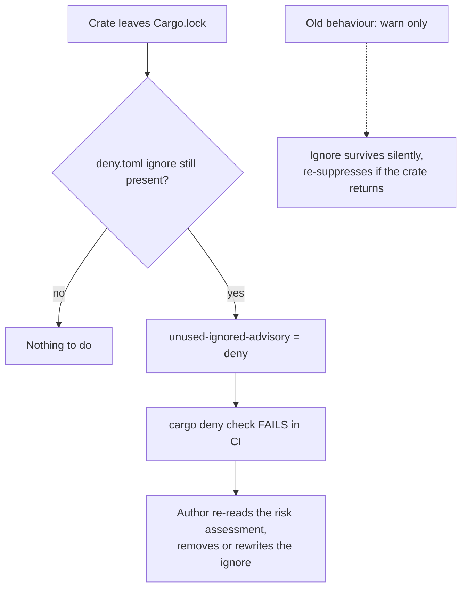

# PR Summary — Issue #1917

## Summary

Removed the dead `GHSA-2f9f-gq7v-9h6m` (Apache Thrift) suppression from both
places it lived, and configured `cargo-deny` to fail loud the next time a
suppression outlives its crate. Closes #1917.

`thrift` is no longer in the resolved graph — `parquet` 59.1 dropped it, so
`grep -c 'name = "thrift"' Cargo.lock` returns `0`. The stated premise for both
entries ("transitive dep via parquet") no longer held:

- `deny.toml` — removed the `{ id = "GHSA-2f9f-gq7v-9h6m", … }` ignore.
- `.github/workflows/security.yml` — removed the `allow-ghsas` line from the
  `dependency-review-action` step, replaced with a comment stating the rule
  (add an entry only alongside a matching, live `deny.toml` ignore).
- `deny.toml` now sets `[advisories] unused-ignored-advisory = "deny"`.

A stale suppression is not merely noise. Left in place, it **silently
re-suppresses** the advisory if the crate ever re-enters the graph — a
`parquet` major bump, a new crate pulling `thrift` in — on the strength of a
risk assessment written for a different dependency shape, with nobody
re-reading it. `unused-ignored-advisory = "deny"` makes that state fail the
gate instead of sitting unnoticed (fail loud, not silent-pass).

`RUSTSEC-2024-0436` (`paste`, unmaintained) was verified as **still needed** —
`paste v1.0.15` is in `Cargo.lock`, reached via `parquet`. Its `deny.toml`
comment claimed `metal (wgpu-hal)` as a second parent; `cargo tree -i paste`
shows `parquet` is now the only one, so the comment was corrected to match.

`docs/archive/pr-summaries/pr-summary-1297.md` still names the advisory. That
file is the immutable historical record of the original decision and is left
untouched; the note that the exposure has ended was posted as a comment on
Issue #1297 instead
([#1297 comment](https://github.com/stSoftwareAU/NEAT-AI-Discovery/issues/1297#issuecomment-5169589049)).

## Evidence

Backend/CLI change only — no web interface to screenshot. Verified with the
tooling that enforces the policy.

Before (two warnings, gate still passed):

```text
warning[unknown-advisory]: advisory not found in any advisory database
warning[advisory-not-detected]: advisory was not encountered
  ┌─ deny.toml:65:13 … no crate matched advisory criteria
advisories ok
```

After:

```text
$ cargo deny check advisories
advisories ok
```

Confirmation that `unused-ignored-advisory = "deny"` really fails a stale
ignore — the retired entry re-added against the new setting in a scratch copy:

```text
error[advisory-not-detected]: advisory was not encountered
  ┌─ deny.toml:66:13 … no crate matched advisory criteria
advisories FAILED
```

Remaining ignore is live:

```text
$ cargo tree -i paste --all-features
paste v1.0.15 (proc-macro)
└── parquet v59.1.0
    └── neat_ai_discovery v0.74.208
```

How a suppression now expires:



## Test Plan

New: `tests/issue_1917_stale_advisory_suppression.rs` (5 tests). All four
failed against the unfixed config and pass after the change:

- `deny_toml_does_not_suppress_the_retired_thrift_advisory` — `deny.toml` does
  not name `GHSA-2f9f-gq7v-9h6m`.
- `security_workflow_does_not_allow_the_retired_thrift_advisory` — the
  dependency-review step does not allow it either.
- `deny_toml_fails_loud_on_an_unused_advisory_ignore` — `[advisories]` sets
  `unused-ignored-advisory` to `deny` (or `warn`).
- `every_advisory_ignore_names_a_crate_still_in_the_graph` — the regression
  guard: every ignore in `deny.toml` must declare the crate that justifies it
  in the test's `JUSTIFIED_IGNORES` table, and that crate must still be in
  `Cargo.lock`. This is what fails when the next suppression goes stale.
- `the_paste_suppression_is_still_required` — pins the verification that
  `RUSTSEC-2024-0436` / `paste` is live.

Docs: `SECURITY.md` gained an "Expiring suppressions" bullet under
**Supply-chain machinery** recording the new policy.

Full gate: `./quality.sh < /dev/null` (bash syntax, shellcheck, cargo install
pinning, PR-summary layout, `cargo deny check`, build, fmt, clippy
`-D warnings`, `cargo check --all-targets --all-features`, full test suite).
Every check passes and every test target is green **except** three
pre-existing failures in `tests/issue_1909_quarantine_second_precision.rs`
(`held_one_second_before_the_window_closes`,
`worst_case_hour_straddle_is_still_held`,
`lockfile_planner_holds_the_worst_case_straddle`). These are unrelated to this
change and reproduce on `milestone/clean-up-20260803` untouched: the #1909
test file is committed, but `bump_deps::is_quarantine_expired` in
`bump-deps.sh` still takes its arguments in whole hours ("All values are in
hours") rather than seconds, so the second-precision assertions cannot pass.
Nothing here touches `bump-deps.sh`; fixing it belongs to Issue #1909.

## Acceptance Criteria

- [x] `GHSA-2f9f-gq7v-9h6m` appears in no active config — only in the archived
      `pr-summary-1297.md` historical record.
- [x] `cargo deny check advisories` passes with no unused-ignore warnings.
- [x] `deny.toml` fails loudly on a future unused ignore
      (`unused-ignored-advisory = "deny"`).
- [x] `RUSTSEC-2024-0436` confirmed still needed (`paste` via `parquet`).
- [x] The security workflow still passes end to end — `cargo deny check` is
      green and the dependency-review step is unchanged apart from the removed
      `allow-ghsas` key.
