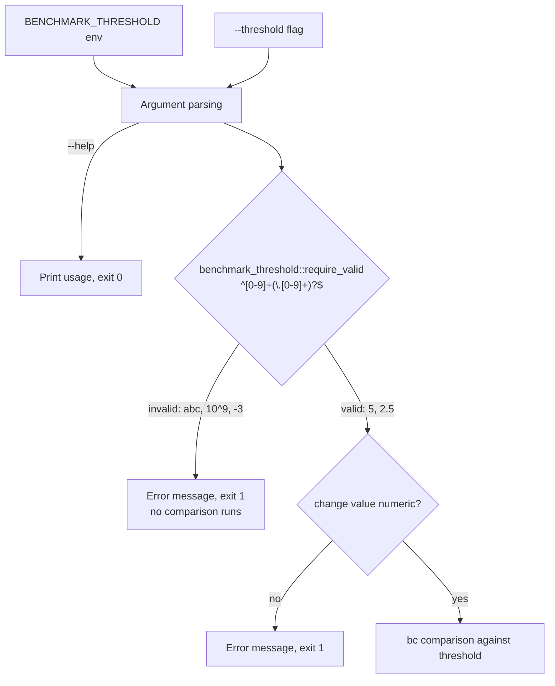

# Validate the benchmark regression threshold before it reaches `bc`

## Summary

`benchmark_compare.sh` interpolated `$THRESHOLD` straight into a `bc` expression
with no numeric check anywhere between the input and the comparison, so anyone
who controlled `BENCHMARK_THRESHOLD` or `--threshold` could defeat the
performance gate and have the defeat look identical to a genuinely clean run:

- `BENCHMARK_THRESHOLD='10^9'` — valid `bc`, puts every regression under
  threshold, and does not read as a number in a CI config.
- `BENCHMARK_THRESHOLD=abc` — `bc` errors, `$(...)` is empty, and `(( ))` then
  operates on an empty operand, so the comparison silently misbehaved instead of
  reporting a configuration error.

The check now lives in one place, `scripts/benchmark_threshold.sh`, sourced by
both `benchmark_compare.sh` and its sibling `scripts/benchmark-ci.sh` (which
already validated, differently) so the two cannot drift apart again. A threshold
must be a plain non-negative decimal — `5` or `2.5`, nothing else. The
Criterion-reported change value is guarded the same way before it reaches `bc`:
a malformed measurement now fails loud rather than producing the same empty
operand.

Closes #1918.

## Changes

- **Added `scripts/benchmark_threshold.sh`** — `benchmark_threshold::is_valid`
  (`^[0-9]+(\.[0-9]+)?$`), `benchmark_threshold::is_measurement` (signed, for
  Criterion output), and `benchmark_threshold::require_valid`, which exits 1
  with a clear message.
- **`benchmark_compare.sh`** — sources the helper (failing loud if it is
  missing, rather than exiting 127 on a stale checkout), validates the threshold
  after argument parsing so `--help` still works and before any comparison runs,
  rejects a bare `--threshold` with no value, and asserts each change value is
  numeric before the `bc` comparisons at the regression/improvement branches.
- **`scripts/benchmark-ci.sh`** — its inline `^[0-9]+$` check is replaced by the
  shared helper. Behaviour is unchanged except that fractional thresholds are
  now accepted, matching `benchmark_compare.sh`.



## Evidence

CLI-only change, so there is no web interface to screenshot. Verified by running
the real scripts:

```text
$ BENCHMARK_THRESHOLD=abc ./benchmark_compare.sh --list
Error: Threshold must be a positive integer or decimal, got 'abc'    exit=1

$ BENCHMARK_THRESHOLD='10^9' ./benchmark_compare.sh --list
Error: Threshold must be a positive integer or decimal, got '10^9'   exit=1

$ BENCHMARK_THRESHOLD=2.5 ./benchmark_compare.sh --list
Available benchmark suites (42):                                     exit=0
```

The new Rust suite fails at the base commit (4 of 9 tests) and passes with the
fix:

```text
$ cargo test --test issue_1918_benchmark_threshold_validation
test result: ok. 9 passed; 0 failed
```

The existing shell suite for the sibling script is unchanged and still green:

```text
$ bash tests/benchmark_ci_test.sh
Passed: 25   Failed: 0
```

`./quality.sh` passes, including the committed `bash -n` and ShellCheck gates
(23 scripts each).

## Test Plan

Added `tests/issue_1918_benchmark_threshold_validation.rs` — drives the real
scripts and asserts exit codes and output, so the standard `cargo test` CI gate
blocks a regression (`tests/benchmark_ci_test.sh` is not run by CI):

- `environment_threshold_rejects_non_numeric` — `BENCHMARK_THRESHOLD=abc` exits
  non-zero, and no comparison runs.
- `environment_threshold_rejects_bc_expression` — `10^9` is rejected.
- `cli_threshold_is_validated_on_the_same_path` — `--threshold` rejects `abc`,
  `10^9`, `-5`, `5;echo pwned`, `1e9`, and the empty string.
- `cli_threshold_requires_a_value` — a bare `--threshold` reports it needs one.
- `valid_integer_threshold_is_accepted`, `valid_decimal_threshold_is_accepted`,
  `valid_environment_threshold_is_accepted` — `10`, `2.5`, and `999999` still
  produce today's output.
- `help_still_works_with_an_invalid_threshold` — validation sits after argument
  parsing.
- `benchmark_ci_shares_the_same_validation` — the sibling script rejects the
  same values, pinning the shared helper.

No existing tests were modified or removed.

## Security Self-Check

- **Input validation** — this PR is the validation: both entry points for the
  threshold are allowlisted to a plain non-negative decimal before use, and the
  measured change value is checked before it reaches `bc`.
- **Injection surface** — the values are interpolated into a `bc` expression,
  not a shell command; the allowlist closes the `bc`-expression path (`10^9`)
  that defeated the gate.
- **Error handling** — failures exit non-zero with a message naming the
  offending value; no stack traces or internal paths are leaked.
- **Secrets / dependencies** — no secrets staged, no dependency changes.
