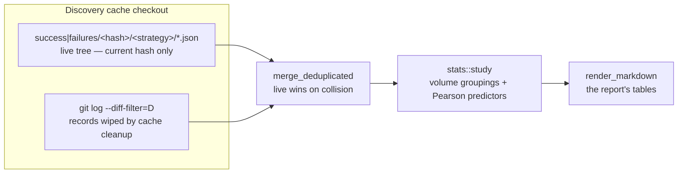

# PR Summary — Candidates Cache Study (Issue #1920)

## Summary

Adds a repeatable study of the production discovery candidates cache and reports
the first run's findings. Closes #1920.

`src/analysis/cache_study/` loads the per-candidate JSON records
(`success|failures/<model-hash>/<strategy>/*.json`), widens the corpus with
records that "Clean up OLD discovery caches" commits deleted — recovered from
git history, worth **+49% corpus** (85 live → 127 records) and the only way to
see the five superseded model hashes — and aggregates volume and gain-size
statistics into a Markdown report. The `study_candidates_cache` example drives
it, so it can be re-run as the cache grows.

Per the issue's accepted scope, the improvements the findings suggest are filed
as follow-ups (#1923, #1924, #1925), not bundled here. **No production discovery
behaviour changes in this PR.**

### Findings

Both questions the issue asks turn out to have the same answer viewed twice.

- **Volume** — `remove-low-impact` is 53% of the corpus and 79% of the live
  model hash; four of seven strategies contribute twelve records between them
  across 47 days. Fleet throughput is ~1.8 cached candidates per machine per
  day, and **57% of runs (44 of 77 cache commits) cache nothing at all**.
- **Gain size** — the field the dominant strategy ranks on,
  `removalCandidate.impact`, correlates with realised gain at **r = −0.036**
  (n = 21). Its companion `meanActivation` is hard-coded to `0.0`
  (`src/focus/ranking/removal_candidates.rs:509`), so the documented
  activation-weighted ranking is dead on the path producing most candidates.
  Discovery is not choosing *bad* removals — it is choosing *arbitrary* ones.
- The one strategy carrying a prediction, `add-neurons`, predicts backwards:
  `expectedCreatureScoreGain` correlates with **success at r = −0.608**. The
  larger the estimate, the more likely the candidate fails.

Full analysis, caveats and evidence tables:
[docs/analysis/candidates-cache-study-1920.md](docs/analysis/candidates-cache-study-1920.md).

## Evidence

Backend/CLI change — no web interface to screenshot. Verified by the test suite
below plus a real run against the production cache.



Real run against the production cache (`cargo run --example
study_candidates_cache -- <checkout>`):

```text
| Records                    | 127      |
| From working tree          | 85       |
| Recovered from git history | 42       |
| Successes                  | 29       |
| Failures                   | 98       |
| Success rate               | 22.8%    |
| Mean success scoreDelta    | 3.080e-6 |
| Median success scoreDelta  | 1.023e-6 |
| Largest success scoreDelta | 2.347e-5 |
```

`./quality.sh` passes cleanly.

## Test Plan

New suite `tests/issue_1920_cache_study.rs` (12 tests), all calling real
functions against fixture caches on disk:

| Test | Verifies |
| --- | --- |
| `parses_valid_cache_paths` | outcome/hash/strategy parsed off both `success/` and `failures/` paths |
| `rejects_paths_that_are_not_cache_records` | non-JSON, wrong depth and unknown top-level dirs are skipped, not mis-parsed |
| `loads_every_live_record_with_its_classification` | full working-tree walk, outcome split and source tagging |
| `malformed_record_fails_loudly_naming_the_file` | a corrupt record errors with the offending filename (Issue #3234 — no silent skip) |
| `rejects_a_directory_that_is_not_a_cache_checkout` | a non-cache directory fails loudly instead of reporting an empty corpus |
| `study_summarises_volume_and_gain` | counts, success rate, median/max gain, vanishing-gain count, and all five groupings |
| `predictor_detects_a_monotone_relationship` | a fixture where impact rises with gain yields r ≈ 1.0 |
| `pearson_handles_degenerate_inputs` | perfect/inverse fits, too-few pairs, zero variance, ragged input |
| `parses_deleted_log_output` | `git log --diff-filter=D` parsing across multiple commits |
| `recovers_wiped_records_from_git_history` | end-to-end against a real temp git repo: seed, wipe a model hash, recover it, and confirm live records are not duplicated |
| `report_renders_the_headline_tables` | every heading plus a known data row and predictor label |
| `report_handles_an_empty_corpus_without_panicking` | empty-corpus rendering |

## Security Self-Check

- **Input validation** — cache paths are structurally validated before use
  (`parse_cache_path`); malformed JSON is rejected with context.
- **Injection surface** — git is invoked via `std::process::Command` with a
  fixed argument vector (no shell), and the only caller-supplied values are the
  checkout path and git-derived commit/path pairs.
- **Secrets** — none read or written; no hidden files staged.
- **Read-only** — the tool never writes to the cache checkout.
- **Public-repo hygiene** — all new docs describe the evidence at concept level,
  per the Issue #1723 guard, which passes.

## Deno regression avoided

Not applicable — this is a Rust repository with no Deno markers.
