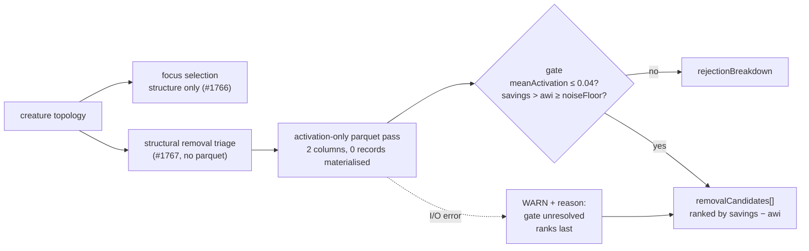

# `remove-low-impact` ranks on a live activation-weighted signal (Issue #1923)

## Summary

`remove-low-impact` produces 53% of every cached candidate and 79% of all
realised gain, but the field it ranked on carried no gain signal. The structural
removal path (`src/focus/ranking/removal_candidates.rs`) constructed every
candidate with `mean_activation: 0.0` / `activation_weighted_impact: 0.0` and a
reason string admitting the activation-weighted gate was *"deferred to
analysis"* — a deferral nothing downstream ever resolved. The #1920 cache study
measured the cost: `removalCandidate.impact` correlates with realised
`scoreDelta` at **r = −0.036**, and `meanActivation` was `0` in all 67 cached
records (zero variance — not even correlatable).

This resolves the gate instead of deferring it. After the structural triage has
chosen the candidate set from topology alone (Issue #1767, unchanged), a
**two-column** streaming Parquet pass measures each surviving candidate's mean
absolute activation, and the candidates are re-gated and re-ranked on
`activationWeightedImpact = impact × meanActivation` — the same criterion the
record-derived path already applied. Issue #892's active-neuron gate, which was
structurally unreachable on this path, now runs.

Closes #1923.

### Why this does not reintroduce the Issue #1766 focus stall

Issue #1766 removed parquet I/O from focus **selection**, because decoding
multi-GB record sets before a single focus neuron had been picked burned the
whole analysis budget (a ~2 h production stall). Three properties keep the new
pass off that path:

1. It runs **after** selection — the focus set is already fixed above it, so a
   slow or failing measurement cannot delay or alter which neurons are focused.
2. It projects `neuron_uuid` + `activation` only and materialises **no**
   `DiscoverRecord`s, so it never decodes the `errors` `ListArray` that
   dominates the file. Memory is `O(candidates)`, not `O(rows)`.
3. It is bounded by the caller's shared discovery deadline
   (`analysisDeadlineMs`), checked at every record-batch boundary.

### Failing loud, not silent

An unreadable parquet or a candidate with no recorded rows leaves the fields at
`0.0` — but never presents that as a measurement:

- the candidate's `reason` reads `activation-weighted gate pending — unresolved:
  <error>` or `— no recorded activation samples`;
- an I/O failure emits a WARN naming the file, the error, and the candidate
  count; and
- unmeasured candidates rank **below** every measured one, so an unmeasured
  `activationWeightedImpact` of `0.0` can never flatter a candidate to the top
  of the list.

## Evidence

This is a backend/FFI change with no web interface, so there is no screenshot.
The evidence is the test suite below plus the wire contract asserted at the FFI
boundary.

Before / after on the wire, for a hidden neuron with structural impact `1e-6`
and three recorded activations `0.01 / -0.03 / 0.02`:

| Field | Before | After |
| --- | --- | --- |
| `meanActivation` | `0.0` (hard-coded) | `0.02` (measured, 3 samples) |
| `activationWeightedImpact` | `0.0` | `2e-8` = `impact × meanActivation` |
| `expectedErrorReduction` | structural impact | activation-weighted impact (#117) |
| `reason` tail | `activation-weighted gate deferred to analysis` | `activation-weighted gate resolved (Issue #1923): meanActivation=…` |

The issue names "re-run the #1920 study; `r vs log gain` is the acceptance
measure" as the follow-up validation. That measurement needs a fresh production
candidates cache accumulated **after** this change ships, so it cannot be
produced in this PR — the study tool (`cargo run --example
study_candidates_cache`) is unchanged and re-runnable against the cache once
candidates carrying a live `meanActivation` have been evaluated.

## Test Plan

### Added

`tests/issue_1923_activation_summary.rs` — the projected aggregator
(`read_mean_abs_activation_by_neuron`):

- `means_the_absolute_activation_of_each_wanted_neuron` — happy path, sign-
  insensitive mean and sample count.
- `ignores_neurons_the_caller_did_not_ask_for` — the wanted-set filter.
- `omits_a_neuron_with_no_recorded_rows` — "never measured" ≠ "measured as
  inactive"; the neuron is absent, not zero.
- `skips_non_finite_activations_and_omits_wholly_non_finite_neurons` — NaN/inf
  samples do not poison the mean, and a wholly non-finite neuron yields no
  measurement.
- `an_empty_request_reads_nothing_and_succeeds` — no file is opened.
- `a_missing_file_is_an_error_not_an_empty_result` — fail loud.
- `an_expired_deadline_aborts_rather_than_returning_partial_results` — a
  truncated scan is never returned as a complete one.

`tests/ffi/issue_1923_activation_weighted_removal_gate.rs` — the wire contract
through `rank_focus_neurons_internal`:

- `mean_activation_is_measured_from_recorded_samples` — the regression test for
  this issue: fails against the unfixed code (`meanActivation` was `0.0`,
  `activationWeightedImpact` was `0.0`), passes after.
- `an_actively_firing_neuron_is_gated_out_and_counted` — Issue #892's gate is
  now reachable, and its rejection is counted in `rejectionBreakdown` rather
  than silently dropped.
- `unmeasured_candidates_rank_below_measured_ones` — an unmeasured `0.0` cannot
  win the ranking.
- `an_unreadable_parquet_marks_the_gate_unresolved` — the fields stay unmeasured
  and the `reason` declares it.

### Modified

`tests/ffi/issue_1767_structural_removal_triage.rs` —
`removal_candidates_defer_activation_weighted_fields_to_analysis` renamed to
`removal_candidates_stay_unmeasured_when_records_cannot_be_read`. **Business
logic changed**: the fields are no longer deferred, they are measured. Every
assertion is unchanged — the fixture passes `/nonexistent/x.parquet`, which is
now the *unresolvable* case, so the suite pins the graceful-degradation half of
the contract while the new suite pins the measured half. No test was removed or
commented out.

### Full gate

`./quality.sh < /dev/null` (fmt, clippy `-D warnings`, `cargo deny`, debug and
release builds, full test suite at `--test-threads=1`).

## Security self-check

- **Input validation** — the new reader validates the Parquet schema (column
  names, Arrow types, nullability) before decoding, reusing the Issue #1901
  gate; the FFI entry point's existing forward-only and input-bound validation
  is untouched.
- **Secrets** — none staged.
- **Injection surface** — no new SQL, shell, or HTTP calls; the parquet path is
  the caller-supplied value the FFI already accepted, opened through the
  existing `open_parquet_file` guard (rejects `.parquet.tmp`, reports removal
  distinctly).
- **Error handling** — errors are logged with context and surfaced in the
  `reason` field; no stack traces or internal paths beyond the file name the
  caller supplied.
- **Dependencies** — none added.
