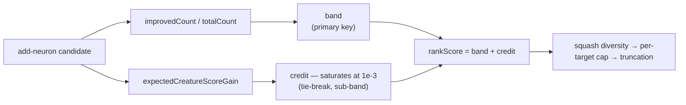

## Summary

`add-neurons` candidates were ranked by `expectedCreatureScoreGain`, which the
Issue #1920 candidates-cache study measured at **r = −0.608** against success:
the engine's most confident predictions were exactly the ones that failed, so
sorting on it descending put the losers at the top of every batch. Ranking now
uses a **reliability-weighted rank score** — the improved-sample share
(`improvedCount / totalCount`, the only field in the corpus that tracks success
positively at r = +0.466) banded, with the gain estimate breaking ties **inside**
a band only. Closes #1924.

The gain-versus-reliability trade-off the issue asks for is explicit and tunable:
`NEAT_AI_DISCOVERY_NEURON_RANKING_BANDS` (default 10) sets how many reliability
bands candidates are bucketed into; `1` collapses the order back to
gain-descending, the pre-#1924 behaviour. The gain credit saturates at `1e-3` —
above that the predictions are pure over-confidence — and is by construction
narrower than one band, so a larger prediction can never lift a candidate past a
more reliable one.

`expectedCreatureScoreGain` itself is unchanged: this stops discovery *ranking*
on a broken predictor, it does not recalibrate it, and the gain floor
(#1191/#1778) still screens on the same value.



## Evidence

Backend/library change — no web interface to screenshot.

The issue names the acceptance measure: `r vs success` for the field the ranking
sorts on. The cache study now scores `rankScore` with the production scorer, so
re-running it measures exactly that. Against the production cache on 2026-08-02
(130 records; 13 `add-neurons`, 4 successes):

```bash
cargo run --example study_candidates_cache -- /path/to/discovery-cache-checkout
```

| Field | Gain n | r vs log gain | Outcome n | r vs success |
| --- | ---: | ---: | ---: | ---: |
| `neuronCandidate.expectedCreatureScoreGain` | 4 | +0.781 | 13 | **−0.608** |
| `neuronCandidate.improvedShare` | 4 | −0.871 | 13 | +0.466 |
| `neuronCandidate.rankScore` | 4 | −0.869 | 13 | **+0.465** |

Sign flipped, and within 0.001 of the best signal the corpus offers — while
keeping the gain tie-break that a pure `improvedShare` ordering throws away.

Ordering over the same 13 records: the successes move from mean position 10.0 of
13 to 4.5, and the worst loss in the corpus (−2.040e-5, which the old key ranked
**first**) drops to twelfth. Full before/after table in
[docs/analysis/neuron-ranking-score-1924.md](docs/analysis/neuron-ranking-score-1924.md).

Caveats are recorded in that document rather than glossed over: 13 records and 4
successes are directionally clear but not calibrated; reliable candidates land
small (r = −0.869 against realised gain); and the top-ranked record is still a
failure, albeit a −5.6e-8 wash rather than a −2.0e-5 loss.

## Test Plan

New — `tests/issue_1924_neuron_ranking_score.rs`, over the full 13-record
production corpus:

- `expected_gain_anti_correlates_with_success` — reproduces the defect (r < −0.5
  for the old ranking key).
- `rank_score_correlates_positively_with_success` — the acceptance measure
  (r > +0.4 for the new key).
- `successes_rank_higher_than_under_the_gain_ordering` — successes move up the
  batch, not just up the correlation.
- `the_most_over_confident_prediction_is_no_longer_ranked_first`
- `reliability_outranks_a_larger_prediction`

New — `src/analysis/neuron/ranking_score.rs` unit tests: band dominance, band
boundaries a saturated gain cannot cross, within-band gain ordering, credit
saturation at the reference, the single-band escape hatch, the env override,
zero-sample candidates, and non-finite inputs.

New — `src/analysis/neuron/post_processing.rs`: the per-target cap and the
`(target, squash)` diversity filter both now retain the reliable candidate over
the over-confident one.

No existing tests were modified or removed. Full suite (`./quality.sh`) passes:
1,459 lib tests plus the integration suites, clippy `-D warnings`, `cargo deny`,
and the doc build.
