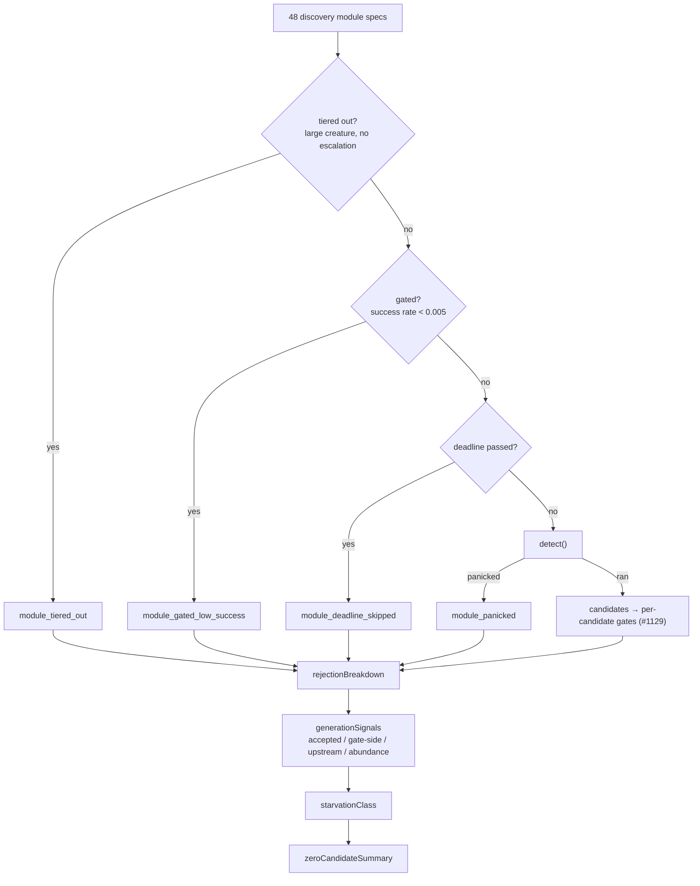

## Summary

A barren discovery pass now says **which gate silenced it**. Four gates suppress
a *whole discovery module* — the historical success-rate gate (#1060), the
deadline skip (#1029), a caught detection panic (#1087), and creature-scale
tiering (#1547) — and all four were log-only. A module that was never asked was
indistinguishable in the response from one that ran and found nothing, which is
exactly the question the #1920 cache study could not answer about the 57% of
production runs that cache nothing:

> The cache stores candidates the controller *evaluated*. Candidates rejected
> inside discovery never appear, so this corpus cannot say why a run proposed
> nothing — only that 57% of them did.

Each skip is now counted under its own stable rejection reason
(`module_gated_low_success`, `module_deadline_skipped`, `module_panicked`,
`module_tiered_out`), classified as **upstream** evidence, and named against the
module in `discoveryModuleStats.skipped`. Alongside them, `zeroCandidateSummary`
reports the starvation classification and the generation-signal counts behind
it — a verdict computed on every pass since #1739 to gate novelty escalation and
then discarded.

This is Issue #1925's first question ("instrumenting which gate rejects the last
candidate in a barren run would answer it"). No gating, tiering, deadline or
panic behaviour changed and no gate was loosened — the candidate set a pass
returns is identical. The second question ("why is the mix so lopsided?") is
deliberately left to the data this attribution produces: the study's own caveat
is that a two-record 50% success rate is "worth measuring properly", not a proven
win, and changing the module set before the counters exist would be guesswork.

Closes #1925.

## Evidence

Backend/CLI change with no web interface, so there is no screenshot. Verified by
the tests below; `./quality.sh` passes (fmt, clippy `-D warnings`, check, full
test suite, release build, `cargo deny`).



New response fields:

```json
{
  "synapseMetadata": {
    "rejectionBreakdown": { "module_tiered_out": 7, "module_gated_low_success": 1 },
    "discoveryModuleStats": [
      { "moduleName": "multi-hop analysis", "candidatesProduced": 0, "skipped": "module_tiered_out" }
    ]
  },
  "zeroCandidateSummary": {
    "starvationClass": "candidateStarved",
    "generationSignals": {
      "accepted": 0, "gateSideRejections": 2, "upstreamRejections": 8,
      "abundanceRejections": 0, "reachingGate": 2, "proposalsFormed": 2
    }
  }
}
```

`proposalsFormed` is the number an operator reads first: `0` with `module_*`
dominating `upstreamRejections` means the strategies were never asked; a large
`proposalsFormed` with a large `gateSideRejections` is the #1737 converged
profile, where generation is not the bottleneck.

The `module_gated_low_success` count also makes a **ratchet** measurable for the
first time: a gated module generates nothing, so it earns no new ablation
attempts, so its success rate cannot recover and the suppression is permanent for
the life of the tracker. That is a concrete mechanism for the issue's "their
rates are unproven precisely because they are never asked for".

### On the acceptance measure

The issue names a re-run of the #1920 study as the acceptance measure. That study
reads the **controller's** cache, which only ever holds candidates the controller
evaluated, so per-strategy record counts cannot move until discovery's proposal
mix does — and no proposal behaviour is changed here. The honest sequence is:
land the attribution, observe `zeroCandidateSummary` / `discoveryModuleStats`
across the fleet's barren runs, then let the dominant `module_*` reason decide
which starvation mechanism (if any) warrants a behaviour change. Recorded in
[docs/analysis/module-skip-attribution-1925.md](../../analysis/module-skip-attribution-1925.md).

## Test Plan

Added `tests/issue_1925_module_skip_attribution.rs`:

- `module_skip_reasons_are_documented_and_classified_upstream` — all four
  reasons appear in `ALL_REJECTION_REASONS` and in
  `UPSTREAM_REJECTION_REASONS` (the partition test pins exhaustive coverage).
- `gated_module_is_counted_and_named_in_module_stats` — a tracker below
  `MODULE_GATE_THRESHOLD` yields `module_gated_low_success: 1` and
  `discoveryModuleStats[].skipped`; the detection closure panics if run, proving
  the module was suppressed.
- `deadline_skipped_module_is_counted` — a past deadline yields
  `module_deadline_skipped: 1`.
- `panicking_module_is_counted_rather_than_silently_empty` — a caught panic is no
  longer indistinguishable from an empty result.
- `tiered_out_module_is_counted` — a tiered-out entry merges into the breakdown.
- `module_that_ran_is_never_counted_as_skipped` — the counterpart guard, for both
  "found nothing" and "found a candidate".
- `a_pass_silenced_by_module_skips_classifies_as_candidate_starved` — module
  skips reach the classifier as upstream drops.
- `zero_candidate_summary_reports_starvation_class_and_signals` — struct and
  camelCase JSON shape of the new fields.

Added `src/analysis/module_dispatch_specs/mod.rs::tiering_returns_the_specs_it_removed`
— tiering hands back the specs it dropped rather than discarding them.

Updated (not removed) existing call sites for the two new
`build_zero_candidate_summary` parameters and the new
`DiscoveryModuleDetectionEntry::skip_reason` field:
`tests/issue_1446_zero_candidate_summary.rs`,
`tests/analysis/issue_1781_fingerprint_skip_escape.rs`,
`tests/analysis/issue_1004_overlap_compression_discovery.rs`,
`benches/quality_skip_dispatch.rs`.

Documentation: `docs/FFI_API.md` (module-level skips + the new
`zeroCandidateSummary` fields) and
`docs/analysis/module-skip-attribution-1925.md`.

## Security Self-Check

- **Input validation** — no new external input; the added parameters are
  internal types computed within the same function.
- **Secrets** — none staged.
- **Injection surface** — no new SQL, shell, filesystem, or HTTP calls.
- **Output encoding** — new response fields are serde-serialised `u32` counts and
  a fixed set of `&'static str` classification names.
- **Error handling** — no new error paths; the change makes previously-silent
  suppressions loud rather than swallowing anything.
- **Dependencies** — none added.
