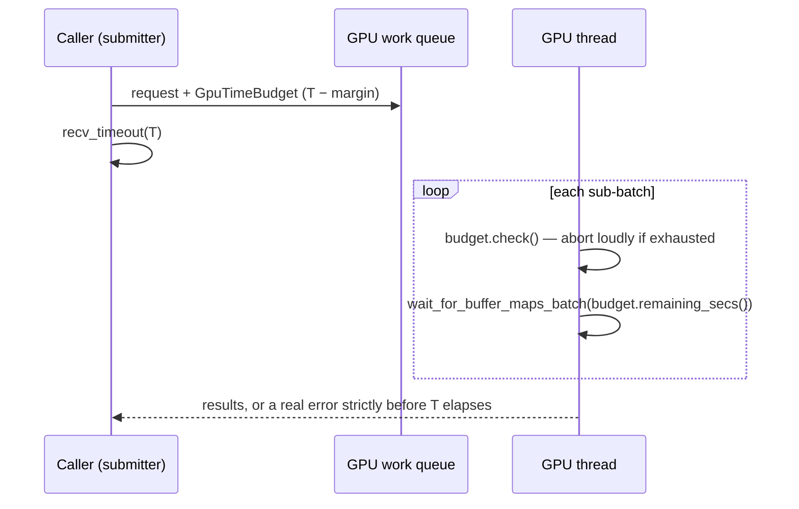

# PR Summary — Issue #1928

## Summary

The GPU worker's inner waits were fixed constants applied *per sub-batch*
(`GPU_BUFFER_MAP_TIMEOUT_SECS` = 295s), while the submitter gave up after at
most `GPU_QUEUE_TIMEOUT_MAX_SECS` = 300s. A request that split into `n`
sub-batches could therefore occupy the GPU thread for `n × 295s`, guaranteeing
the caller timed out while the thread was still inside the driver — and `Drop`
abandoned it after 10s with the "GPU thread did not exit within timeout"
warning reported in #1926.

This threads a per-request time budget from the submitter into the evaluation
code. Every inner wait is now capped by the budget remaining at that moment, so
the sum across sub-batches can never exceed the caller's timeout. Closes #1928.

- New `GpuTimeBudget` (`src/analysis/gpu/budget.rs`): inner deadline = caller
  timeout − `GPU_BUFFER_MAP_TIMEOUT_MARGIN_SECS`, so the worker always errors
  out *before* the caller stops waiting and the error travels back through
  `response_tx` instead of the caller giving up on a silent worker.
- Each `GpuWorkRequest` variant carries a `budget`, set in
  `queue/submission.rs` from the same `calculate_gpu_batch_timeout()` value the
  submitter waits on.
- `helpful`, `harmful`, `relu` and `activation` evaluation gained
  `*_with_budget` entry points. The sub-batch loops call `budget.check()` before
  starting another chunk and pass `budget.remaining_secs()` to
  `wait_for_buffer_map(s_batch)`, recomputed each iteration; the 5s
  post-chunk `poll_device_until_idle` is capped the same way.
- `GPU_BUFFER_MAP_TIMEOUT_SECS` remains, now only as the no-deadline fallback
  (`GpuTimeBudget::unbounded()`), and the existing
  `const _: () = assert!(GPU_BUFFER_MAP_TIMEOUT_SECS < GPU_QUEUE_TIMEOUT_MAX_SECS)`
  invariant in `device.rs` is untouched.

Out of scope (as stated in the issue): the circuit breaker and the `sample`
thread-dump hang. `bias_evaluation` is also unchanged — it is called directly on
the caller's own thread (`calculate_optimal_bias`), not through the queue, so no
worker thread can be abandoned there.

## Evidence

Backend/library change — there is no web interface to screenshot. Verified by
unit tests (below) plus the full `./quality.sh` gate (fmt, clippy `-D warnings`,
check, tests, release build).

Before: `worst-case worker time = n_sub_batches × 295s` vs a 300s caller
timeout. After: `worst-case worker time = T − 5s`, independent of sub-batch
count.

## Test Plan

New tests (all pure deadline arithmetic — no GPU required, so they keep
guarding on the CI ubuntu runner where GPU tests self-skip):

- `src/analysis/gpu/budget.rs`
  - `inner_deadline_is_strictly_before_caller_timeout` — inner deadline is the
    caller's timeout less exactly the safety margin.
  - `short_caller_timeout_still_leaves_a_margin` — the margin is never skipped.
  - `budget_shrinks_across_successive_sub_batches` — the budget is monotonically
    non-increasing across ten simulated sub-batches, is exhausted once the
    caller's window is used up, and the total inner wait stays inside the
    caller's timeout.
  - `unbounded_budget_falls_back_to_the_constant` — the no-deadline path uses
    `GPU_BUFFER_MAP_TIMEOUT_SECS` and never expires.
  - `exhausted_budget_fails_loudly` — an exhausted budget returns an error
    naming the stage it refused, rather than starting another wait.
  - `capped_wait_never_exceeds_remaining_budget` — fixed waits shrink with the
    budget.
- `src/analysis/gpu/queue/submission.rs`
  - `submitted_request_budget_expires_before_the_caller_timeout` — an enqueued
    request carries a bounded budget strictly shorter than the caller's timeout,
    with the margin deducted.
  - `submitted_request_without_deadline_stays_within_the_max_timeout` — the
    no-deadline submission still bounds the worker below
    `GPU_QUEUE_TIMEOUT_MAX_SECS`.

Existing tests kept unchanged apart from adding the new required `budget` field
to `GpuWorkRequest` constructors in `queue/mod.rs` and `queue/execution.rs`
tests; no test was removed or disabled.

## Documentation

`docs/GPU_GUIDE.md` — "GPU timeout errors" now documents the per-request time
budget and includes a sequence diagram of the caller/worker deadline
relationship.
