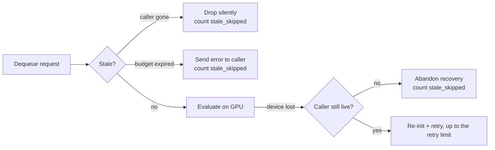

## Summary

The GPU thread had no way to know a submitter had given up: a caller that timed
out simply dropped its response receiver, so the worker still dequeued the
request, spent a full evaluation on it, and — on the device-lost path —
re-initialised the `GpuAnalyzer` and retried it up to `DEFAULT_GPU_RETRY_LIMIT`
times with back-off, all for a result nobody could receive. On a backed-up
bounded work queue that time and capacity belongs to live submitters.

The worker now classifies every dequeued request before touching the analyser
and skips the stale ones, counting each skip in `global_gpu_metrics()`.
Closes #1929.

### What changed

- **`src/analysis/gpu/queue/staleness.rs`** (new) — stale detection. A request
  is stale when its caller has gone or when its own `GpuTimeBudget` (Issue
  #1928) expired while it queued. `crossbeam_channel::Sender` exposes no
  receiver count (the issue's suggested `Sender::receiver_count()` does not
  exist in 0.5.x), so liveness uses the `Arc`-based alternative the issue also
  offers: the submitter holds a `CallerGuard` for exactly as long as it waits,
  and the request carries the paired weak `CallerLiveness` handle.
- **`src/analysis/gpu/queue/execution.rs`** — the loop skips stale requests
  before calling the analyser, and re-checks liveness before *every* device-lost
  recovery attempt, so an abandoned request costs zero re-initialisations and
  zero back-off sleeps.
- **`src/analysis/gpu/queue/executor.rs`** (new) — a `RequestEvaluator` /
  `EvaluatorFactory` seam. Production runs on `GpuAnalyzer` exactly as before;
  the seam is what lets the tests assert the analyser is *never* called, on CI
  machines with no GPU.
- **`src/observability/gpu_metrics.rs`** — `stale_skipped` counter, recorded
  unconditionally (it is a fault signal, not a throughput stat) and included in
  the `NEAT_AI_DISCOVERY_GPU_METRICS=1` report.
- **`src/analysis/gpu/queue/submission.rs`** — every submitter creates a guard
  that lives exactly as long as it waits; `GpuFuture` carries it and drops it as
  soon as `collect()` stops waiting.

### Fail-loud behaviour

A dropped caller is discarded silently — there is nobody left to tell. An
**expired budget** with a caller still waiting is different: it now gets a real
error through the response channel immediately, instead of sitting out its full
timeout on work the worker already knows it will not finish in time.

## Evidence

Backend/library change — no web interface to screenshot. Verified by tests
(below) and by `./quality.sh`.

Before this change the `S` and `R` diamonds did not exist: every dequeued
request went straight to `G`, and every device-lost failure went straight to
`T`.

## Test Plan

Loop-level tests (`src/analysis/gpu/queue/stale_skip_tests.rs`) drive the real
worker loop with a counting stub evaluator and factory, so they assert what the
loop does *not* do and run without a GPU:

- `stale_request_skipped_without_analysis` — a request whose caller has gone is
  dropped without invoking the analyser, and the live request queued behind it
  is still served (acceptance criterion 1 + 3).
- `device_lost_retry_aborts_on_dead_receiver` — the caller vanishes mid-flight;
  zero `GpuAnalyzer` re-initialisations instead of `DEFAULT_GPU_RETRY_LIMIT`
  (acceptance criterion 2).
- `device_lost_retry_still_runs_for_live_caller` — the converse: a live caller
  still gets the full recovery budget and a real error, so the abort above is
  caused by the dead caller and not by the check swallowing all recovery.
- `stale_skip_counted_in_metrics` — the counter rises by exactly the number of
  skipped requests (acceptance criterion 4).
- `expired_budget_request_fails_loudly_without_analysis` — an expired request
  never reaches the analyser and its caller receives a real error.

Detection tests (`src/analysis/gpu/queue/staleness.rs`) cover `stale_reason()`
for every request variant: live caller, dropped caller, expired budget,
unexpired budget, dropped-caller-wins-over-expired-budget, and `Shutdown` never
being stale.

Public-surface tests (`tests/gpu/issue_1929_stale_request_skip.rs`, registered
in `tests/gpu/main.rs`) cover the `stale_skipped` counter as production reads
it, including that skips do not inflate the batch/sample/busy-time counters.

The loop tests live in-crate rather than in `tests/gpu/` because
`GpuWorkRequest` and the worker loop are `pub(crate)`; the integration file
covers everything observable from outside the crate.

## Security Self-Check

- Input validation: no new external input; the liveness handle is an internal
  `Weak<()>`.
- Secrets: none staged.
- Injection surface: no new SQL, shell, filesystem, or HTTP calls.
- Output encoding: new log fields are fixed `&'static str` labels.
- Authentication/authorisation: not applicable.
- Error handling: the new error message names the expired budget only — no
  paths or internal state leaked.
- Dependencies: none added.
