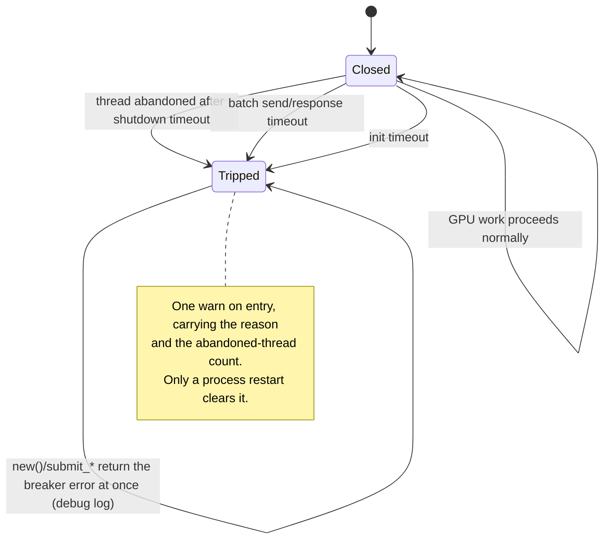

# Add a process-wide GPU circuit breaker (Issue #1930)

## Summary

Nothing remembered that the GPU had already wedged. Every analysis called
`GpuWorkQueue::new()` from one of three independent sites, spawning a fresh GPU
thread — and therefore a fresh `wgpu` device, buffer pool and Metal command
buffers — against the same dead hardware, then sat out another 60–300s batch
timeout before failing. The #1926 report shows three abandoned threads and
~30 minutes of wall clock burned that way in a single run.

This adds `src/analysis/gpu/breaker.rs`: a one-way `GpuCircuitBreaker` that trips
on the first wedged batch and refuses all further GPU work for the life of the
process. Closes #1930.

**Trip conditions** (first one wins and keeps its reason):

| Condition | Site |
|-----------|------|
| A GPU thread did not exit within `GPU_SHUTDOWN_TIMEOUT_SECS` and was abandoned | `Drop for GpuWorkQueue` (`scheduling.rs`) |
| A batch submission timed out — the queue never accepted it, or the GPU never answered | all six `submit_*`/`evaluate_*` entry points plus `GpuFuture::collect` |
| GPU initialisation timed out after `GPU_INIT_TIMEOUT_SECS` | `GpuWorkQueue::new()` |

**Once tripped:** `GpuWorkQueue::new()` returns an error instead of spawning a
thread, and every submission returns immediately instead of starting a new
multi-minute wait. The error carries the original trip reason and the
abandoned-thread count. The trip logs **once** at `warn`; everything suppressed
afterwards logs at `debug`, so a wedged GPU cannot flood the log.

The breaker keys off those explicit sites, never off string matching:
`is_device_lost_error()` matches "driver may be unresponsive" but not the
batch-timeout wording "The GPU may be unresponsive", so message matching would
miss the exact failure this exists to stop. Self-restart stays out of scope —
that remains with the external supervisor.

### The breaker is a value, not just a global

Production uses one breaker, `global_gpu_breaker()`, which `GpuWorkQueue` holds a
`&'static` reference to — so a trip anywhere stops GPU work everywhere. Tests
point a queue at an isolated instance instead. Without that seam, unit tests
exercising the tripped path refused GPU work for every other test in the binary
and cascaded into 12 unrelated failures. This mirrors the `RequestEvaluator` seam
introduced for #1929.

### Latent test-fixture bug found and fixed

The three `with_deadline` fixtures in `src/analysis/gpu/queue/mod.rs` built a
`GpuWorkQueue` by hand and kept the exit-channel **sender** alive past the
queue's own drop. `Drop` therefore waited the full `GPU_SHUTDOWN_TIMEOUT_SECS`
(10s each) and reported a GPU thread that had never been spawned as abandoned.
Dropping the sender immediately makes `Drop` take the disconnected path, removing
both the false abandonment and 30s of dead wall clock from the suite.

## Evidence

Backend/library change — there is no web interface to screenshot. Verified by
tests, described under Test Plan.

Quality gate output (`./quality.sh`): `cargo deny`, `clippy -D warnings`,
`cargo check --all-targets --all-features`, `cargo test --lib --tests
--all-features -- --test-threads=2` and `cargo doc` all pass — 1486 lib tests and
61 GPU integration tests green.

## Test Plan

Crate-internal (`cargo test --lib`), all against isolated breakers so no global
state is mutated:

- `src/analysis/gpu/breaker.rs`
  - `a_new_breaker_is_closed` — a fresh breaker allows work.
  - `tripping_records_the_reason_and_blocks_work` — the error names the reason
    and carries the abandoned-thread count.
  - `the_first_trip_reason_is_kept` — later trips never overwrite the original
    diagnosis.
  - `abandoning_a_thread_trips_the_breaker` — the `Drop` path trips it.
  - `reset_restores_the_closed_state` — the test-only reset hook.
  - `reason_codes_round_trip` — the atomic representation, including the
    untripped sentinel.
  - `concurrent_trips_settle_on_one_reason` — 200 rounds of two racing trips;
    guards the compare-exchange against a check-then-set regression.
  - `the_free_functions_delegate_to_the_global_breaker` — production wiring reads
    the one global instance.
- `src/analysis/gpu/queue/submission.rs`
  - `tripped_breaker_short_circuits_every_entry_point` — all six entry points
    return the breaker error, enqueue nothing, and the whole sequence is bounded
    well under the 60s minimum wait it replaces.
  - `tripped_breaker_suppresses_the_empty_input_fast_paths` — no clean zero
    result that a caller could mistake for real work.
  - `a_batch_response_timeout_trips_the_breaker` /
    `a_full_queue_send_timeout_trips_the_breaker` — both timeout shapes trip it,
    and the caller still receives the original timeout error.
  - `reset_restores_normal_submission` — submission works again after a reset.

Integration (`tests/gpu/issue_1930_gpu_circuit_breaker.rs`, registered in
`tests/gpu/main.rs`), covering the process-global wiring:

- `queue_creation_is_refused_after_a_trip` — `GpuWorkQueue::new()` returns the
  breaker error inside 2s, far under `GPU_INIT_TIMEOUT_SECS`, so no thread was
  spawned or waited on.
- `queue_creation_stays_refused_on_every_later_attempt` — the breaker is one-way.
- `the_breaker_error_carries_the_reason_and_the_abandoned_count`.
- `the_original_trip_reason_survives_later_trips`.
- `the_abandoned_thread_count_is_exposed_via_gpu_metrics` — the breaker and
  `global_gpu_metrics()` report the same counter.
- `the_trip_logs_exactly_one_warn_and_nothing_louder_afterwards` — the log-flood
  guard: a capturing subscriber asserts exactly one `warn` carrying the reason
  and count, with suppressed calls staying at debug.
- `the_reset_hook_restores_the_untripped_state`.

Every real-GPU test in `tests/gpu/gpu_work_queue.rs` is now `#[serial]`, since the
breaker tests in that binary trip and reset process-wide state.

## Runtime backstop

`abandoned_threads` is published in `global_gpu_metrics()` and printed by
`NEAT_AI_DISCOVERY_GPU_METRICS=1`. After this change a run log may contain at
most one `GPU thread did not exit` warning plus one breaker-trip `warn`; two or
more abandon warnings, `abandoned_threads > 1`, or any GPU submission after the
trip warn means the breaker regressed.

## Documentation

`docs/GPU_GUIDE.md` gains a "Process-wide circuit breaker" section under GPU
timeout errors: the trip table, the post-trip behaviour, why string matching is
not used, the metrics backstop, and the state diagram above.
