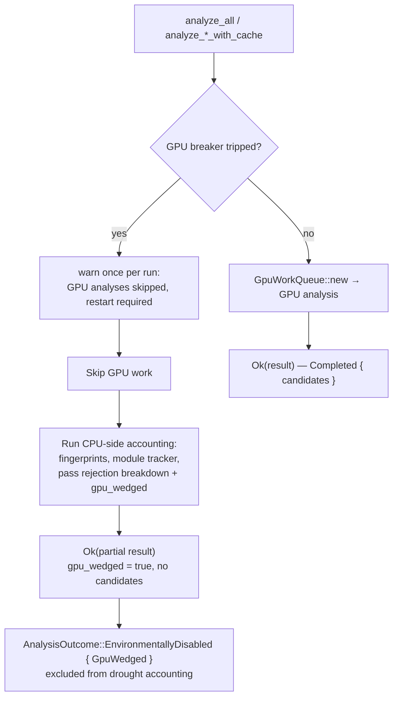

# Analyses skip GPU work and return a signalled partial result when the GPU breaker is tripped

## Summary

The circuit breaker from the sibling sub-issue (#1930) stops GPU work, but the
analyses still had to do something sensible with the remaining run budget. All
three GPU-queue construction sites treated "no GPU queue" as a hard error, so a
tripped breaker propagated a raw error out of `analyze_all`, discarded whatever
CPU-side state existed, and read to the host as one more failed attempt.

The analyses now **skip** the GPU work and exit normally with a signalled
partial result — mirroring the cancellation path, which already returns an
`AnalyzeAllResult` with `cancelled: true` rather than an error. Closes #1931.

- **Three skip sites.** `analyze_all`, `analyze_neurons_with_cache` and
  `analyze_synapses_with_cache` check the breaker before constructing the queue
  and return `Ok(...)` with empty GPU-derived results instead of `.context(...)?`.
  In `analyze_all` the check sits *before* `gpu_is_available()`, because a wedged
  device usually still enumerates as an adapter.
- **An explicit signal, not a silent empty.** `AnalyzeAllResult.gpu_wedged` plus
  `gpu_wedged` on both analysis metadata structs, and a new
  `EnvironmentalDisableReason::GpuWedged` that `AnalysisOutcome::from_result`
  maps a wedged pass to. `GpuWedged` is distinct from `GpuUnavailable`: the host
  *has* a usable GPU that stopped responding mid-run, and the remedy is an
  external process restart rather than a hardware or driver change.
- **CPU-side accounting survives.** Neuron fingerprints, the fingerprint
  hit/miss counts, the module outcome tracker and the pass rejection breakdown
  are all still returned. The breakdown records one new `gpu_wedged` rejection
  per focus neuron that was never evaluated (classified upstream in
  `candidate_starvation`, since nothing reached the accept gate).
- **One warning per run.** `GpuCircuitBreaker::warn_analyses_skipped` latches on
  an `AtomicBool` cleared by `reset()`, so a run that re-attempts analysis pass
  after pass announces the skip once rather than once per attempt.
- **No CPU fallback.** #1419 removed that false claim, so the result is
  genuinely empty and is reported as such — the warning and the signal both say
  so explicitly, and the pass is excluded from drought / cooldown / starvation
  accounting rather than counted as a zero-candidate success.

### Flow



## Evidence

Backend/library change — there is no web interface to screenshot. The evidence
is the new integration test binary, which needs no GPU (the breaker is plain
atomics and every skip happens before the device is touched), so it runs
identically in CI:

```text
running 8 tests
test a_later_run_warns_again_after_a_reset ... ok
test a_wedged_pass_is_not_a_genuine_zero_candidate_pass ... ok
test analyze_all_returns_a_signalled_partial_result ... ok
test analyze_neurons_with_cache_returns_a_signalled_partial_result ... ok
test analyze_synapses_with_cache_returns_a_signalled_partial_result ... ok
test cpu_side_accounting_survives_the_skip ... ok
test every_trip_reason_skips_rather_than_errors ... ok
test the_skip_warns_exactly_once_per_run ... ok

test result: ok. 8 passed; 0 failed; 0 ignored; 0 measured; 0 filtered out
```

`./quality.sh` passes cleanly (fmt, clippy `-D warnings`, full test suite, docs,
release build).

## Test Plan

New — `tests/issue_1931_gpu_breaker_partial_result.rs`, covering the issue's four
failure-detection cases:

- (a) `analyze_all_returns_a_signalled_partial_result`,
  `analyze_neurons_with_cache_returns_a_signalled_partial_result`,
  `analyze_synapses_with_cache_returns_a_signalled_partial_result` — each entry
  point returns `Ok` with empty GPU-derived fields and the wedged signal set.
  `every_trip_reason_skips_rather_than_errors` pins all three trip reasons. A
  regression back to `.context(...)?` fails these.
- (b) `a_wedged_pass_is_not_a_genuine_zero_candidate_pass` — a healthy pass with
  both analyses disabled returns the *same* surface (`Ok`, `synapse: None`,
  `neuron: None`), and only the signal tells them apart:
  `is_genuinely_empty()` vs `EnvironmentalDisableReason::GpuWedged`.
- (c) `cpu_side_accounting_survives_the_skip` — fingerprints, hit/miss counts, a
  seeded module outcome tracker and the `gpu_wedged` pass rejection breakdown are
  all still populated.
- (d) `the_skip_warns_exactly_once_per_run` — nine analysis attempts across the
  three entry points produce exactly one warning, carrying the trip reason and
  the restart instruction. `a_later_run_warns_again_after_a_reset` proves the
  latch is re-armed rather than permanently silent.

Also added:

- `src/analysis/gpu_wedged.rs` unit tests — the skip result shape, the empty
  focus set edge case, and that default metadata is *not* flagged as wedged.
- `src/analysis/gpu/breaker.rs` — `the_skip_warning_latches_after_the_first_call`
  and an extended `reset_restores_the_closed_state` covering the new latch.

## Documentation

- `docs/GPU_GUIDE.md` — new "What the analyses do once the breaker trips"
  section: the per-entry-point return shapes, the surviving CPU-side
  bookkeeping, the `gpuWedged` classification, and the once-per-run warning
  (with the regression signals in both directions).
- `docs/FFI_API.md`, `docs/DROUGHT_PLAYBOOK.md` — `environmentallyDisabled` can
  now be `"gpuWedged"`.
