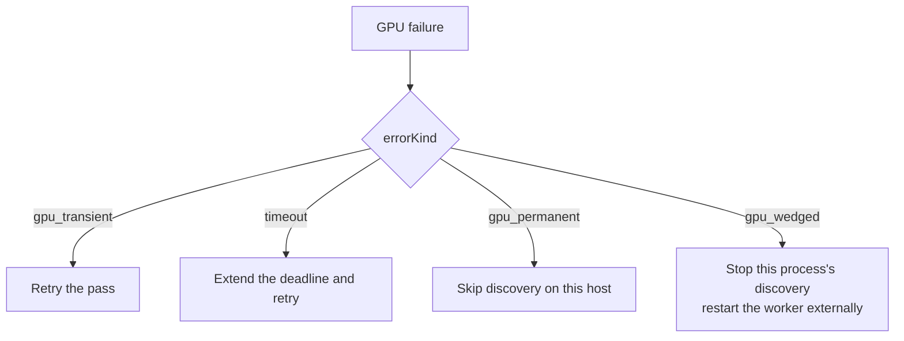
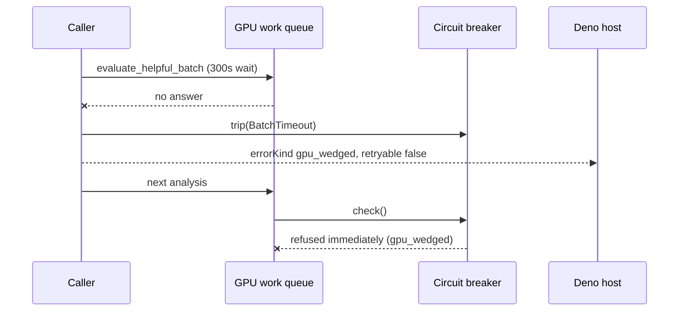

# Classify a wedged GPU as non-retryable at the FFI boundary

## Summary

A GPU that is present but no longer answering surfaced as a bare `anyhow!`
timeout string — "GPU helpful batch evaluation timed out after 300s" — which
`classify_error()` mapped to `DiscoveryErrorKind::Timeout`, documented as
"retryable with a longer deadline". The host took that advice literally: the
#1926 incident log shows `analysis timeout extended by 10m` followed by repeated
fresh analyses against hardware that would never answer.

This PR gives the failure its own kind so the signal is honest.

- **New `DiscoveryErrorKind::GpuWedged`** (serialises as `"gpu_wedged"`), absent
  from `is_retryable()` — a wedged GPU cannot be recovered inside the process.
- **New typed `DiscoveryError::GpuWedged { detail, abandoned_threads }`**, whose
  message states the GPU will not answer for the remainder of the process and
  that the worker must be restarted externally. The old "Consider reducing batch
  size or restarting" advice is gone.
- **Every GPU circuit-breaker trip site now constructs it** via the shared
  `breaker::gpu_wedged_error()`: the submission timeout arms and full-queue send
  timeouts (`src/analysis/gpu/queue/submission.rs`), the GPU init timeout
  (`queue/scheduling.rs`), and the error returned by every call suppressed after
  the breaker trips (`breaker.rs`).
- **The kind survives the FFI boundary**: `AnalyzeParallelOutput::failure()` now
  builds the failure response in one place, so a wedged GPU reaches the Deno host
  as `"errorKind": "gpu_wedged"`, `"retryable": false`, with the abandoned-thread
  count in the message.
- **String fallback hardened**: wedged wording is matched *before* the timeout
  branch, so an error that reaches the host as text only still classifies as
  wedged rather than as a retryable timeout.

`GpuUnavailable` → `gpu_permanent` and `GpuDeviceLost` → `gpu_transient` are
unchanged, as is the retryable `Timeout` for a genuine deadline overrun.

Closes #1932.

## Evidence

Backend/CLI change — no web interface to screenshot. Verified by the test suite
below plus the full `./quality.sh` gate (fmt, clippy `-D warnings`, check, test,
release build).

Host decision flow after the change:

Where the new kind is raised:

## Test Plan

New — `tests/ffi/issue_1932_gpu_wedged_classification.rs` (registered in
`tests/ffi/main.rs`):

- `gpu_wedged_kind_is_not_retryable` — `GpuWedged.is_retryable() == false`.
- `gpu_wedged_kind_serialises_as_snake_case` — `"gpu_wedged"` on the wire.
- `typed_gpu_wedged_error_maps_to_the_gpu_wedged_kind` — mapping plus the new
  message wording (abandoned-thread count present, batch-size advice gone).
- `a_submission_batch_timeout_classifies_as_gpu_wedged_not_timeout` — the real
  `batch_timeout_error()` trip site, the exact #1926 failure.
- `a_full_queue_send_timeout_classifies_as_gpu_wedged` — `queue_full_error()`.
- `a_suppressed_call_on_a_tripped_breaker_classifies_as_gpu_wedged` — every
  post-trip call carries the same verdict.
- `stringified_wedged_errors_classify_without_the_typed_downcast` — string
  fallback does not leak back to `Timeout`.
- `the_host_json_carries_gpu_wedged_and_retryable_false` — JSON round-trip of the
  response the host actually receives.
- `gpu_unavailable_and_device_lost_classification_is_unchanged` and
  `an_ordinary_deadline_overrun_is_still_a_retryable_timeout` — regression guards
  for the existing taxonomy.

Unit tests added alongside the code:

- `src/ffi_types/error_classification.rs::test_gpu_wedged_is_not_retryable`.
- `src/analysis/gpu/breaker.rs::a_suppressed_call_returns_a_typed_wedged_error`.

Existing suites that pin the surrounding behaviour still pass unchanged:
`tests/infrastructure/issue_677_typed_error_enums.rs`,
`tests/scoring/issue_651_error_classification.rs`,
`tests/gpu/issue_1930_gpu_circuit_breaker.rs`, and the
`src/analysis/gpu/queue/submission.rs` breaker tests.

## Documentation

- `docs/FFI_API.md` — new "🧯 Wedged GPU" section with the JSON shape, the host
  action, the kind-comparison table, and a Mermaid decision flow.
- `docs/GPU_GUIDE.md` — the sample timeout message updated to the new wording;
  the circuit-breaker section notes the typed non-retryable classification.
- `README.md` — points at the new kind from the GPU capability-verdict paragraph.

## Out of scope

Host-side consumption of the new kind lives in the NEAT-AI repo, per the issue.
