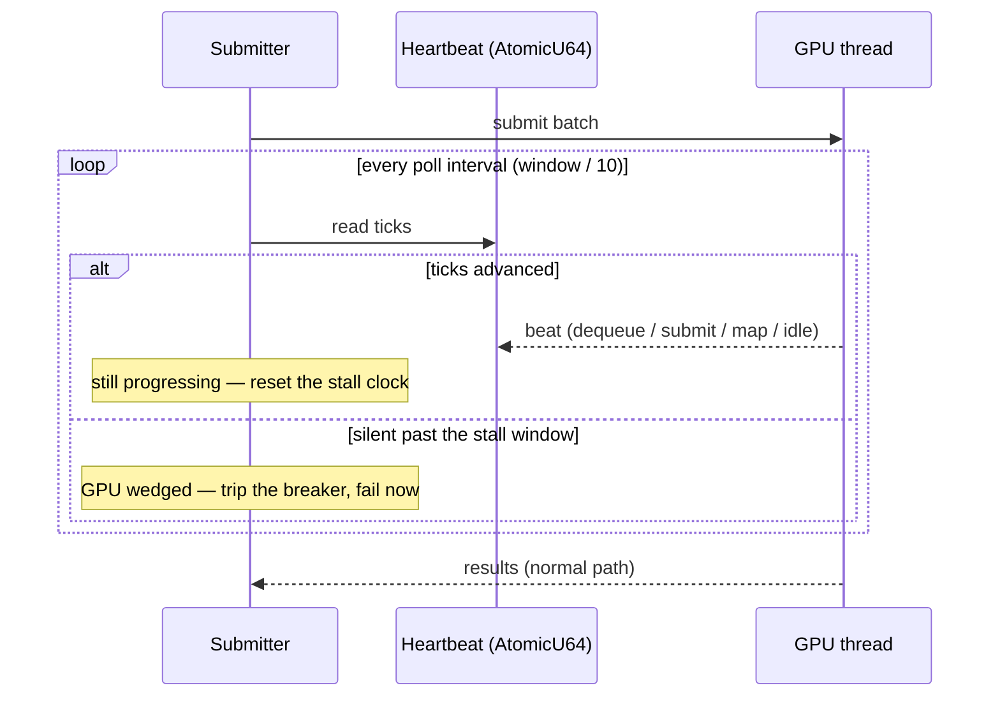

# Detect a wedged GPU in seconds via a GPU-thread liveness heartbeat

## Summary

A wedged GPU used to cost the submitter its **whole** batch timeout — 60–300s of
a one-hour run budget — before anything concluded the device was gone, and the
verdict was indistinguishable from "the GPU is slow but progressing". The only
existing signal (`GPU_REQUEST_STALL_WARN_SECS` = 30) was an after-the-fact
warning that fed no decision.

The GPU thread now publishes a monotonically increasing progress counter
(`AtomicU64`) at every observable step, and the submitter's wait became a bounded
loop that watches both the response channel and that counter. No progress for the
configured stall window (default 30s) declares the GPU wedged immediately; the
absolute batch timeout remains as the backstop. A long kernel that keeps
advancing the counter resets the window and is never flagged.

Closes #1933.

## What changed

- **`src/analysis/gpu/heartbeat.rs`** (new) — `GpuHeartbeat` (the shared
  `AtomicU64`), `global_gpu_heartbeat()`, the device-step beat helpers, and
  `HeartbeatWatch`, a submitter's view that measures silence from the last
  *change* rather than from the start of the wait.
- **`src/analysis/gpu/queue/execution.rs`** — the work loop takes the heartbeat
  and beats on request dequeued and request completed.
- **`src/analysis/gpu/device.rs`** — beats when a buffer mapping completes
  (`wait_for_buffer_map`, `wait_for_buffer_maps_batch`) and when
  `poll_device_until_idle` returns a drained queue. Beats fire only when a step
  **completes**, never from inside a poll loop, so a spinning driver cannot fake
  liveness.
- **`src/analysis/gpu/{helpful,harmful}_evaluation.rs`** — beat on each sub-batch
  submission, so a long multi-chunk batch is never mistaken for a wedge.
- **`src/analysis/gpu/queue/submission.rs`** — `wait_for_gpu_response()` replaces
  the five bare `recv_timeout(timeout)` waits (and `GpuFuture::collect`), waking
  every `window / 10` (10ms–1s) to check both channel and heartbeat.
- **`src/analysis/gpu/breaker.rs`** — new `GpuTripReason::HeartbeatStall`, so a
  stall verdict trips the process-wide breaker with its own reason and returns
  the typed `DiscoveryError::GpuWedged`.
- **`src/config/user_facing.rs`** — `gpu_stall_window()` reads
  `NEAT_AI_DISCOVERY_GPU_STALL_WINDOW_SECS` (default 30, clamped 1–600, `0`
  disables the guard, invalid falls back to the default).
- **Docs** — `docs/CONFIGURATION.md` (the knob), `src/config/mod.rs` table, and a
  new `docs/GPU_GUIDE.md` section with the beat-site table and a sequence
  diagram; the breaker trip-condition table gained the stall row.

## Evidence

Backend/CLI change — no web interface to screenshot. The behaviour is verified by
the tests below; `./quality.sh` (fmt, clippy `-D warnings`, `cargo deny`, tests,
release build) passes.

Detection path before and after:

Wall-clock cost of the first detection on a wedged device: **up to 300s → the
stall window (30s by default)**, asserted directly by
`stalled_heartbeat_trips_within_window`, which drives a real
`calculate_gpu_batch_timeout()` wait and asserts the verdict arrives in under 5s
with a 200ms window.

## Test Plan

Added:

- `src/analysis/gpu/queue/submission.rs`
  - `stalled_heartbeat_trips_within_window` — a heartbeat that stops advancing
    yields a `Stalled` verdict well inside `calculate_gpu_batch_timeout()`. A
    regression to the full batch timeout fails the elapsed-time assertion.
  - `slow_but_advancing_heartbeat_does_not_trip` — a synthetic evaluator thread
    beats every 60ms inside a 250ms window for far longer than the window and
    still answers; no false positive (acceptance criterion 2).
  - `the_absolute_timeout_remains_the_backstop` — with the guard disabled the
    wait ends at the absolute timeout.
  - `a_dropped_sender_is_reported_as_disconnected` — a dead GPU thread is still a
    disconnect, not a stall.
  - `a_heartbeat_stall_trips_the_breaker_as_a_wedged_gpu` — the verdict trips the
    breaker with `GpuTripReason::HeartbeatStall` and names the window.
- `src/analysis/gpu/queue/execution.rs`
  - `the_work_loop_publishes_progress_at_every_step` — one request through
    `run_work_loop` advances the shared counter across all five instrumented
    steps; dropping an update site fails here before any runtime symptom.
- `src/analysis/gpu/heartbeat.rs` — counter monotonicity, the device-step
  helpers, stall detection after the window, slow progress resetting the clock,
  the zero-window disable, and poll-interval bounds.
- `tests/infrastructure/issue_717_config_env_vars.rs` — `gpu_stall_window()`
  default, override, out-of-range clamp (both ends), `0` disables, and invalid
  falls back to the default.

Existing tests unchanged; `src/analysis/gpu/queue/stale_skip_tests.rs` call sites
were updated for the new `run_work_loop` parameter only.
